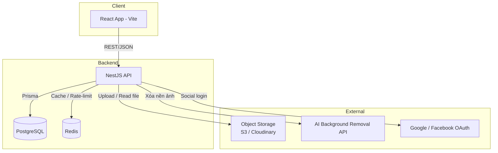

# Kiến trúc hệ thống — Wedding Card Builder

> Tài liệu này mô tả kiến trúc tổng thể của hệ thống tạo thiệp cưới online với
> editor kéo-thả tự do (free-form canvas)
> Dùng song song với `wedding_card_schema.sql` (schema database) và
> `DATA_FLOW.md` (chi tiết luồng xử lý).

## 1. Tổng quan



- **Frontend**: Single Page Application, render toàn bộ editor trên client,
  gọi API qua REST.
- **Backend**: NestJS, đóng vai trò API + xử lý nghiệp vụ + giao tiếp dịch vụ
  ngoài (storage, AI).
- **PostgreSQL**: nguồn sự thật (source of truth) duy nhất cho dữ liệu.
- **Redis**: cache (trang thiệp public, danh sách mẫu) + rate limiting +
  whitelist refresh token. Không lưu dữ liệu nghiệp vụ chính.

## 2. Stack công nghệ

| Layer              | Công nghệ                                            | Lý do chọn                                                          |
| ------------------ | ---------------------------------------------------- | ------------------------------------------------------------------- |
| Frontend framework | React 18 + Vite + TypeScript                         | Không cần SSR/SEO (đã xác nhận), dev nhanh hơn Next                 |
| Routing            | react-router-dom                                     | Chuẩn cho SPA                                                       |
| State management   | Zustand                                              | Nhẹ, phù hợp state phức tạp của editor (block đang chọn, undo/redo) |
| Data fetching      | @tanstack/react-query + axios                        | Cache, refetch, optimistic update cho editor                        |
| Form & validate    | react-hook-form + zod                                | Form RSVP, đăng ký, settings                                        |
| Canvas editor      | react-moveable                                       | Kéo-thả / resize / xoay block tự do                                 |
| Backend framework  | NestJS + TypeScript                                  | Kiến trúc module rõ ràng, tích hợp sẵn Redis/JWT/Throttler          |
| ORM                | Prisma                                               | Type-safe, migration tốt                                            |
| Database           | PostgreSQL                                           | Theo schema đã thiết kế (JSONB cho block content/style)             |
| Cache / rate-limit | Redis (`@nestjs/cache-manager`, `@nestjs/throttler`) | Cache trang public, chống spam RSVP/wishes                          |
| Auth               | Passport + JWT (access/refresh)                      | Hỗ trợ social login Google/Facebook sau                             |
| File storage       | S3-compatible / Cloudinary                           | Ảnh, video, nhạc nền                                                |
| Xử lý ảnh AI       | API ngoài (remove.bg hoặc self-host)                 | Tính năng "Xóa nền" trong panel chỉnh ảnh                           |

## 3. Module Backend (NestJS)

| Module            | Trách nhiệm chính                                                     | Bảng Prisma liên quan                                                   |
| ----------------- | --------------------------------------------------------------------- | ----------------------------------------------------------------------- |
| `AuthModule`      | Đăng ký/đăng nhập, JWT access+refresh, social login                   | `users`                                                                 |
| `UsersModule`     | Hồ sơ user, gói đang dùng                                             | `users`, `plans`                                                        |
| `PlansModule`     | CRUD gói dịch vụ (admin)                                              | `plans`                                                                 |
| `TemplatesModule` | Danh sách mẫu, danh mục, trang/block mẫu                              | `templates`, `template_categories`, `template_pages`, `template_blocks` |
| `CardsModule`     | **Module lõi** — CRUD thiệp, trang, block; clone từ template; publish | `cards`, `card_pages`, `card_blocks`                                    |
| `AssetsModule`    | Upload file, proxy gọi AI xóa nền                                     | `assets`                                                                |
| `EventsModule`    | Giờ/địa điểm lễ cưới                                                  | `wedding_events`                                                        |
| `GuestsModule`    | Danh sách khách mời, sinh link cá nhân hoá                            | `guests`                                                                |
| `RsvpModule`      | Nhận & quản lý phản hồi tham dự                                       | `rsvp_responses`                                                        |
| `WishesModule`    | Nhận, duyệt, hiển thị lời chúc                                        | `wishes`                                                                |
| `PublicModule`    | Endpoint không cần auth cho khách mời (xem thiệp, RSVP, gửi lời chúc) | đọc từ các bảng trên qua cache Redis                                    |
| `AnalyticsModule` | Ghi nhận lượt xem                                                     | `card_views`                                                            |

Mỗi module theo cấu trúc chuẩn NestJS: `*.controller.ts`, `*.service.ts`,
`*.module.ts`, `dto/*.dto.ts` (validate bằng `class-validator`).

## 4. Module Frontend (theo feature folder)

```
src/
├── features/
│   ├── auth/              # Login, Register, OAuth callback
│   ├── dashboard/          # Danh sách thiệp của user
│   ├── templates/          # Trang chọn mẫu
│   ├── editor/             # Trình chỉnh sửa kéo-thả — phần phức tạp nhất
│   │   ├── canvas/         # Vùng render trang + block (react-moveable)
│   │   ├── toolbar/        # Sidebar trái: Văn bản, Hình ảnh, Nền, Stock,
│   │   │                   # Công cụ, Nhạc nền, Tiện ích, Mẫu, Hiệu ứng, Presets
│   │   ├── panels/         # Sidebar phải: thuộc tính block đang chọn
│   │   │                   # (đổi ảnh, cắt ảnh, xóa nền AI, độ mờ, căn chỉnh,
│   │   │                   # lật ảnh, khoảng đệm, đường viền, đổ bóng, nâng cao)
│   │   ├── autosave/       # Local draft + phát hiện bản sao lưu
│   │   └── store/          # Zustand store: pages, blocks, selectedBlockId, history
│   ├── guests/             # Quản lý khách mời + RSVP (phía chủ thiệp)
│   ├── wishes/             # Duyệt / hiển thị lời chúc (phía chủ thiệp)
│   └── public-card/        # Trang xem thiệp công khai (route /thiep/:slug)
├── shared/
│   ├── api/                # axios instance, react-query hooks
│   ├── components/         # UI dùng chung
│   └── hooks/
└── App.tsx
```

## 5. Kiến trúc Editor (chi tiết)

Đây là phần trung tâm của sản phẩm, cần thiết kế kỹ vì độ phức tạp cao nhất.

- **Mô hình render**: mỗi `card_page` = 1 canvas (kích thước `width` x
  `height` cố định, giống khung điện thoại). Mỗi `card_block` được render
  `position: absolute` theo `pos_x`, `pos_y`, xoay theo `rotation`, xếp lớp
  theo `z_index`.
- **Tương tác kéo-thả**: `react-moveable` gắn vào block đang `selected`.
    - `onDrag` / `onResize` / `onRotate` → cập nhật **ngay** vào Zustand store
      (UI phản hồi tức thì, không chờ server).
    - Debounce ~400ms sau khi người dùng ngừng tương tác → gọi
      `PATCH /cards/:cardId/blocks/:blockId`.
    - Nếu API lỗi → rollback giá trị cũ + toast lỗi.
- **Toolbar trái** sinh block mới theo `block_type` tương ứng khi kéo vào
  canvas (text, image, shape, countdown, map, button, rsvp_form,
  wishes_wall...). Xem enum `block_type` trong schema.
- **Panel phải** chỉnh thuộc tính block đang chọn — mọi control ở đây
  (độ mờ, căn chỉnh, khoảng đệm, đường viền, đổ bóng...) map trực tiếp vào
  field `style` (JSONB), riêng "Xóa nền" / "Cắt ảnh" / "Đổi ảnh" gọi API xử
  lý ảnh rồi cập nhật `content.url`.
- **Nhạc nền**: lưu ở `cards.settings.backgroundMusic` (JSONB), không cần
  bảng riêng vì mỗi thiệp chỉ có 1 nhạc nền tại một thời điểm.
- **Stock / Presets**: thư viện ảnh/mẫu phối màu có sẵn — có thể là dữ liệu
  tĩnh (JSON config) hoặc bảng riêng `stock_assets` nếu cần quản trị qua
  admin panel (chưa cần ở MVP).

## 6. Bảo mật

- JWT access token (ngắn hạn, ví dụ 15 phút) + refresh token (dài hạn, lưu
  whitelist trong Redis theo `userId` để revoke được khi logout).
- Rate limit theo IP cho mọi endpoint không cần auth: `POST /public/.../rsvp`,
  `POST /public/.../wishes`, `POST /auth/login` (chống brute-force).
- Validate toàn bộ input qua DTO + `class-validator`.
- Thiệp có `access_password` (tuỳ chọn) → kiểm tra ở endpoint
  `GET /public/cards/:slug` trước khi trả nội dung.
- Helmet cho HTTP headers cơ bản; CORS chỉ whitelist domain frontend.

## 7. Triển khai (Deployment)

| Thành phần                  | Gợi ý hạ tầng                                  |
| --------------------------- | ---------------------------------------------- |
| Backend (NestJS)            | Docker container → VPS / Render / Railway      |
| Frontend (React build tĩnh) | Vercel / Netlify / S3 + CloudFront             |
| PostgreSQL                  | Managed (Supabase / RDS) hoặc self-host        |
| Redis                       | Managed (Upstash / Redis Cloud) hoặc self-host |
| Object storage              | S3 / Cloudinary                                |
| CI/CD                       | GitHub Actions: lint → test → build → deploy   |
