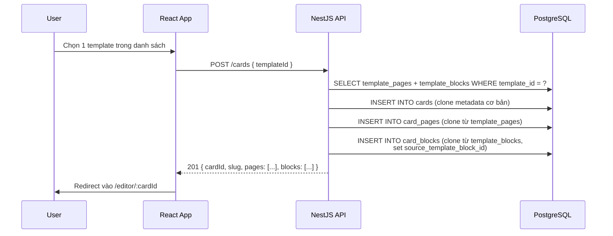
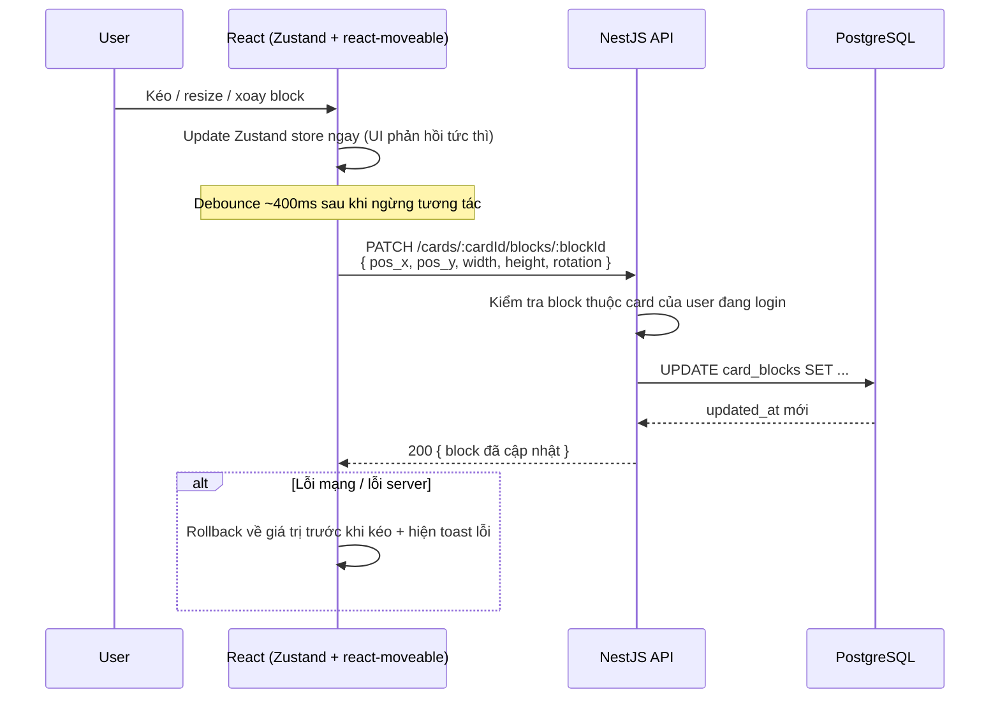
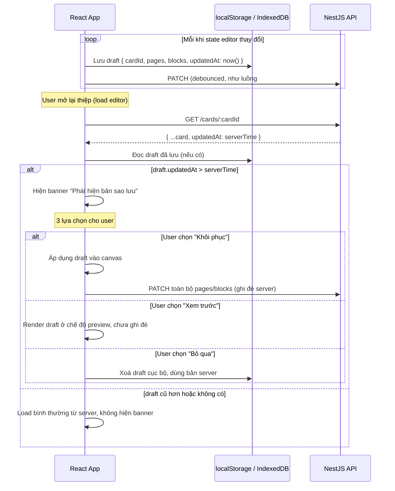
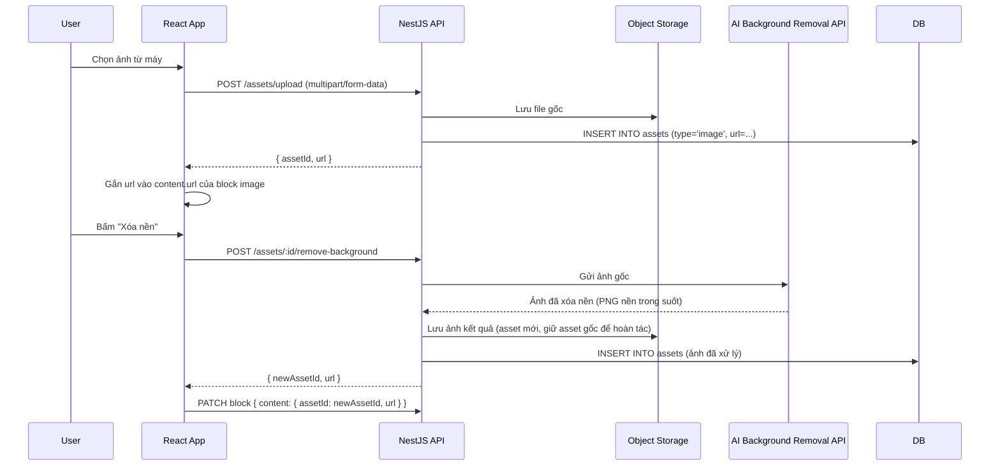
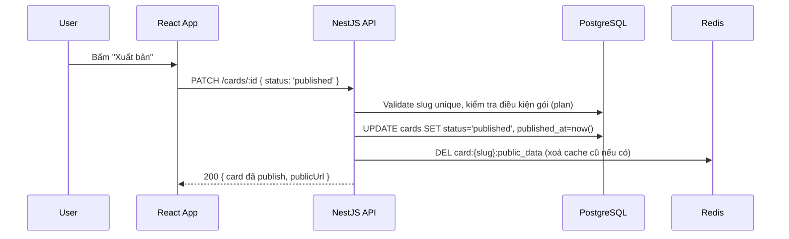
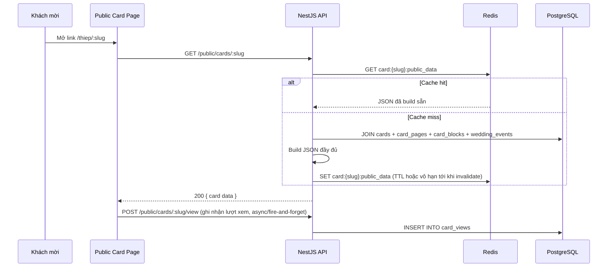
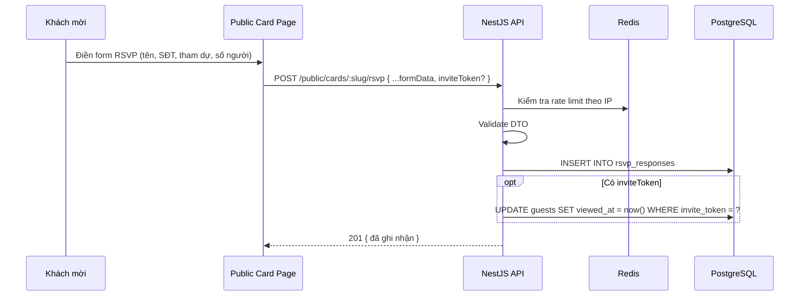
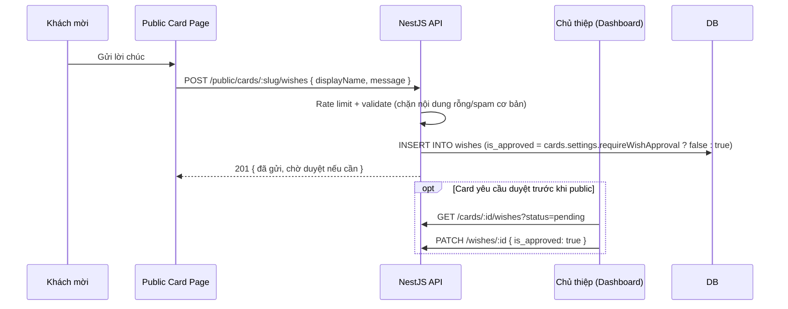
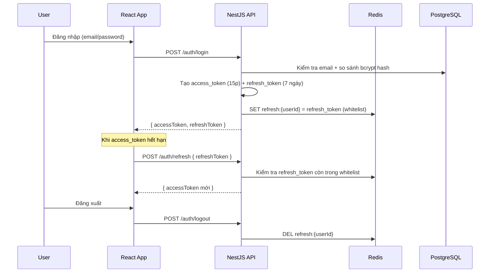

# Luồng dữ liệu (Data Flow) — Wedding Card Builder

> Mô tả chi tiết từng luồng xử lý chính trong hệ thống. Dùng kèm
> `ARCHITECTURE.md` (tổng quan hệ thống) và `wedding_card_schema.sql`
> (cấu trúc bảng được tham chiếu trong mỗi luồng).

## 1. Tạo thiệp mới từ mẫu

**Lưu ý:** việc clone thực hiện trong 1 transaction Prisma
(`prisma.$transaction`) để đảm bảo không tạo ra `card` mồ côi nếu việc clone
block bị lỗi giữa đường.

## 2. Chỉnh sửa block trong editor (kéo-thả / resize / xoay)

**Quy tắc quan trọng:** mọi thay đổi nội dung (`content`) hoặc style
(`style`) cũng đi qua endpoint `PATCH` tương tự, chỉ khác payload — không
tạo endpoint riêng cho từng loại thay đổi để giữ API gọn.

## 3. Autosave cục bộ & phát hiện bản sao lưu

Tính năng này xử lý trường hợp mất mạng / đóng tab giữa lúc đang chỉnh sửa
(tương ứng banner "Phát hiện bản sao lưu" trong UI thật).

**Không cần thêm bảng DB cho tính năng này** — chỉ cần backend luôn trả
`updated_at` chính xác ở mọi response liên quan đến `cards`/`card_pages`/
`card_blocks`, frontend tự so sánh với bản lưu cục bộ.

## 4. Upload ảnh & xóa nền bằng AI

**Lưu ý chi phí:** gọi AI xóa nền tốn phí theo lượt — nên cache kết quả
(không gọi lại nếu user bấm "Xóa nền" nhiều lần trên cùng 1 ảnh gốc đã xử
lý rồi) bằng cách kiểm tra asset đã có bản `processedFrom = originalAssetId`
chưa trước khi gọi AI.

## 5. Publish thiệp

## 6. Khách xem thiệp công khai (có cache)

**Invalidate cache:** mỗi lần card được publish lại hoặc chỉnh sửa sau khi
đã publish → xoá key `card:{slug}:public_data` (xem luồng #5).

## 7. RSVP (xác nhận tham dự)

## 8. Lời chúc (Wishes)

## 9. Xác thực (Auth)

Social login (Google/Facebook) dùng Passport strategy riêng
(`passport-google-oauth20`, `passport-facebook`), sau khi callback thành
công thì tạo/tìm `user` theo `provider` + `provider_id`, rồi cấp token theo
đúng luồng trên.
