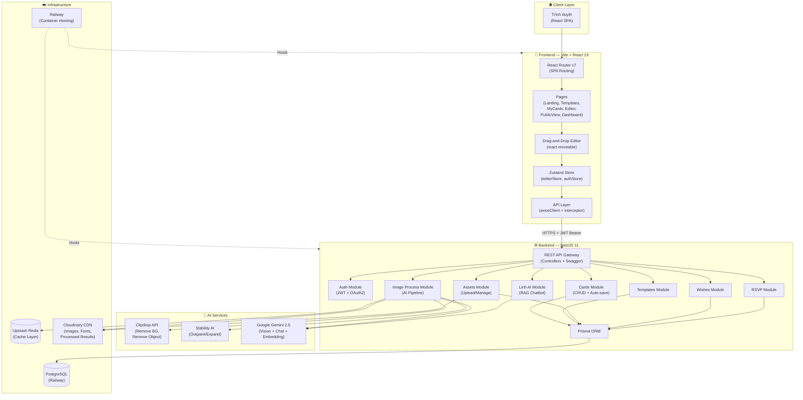
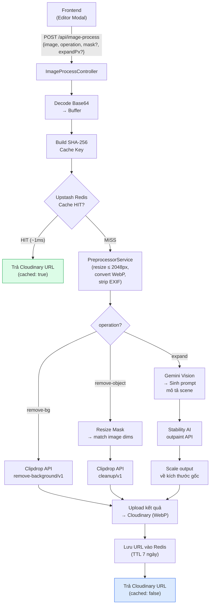
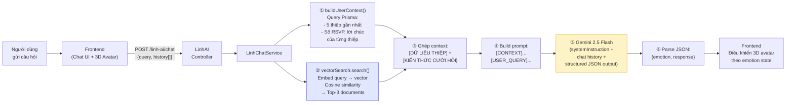

# Chương 5: Xây dựng và Triển khai Hệ thống

---

## 5.1 Kiến trúc Hệ thống

### 5.1.1 Sơ đồ Kiến trúc tổng thể



Hệ thống được thiết kế theo kiến trúc **phân tầng (Layered Architecture)** gồm 4 tầng chính, giao tiếp một chiều từ trên xuống:

**① Client Layer** — Người dùng truy cập qua trình duyệt web (desktop hoặc mobile). Toàn bộ giao diện được render phía client dưới dạng Single Page Application, giao tiếp với backend hoàn toàn qua giao thức HTTPS.

**② Frontend Layer** — Ứng dụng React 19 được đóng gói bởi Vite 8 và triển khai trên Vercel CDN. Tầng này chứa hai nhóm chức năng cốt lõi: (1) **Canvas Editor** — trình soạn thảo thiệp kéo-thả sử dụng `react-moveable` kết hợp `html-to-image` để capture thumbnail; và (2) **Trang công khai** — tích hợp `React Leaflet` cho widget bản đồ. Toàn bộ state được quản lý tập trung bằng Zustand, gọi API qua Axios với interceptor tự động gắn JWT token.

**③ Backend API Layer** — Server NestJS 11 triển khai trên Railway, cung cấp REST API với documentation Swagger/OpenAPI. Tầng này chia thành hai nhóm module:
- **Business Modules:** `Cards`, `Users`, `Templates`, `Assets` (Multer + Sharp), `Wishes`, `RSVP`, `LibraryElements`, `Auth` (JWT + OAuth2 Google/Facebook) — xử lý toàn bộ nghiệp vụ CRUD, auto-save, xuất bản thiệp
- **AI Modules:** `ImageProcessing` (Remove BG, Remove Object, Expand Image) và `LinhAI Chatbot` (RAG Pipeline + Vector Search) — đóng vai trò trung gian điều phối giữa frontend và các dịch vụ AI bên ngoài

Tất cả module đều truy cập cơ sở dữ liệu thông qua **Prisma ORM v5** với type-safe query, đảm bảo tính nhất quán dữ liệu.

**④ Data Layer & External AI Services** — Tầng hạ tầng bao gồm:
- **PostgreSQL** (Railway) — lưu trữ dữ liệu quan hệ (users, cards, blocks, RSVP, wishes...)
- **Cloudinary CDN** — lưu trữ và phân phối media (ảnh, font, thumbnail, kết quả xử lý AI)
- **Upstash Redis** — cache hit/miss cho kết quả xử lý ảnh AI, giảm chi phí gọi API lặp lại
- **Gmail SMTP** (Nodemailer) — gửi email xác thực và thông báo
- **External AI:** Stability AI (outpainting/mở rộng ảnh), Clipdrop API (xóa nền/xóa đối tượng), Google Gemini 2.5 Flash + Embedding-2 (LLM generation, vision analysis, text embedding cho vector search)

### 5.1.2 Mô hình kiến trúc

Hệ thống được xây dựng theo mô hình **Monorepo** với hai dự án độc lập:

| Thành phần | Vai trò | Giao tiếp |
|---|---|---|
| `wedding-frontend` | Single Page Application, giao diện người dùng | Gọi REST API qua HTTPS |
| `wedding-backend` | RESTful API Server, xử lý nghiệp vụ & AI | Trả JSON qua HTTP response |

Kiến trúc backend tuân theo **Modular Architecture** của NestJS — mỗi domain nghiệp vụ (Cards, Templates, Auth, AI...) được đóng gói thành một Module độc lập với Controller → Service → Prisma ORM, đảm bảo nguyên tắc **Separation of Concerns**.

---

## 5.2 Môi trường Phát triển

| Hạng mục | Công nghệ | Phiên bản |
|---|---|---|
| **Runtime** | Node.js | 20 LTS |
| **Package Manager** | npm | 10.x |
| **IDE** | VS Code | Latest |
| **Version Control** | Git + GitHub | — |
| **Database (Dev)** | PostgreSQL | 15 (Railway) |
| **Cache** | Upstash Redis | Serverless |
| **File Storage** | Cloudinary | v2 |
| **API Documentation** | Swagger UI | Tích hợp qua `@nestjs/swagger` |
| **Deploy** | Railway | Container-based |

---

## 5.3 Phân tích Công nghệ sử dụng

### 5.3.1 Frontend (React 19 + Vite)

| Công nghệ | Mục đích sử dụng |
|---|---|
| **React 19** | UI library chính, sử dụng Hooks & Functional Components |
| **Vite 8** | Build tool siêu nhanh, HMR tức thì trong quá trình phát triển |
| **TypeScript 6** | Đảm bảo type-safety toàn bộ codebase |
| **Zustand 5** | State management nhẹ, thay thế Redux — quản lý toàn bộ trạng thái Editor (~1.800 dòng) và Auth |
| **React Router v7** | Client-side routing, lazy loading pages |
| **TailwindCSS 4** | Utility-first CSS framework kết hợp CSS Modules cho Editor |
| **Framer Motion** | Animation library cho micro-interactions và page transitions |
| **react-moveable** | Thư viện core cho drag, resize, rotate các phần tử trên canvas |
| **html-to-image** | Chụp ảnh canvas DOM thành thumbnail WebP |
| **Axios** | HTTP client với interceptor tự động gắn JWT token |
| **Zod** | Schema validation cho form (kết hợp react-hook-form) |
| **Three.js** | Render nhân vật AI 3D (Linh) trên giao diện |
| **Leaflet** | Tích hợp bản đồ Google Maps vào widget thiệp |
| **Recharts** | Biểu đồ thống kê trên Dashboard |

### 5.3.2 Backend (NestJS 11)

| Công nghệ | Mục đích sử dụng |
|---|---|
| **NestJS 11** | Framework chính, kiến trúc module hóa với Dependency Injection |
| **Prisma 5** | ORM type-safe, tự generate TypeScript types từ schema |
| **Passport.js** | Xác thực đa chiến lược: JWT, Google OAuth2, Facebook OAuth |
| **@nestjs/jwt** | Phát hành và xác minh Access/Refresh Token |
| **bcrypt** | Hash mật khẩu người dùng (salt rounds = 10) |
| **Sharp** | Xử lý ảnh server-side: resize, convert WebP, strip EXIF |
| **Cloudinary SDK** | Upload và quản lý tệp media trên CDN |
| **@upstash/redis** | Cache kết quả AI qua HTTP-based Redis (serverless) |
| **class-validator** | Validate DTO ở tầng Controller trước khi vào Service |
| **Swagger** | Tự sinh API documentation tại `/api` |
| **Nodemailer** | Gửi email xác thực, thông báo |

### 5.3.3 Tích hợp AI

| Dịch vụ AI | API sử dụng | Chức năng trong hệ thống |
|---|---|---|
| **Clipdrop** | `remove-background/v1` | Xóa nền ảnh (trả về PNG transparent) |
| **Clipdrop** | `cleanup/v1` | Xóa đối tượng khỏi ảnh bằng mask |
| **Stability AI** | `stable-image/edit/outpaint` | Mở rộng viền ảnh (outpaint) với AI-generated content |
| **Google Gemini 2.5 Flash** | `generateContent` (Vision) | Phân tích ảnh → sinh prompt mô tả cho Stability AI |
| **Google Gemini 2.5 Flash** | `sendMessage` (Chat) | LLM chính cho chatbot RAG "Linh" |
| **Google Gemini Embedding** | `embedContent` | Nhúng văn bản thành vector cho tìm kiếm ngữ nghĩa |

---

## 5.4 Tài liệu Giao tiếp chung (API Communication)

### 5.4.1 Cấu trúc Request/Response

**Base URL:** `VITE_API_URL` (production: domain Railway)

**Interceptor phía Frontend:**
```typescript
// axiosClient.ts — Mọi request đều tự động gắn JWT
axiosClient.interceptors.request.use((config) => {
  const token = localStorage.getItem('access_token');
  if (token) config.headers.Authorization = `Bearer ${token}`;
  return config;
});
```

**Chuẩn Request phổ biến:**

| Loại | Content-Type | Ví dụ |
|---|---|---|
| JSON body | `application/json` | Tạo thiệp, cập nhật block, chat AI |
| File upload | `multipart/form-data` | Upload ảnh, font, thumbnail |
| Query params | URL params | Phân trang, tìm kiếm, lọc |

### 5.4.2 Chuẩn Response

Mọi API response đều trả về JSON với HTTP status code chuẩn REST:

```
Thành công: 200 OK | 201 Created
Lỗi client: 400 Bad Request | 401 Unauthorized | 403 Forbidden | 404 Not Found
Lỗi server: 500 Internal Server Error | 503 Service Unavailable
```

**Ví dụ response thành công (Lưu canvas):**
```json
{
  "id": "uuid-card-id",
  "title": "Thiệp cưới Thuận & Trúc",
  "status": "draft",
  "blocks": [...],
  "background": { "type": "solid", "color": "#ffffff" },
  "settings": { "canvasWidth": 500, "canvasHeight": 2000 }
}
```

**Ví dụ response lỗi (AI processing):**
```json
{
  "success": false,
  "error": "Clipdrop remove-bg error (429): Rate limit exceeded",
  "code": "API_ERROR_CLIPDROP"
}
```

### 5.4.3 Bảng tổng hợp Endpoint chính

| Module | Method | Endpoint | Mô tả |
|---|---|---|---|
| **Auth** | POST | `/auth/login` | Đăng nhập email/password |
| | GET | `/auth/google` | OAuth2 Google |
| | GET | `/auth/profile` | Lấy thông tin user (JWT) |
| **Cards** | POST | `/cards` | Tạo thiệp (trắng hoặc từ template) |
| | GET | `/cards` | Danh sách thiệp (phân trang, lọc) |
| | GET | `/cards/:id` | Chi tiết thiệp + blocks |
| | PATCH | `/cards/:id` | Cập nhật thông tin + xuất bản |
| | POST | `/cards/:id/save` | **Auto-save canvas** (gọi mỗi 30s) |
| | POST | `/cards/:id/thumbnail` | Upload thumbnail (multipart) |
| | GET | `/cards/public/:slug` | Xem thiệp công khai (không cần auth) |
| **Assets** | POST | `/assets/upload` | Upload ảnh/font lên Cloudinary |
| | GET | `/assets/fonts` | Lấy danh sách font (system + user) |
| **Image AI** | POST | `/api/image-process` | Xử lý ảnh AI (unified endpoint) |
| **Chatbot** | POST | `/linh-ai/chat` | Chat với AI Linh (RAG) |
| **Wishes** | POST | `/wishes/public/:cardId` | Gửi lời chúc công khai |
| **RSVP** | POST | `/rsvps/public/:cardId` | Xác nhận tham dự |

### 5.4.4 Định dạng dữ liệu đặc biệt

| Loại dữ liệu | Định dạng | Ghi chú |
|---|---|---|
| **ID** | UUID v4 | Prisma auto-generate, validate bằng `ParseUUIDPipe` |
| **Ảnh gửi lên AI** | Base64 string | Frontend encode canvas element → base64, gửi trong JSON body |
| **Ảnh trả về** | Cloudinary URL | Kết quả AI được upload lên CDN, trả về `secure_url` |
| **Canvas data** | JSON object | `blocks[]` + `background{}` + `settings{}` — serialize/deserialize qua Prisma JSON field |
| **Ngày giờ** | ISO 8601 | `2026-07-12T13:00:00.000Z` |
| **Emotion (AI Chat)** | Enum string | `'neutral' | 'happy' | 'excited' | 'thinking'` |

---

## 5.5 Tích hợp AI — Xử lý Hình ảnh

### 5.5.1 Kiến trúc Unified Pipeline

Toàn bộ chức năng xử lý ảnh AI được gom vào **một endpoint duy nhất** (`POST /api/image-process`), phân biệt bằng trường `operation`. Thiết kế này giúp frontend chỉ cần một hàm gọi API, đồng thời backend tập trung logic caching và error handling tại một điểm.



### 5.5.2 Chiến lược Cache 2 lớp

Một trong những thiết kế kỹ thuật đáng chú ý nhất của module Image Process là hệ thống **cache 2 lớp** nhằm giảm chi phí gọi API AI bên ngoài (vốn rất đắt đỏ):

| Lớp | Công nghệ | Vai trò | Tốc độ |
|---|---|---|---|
| **Layer 1** | Upstash Redis (HTTP) | Lưu mapping `SHA-256 key → Cloudinary URL` với TTL 7 ngày | ~1ms |
| **Layer 2** | Cloudinary CDN | Lưu trữ vĩnh viễn file ảnh kết quả (WebP, `overwrite: false`) | — |

**Cách tạo Cache Key:**
```
SHA-256( imageBuffer + operation + JSON.stringify(params) )
```
Trong đó `params` thay đổi tuỳ operation:
- `remove-bg`: chuỗi rỗng (chỉ phụ thuộc ảnh đầu vào)
- `remove-object`: SHA-256 của maskBuffer (cùng ảnh + mask khác = key khác)
- `expand`: `"left,right,top,bottom"` (ví dụ: `"100,100,0,0"`)

**Ý nghĩa:** Nếu người dùng xóa nền cùng một bức ảnh hai lần → hệ thống trả kết quả từ cache trong **1ms** thay vì gọi Clipdrop mất **2–5 giây** và tốn credit API.

### 5.5.3 Chuỗi xử lý Mở rộng ảnh (Expand) — Phức tạp nhất

Chức năng **Expand** (mở rộng viền ảnh bằng AI) có pipeline phức tạp nhất vì kết hợp **3 AI services** trong một lần gọi:

1. **Preprocess** — Resize ảnh gốc xuống ≤ 2048px, convert WebP, strip EXIF (Sharp)
2. **Tính scale ratio** — Nếu ảnh bị resize, `expandPx` phải scale theo tỷ lệ tương ứng, rồi clamp về MAX_EXPAND = 2000px
3. **Gemini Vision** — Gửi ảnh đã preprocess cho Gemini 2.5 Flash phân tích → sinh prompt mô tả phong cách, ánh sáng, bối cảnh (tối đa 50 từ tiếng Anh)
4. **Stability AI** — Gửi ảnh + prompt + expandPx sang Stability Outpaint API → trả về ảnh đã mở rộng
5. **Scale output** — Resize kết quả về đúng kích thước mong muốn (ảnh gốc + expandPx gốc) bằng Sharp

---

## 5.6 Tích hợp AI — Chatbot "Linh" (RAG Pipeline)

### 5.6.1 Kiến trúc RAG (Retrieval-Augmented Generation)

Chatbot "Linh" không phải là một LLM đơn thuần mà được xây dựng theo kiến trúc **RAG** — kết hợp tìm kiếm ngữ nghĩa trên cơ sở tri thức với khả năng sinh ngôn ngữ tự nhiên của LLM.



### 5.6.2 Vector Search — Tìm kiếm ngữ nghĩa

Hệ thống sử dụng **In-Memory Vector Store** thay vì database vector chuyên dụng (như Pinecone, Weaviate), phù hợp với quy mô knowledge base hiện tại (~1.000 documents):

**Quy trình khởi tạo (OnModuleInit):**
1. Đọc toàn bộ `WEDDING_KNOWLEDGE` (122KB, ~1.092 dòng kiến thức cưới hỏi Việt Nam)
2. Gọi **Gemini Embedding Model** (`gemini-embedding-2`) để nhúng từng document thành vector
3. Lưu `{ id, content, topic, embedding: number[] }` vào mảng `vectorStore` trong RAM
4. Xử lý rate limit: sleep 1.5 giây giữa mỗi document, retry 5 lần nếu gặp 429

**Quy trình tìm kiếm:**
1. Embed câu hỏi user → query vector
2. Tính **Cosine Similarity** giữa query vector và tất cả document vectors
3. Sort giảm dần → trả về **Top-K** documents có điểm cao nhất (mặc định K=3)

**Thuật toán Cosine Similarity:**
```
cosine(A, B) = (A · B) / (‖A‖ × ‖B‖)
             = Σ(Ai × Bi) / (√Σ(Ai²) × √Σ(Bi²))
```
Giá trị nằm trong `[-1, 1]`, càng gần 1 càng tương đồng về ngữ nghĩa.

### 5.6.3 Điều khiển cảm xúc 3D Avatar

Một điểm đặc biệt của chatbot Linh là phản hồi không chỉ là text mà còn bao gồm **trạng thái cảm xúc** để điều khiển nhân vật 3D (render bằng Three.js):

| Emotion | Khi nào sử dụng | Biểu hiện 3D |
|---|---|---|
| `neutral` | Báo cáo số liệu, giải thích quy trình | Đứng yên, cử chỉ bình thường |
| `happy` | Chào hỏi, chia sẻ mẹo cưới | Cười, vẫy tay |
| `excited` | Tin vui, chốt dịch vụ thành công | Nhảy, hào hứng |
| `thinking` | Cần user làm rõ câu hỏi | Đặt tay lên cằm, suy nghĩ |

Gemini trả về JSON có schema cố định (`responseMimeType: 'application/json'`), đảm bảo frontend luôn parse được:
```json
{ "emotion": "happy", "response": "Chào bạn! Linh sẵn sàng tư vấn..." }
```

---

## 5.7 Giải thích Kỹ thuật xử lý

### 5.7.1 Editor State Management — Zustand Store

Trái tim kỹ thuật của ứng dụng nằm ở `editorStore.ts` (~1.800 dòng), quản lý toàn bộ trạng thái của trình soạn thảo thiệp bằng **Zustand** — một state management library nhẹ hơn Redux nhưng vẫn đảm bảo reactivity.

**Cấu trúc State chính:**

```typescript
interface EditorState {
  // ── Canvas ──
  elements: CanvasElement[];       // Mảng các phần tử trên canvas
  canvasWidth: number;             // 500px (mobile-first)
  canvasHeight: number;            // 2000px (scroll dọc)
  canvasBackground: BackgroundProperties;
  zoom: number;                    // 100% mặc định

  // ── Selection & Tool ──
  activeTool: ToolType;            // 'text' | 'image' | 'shape' | ...
  selectedElement: CanvasElement | null;

  // ── Undo/Redo ──
  history: HistorySnapshot[];      // Mảng snapshot
  historyIndex: number;            // Con trỏ vị trí hiện tại

  // ── Auto-save ──
  cardId: string | null;
  autoSaveStatus: 'idle' | 'saving' | 'saved' | 'error';
  lastSavedData: string | null;    // JSON.stringify() để so sánh diff

  // ── Editor Mode ──
  editorMode: 'card' | 'template'; // Phân biệt user vs admin
}
```

**Cấu trúc một Canvas Element:**

```typescript
interface CanvasElement {
  id: string;                  // UUID unique
  type: 'text' | 'image' | 'shape' | 'countdown' | 'map'
      | 'qr_code' | 'calendar' | 'album' | 'form' | 'button_contact';
  x: number; y: number;       // Vị trí trên canvas (px)
  width: number; height: number;
  rotation: number;            // Góc xoay (độ)
  zIndex: number;              // Thứ tự lớp (layer ordering)
  // Property objects tuỳ theo type:
  textProps?: TextProperties;
  imageProps?: ImageProperties;
  shapeProps?: ShapeProperties;
  // ... (10 loại widget)
}
```

### 5.7.2 Thuật toán Undo/Redo

Hệ thống sử dụng **History Stack Pattern** — một biến thể của Command Pattern:

```
history = [S₀, S₁, S₂, S₃, S₄]
                          ↑
                    historyIndex = 4  (hiện tại)
```

- **Undo:** `historyIndex--` → restore `history[historyIndex]`
- **Redo:** `historyIndex++` → restore `history[historyIndex]`
- **Thao tác mới** khi đang ở giữa history: cắt bỏ tất cả snapshot sau `historyIndex`, rồi push snapshot mới

Mỗi snapshot lưu trữ `{ elements: CanvasElement[], canvasBackground }` — đây là **Snapshot-based approach** (clone toàn bộ state), đơn giản hơn Command-based nhưng tốn bộ nhớ hơn. Phù hợp với ứng dụng này vì số lượng elements trên một thiệp thường < 50.

### 5.7.3 Cơ chế Auto-save thông minh

Auto-save được thiết kế với nguyên tắc **"chỉ lưu khi có thay đổi thực sự"**:

```
┌─────────────┐    30s interval    ┌──────────────────┐
│  setInterval ├──────────────────►│  saveCanvasNow() │
│  (30.000ms)  │                   └────────┬─────────┘
└─────────────┘                             │
                                            ▼
                              ┌─────────────────────────┐
                              │ currentData = JSON.stringify( │
                              │   { elements, background,    │
                              │     music, canvasWidth }     │
                              │ )                            │
                              └──────────────┬──────────────┘
                                             │
                                    ┌────────▼────────┐
                                    │ currentData ===  │
                                    │ lastSavedData ?  │
                                    └───┬────────┬────┘
                                   YES  │        │  NO
                                        ▼        ▼
                                    [SKIP]   [POST /cards/:id/save]
                                                  │
                                             ┌────▼────┐
                                             │ SUCCESS │
                                             └────┬────┘
                                                  │
                                    ┌─────────────▼─────────────┐
                                    │ ① set autoSaveStatus='saved' │
                                    │ ② set lastSavedData=currentData │
                                    │ ③ setTimeout 3s → 'idle'       │
                                    │ ④ Fire-and-forget: capture     │
                                    │    thumbnail → upload CDN      │
                                    └───────────────────────────────┘
```

**Điểm đặc biệt:** Thumbnail được capture từ DOM (`html-to-image`) và upload lên Cloudinary **hoàn toàn ngầm** (fire-and-forget) — không block UI, không ảnh hưởng trải nghiệm người dùng. Nếu upload thumbnail thất bại, auto-save vẫn thành công.

### 5.7.4 Cơ chế đồng bộ Blocks (Sync Strategy)

Khi auto-save, frontend gửi **toàn bộ danh sách blocks hiện tại** lên backend. Backend thực hiện **Full Sync** trong một Prisma Transaction:

1. So sánh `blocks` từ FE với blocks hiện có trong DB
2. **INSERT** blocks mới (có trong FE, chưa có trong DB)
3. **UPDATE** blocks đã thay đổi (so sánh position, content, style...)
4. **DELETE** blocks đã bị xóa (có trong DB, không có trong FE)

Chiến lược này đơn giản hơn delta-based sync nhưng đảm bảo **eventual consistency** — DB luôn phản ánh đúng trạng thái mới nhất từ Editor.

### 5.7.5 Xử lý ảnh trước khi gửi AI (Preprocessing)

Mọi ảnh trước khi gửi tới AI API đều đi qua `PreprocessorService` với 3 bước:

| Bước | Kỹ thuật | Lý do |
|---|---|---|
| Resize | `sharp.resize(2048, 2048, { fit: 'inside', withoutEnlargement: true })` | Clipdrop/Stability có giới hạn kích thước đầu vào |
| Convert | `.webp({ quality: 85 })` | Giảm dung lượng ~60–70% so với PNG, giữ chất lượng cao |
| Strip metadata | `.withMetadata({ exif: {} })` | Loại bỏ dữ liệu EXIF thừa, giảm kích thước payload |

---

## 5.8 Điểm khó & Cách giải quyết

### 5.8.1 Vấn đề: Scale Ratio khi Expand ảnh

**Mô tả:** Khi người dùng yêu cầu mở rộng ảnh 100px mỗi bên, nhưng ảnh gốc 4000×3000px phải resize xuống 2048px trước khi gửi AI → `expandPx` không còn chính xác.

**Giải pháp:**
```typescript
// Tính tỷ lệ scale
const scaleX = processedWidth / originalWidth;  // VD: 2048/4000 = 0.512
const scaleY = processedHeight / originalHeight;

// Scale expandPx theo tỷ lệ
const scaledLeft = Math.round(left * scaleX);    // 100 * 0.512 = 51px
// ...gửi scaledPx cho Stability AI

// Sau khi nhận kết quả, scale output về kích thước gốc:
const targetWidth = originalWidth + left + right;  // 4000 + 100 + 100 = 4200px
sharp(result).resize(targetWidth, targetHeight);
```

Nếu không xử lý scale ratio, ảnh mở rộng sẽ bị lệch tỷ lệ hoặc bị cắt sai vị trí.

### 5.8.2 Vấn đề: Chi phí API AI đắt đỏ

**Mô tả:** Mỗi lần gọi Clipdrop/Stability AI tốn credit thực sự. Người dùng có thể vô tình gọi lại cùng một thao tác nhiều lần (redo, refresh...).

**Giải pháp:** Thiết kế **Cache 2 lớp** (Redis + Cloudinary) với **deterministic cache key** (SHA-256). Cùng một ảnh + cùng operation + cùng params → luôn ra cùng cache key → trả kết quả từ Redis trong 1ms thay vì gọi AI mất 2–10 giây.

Thiết kế cache **fault-tolerant**: nếu Redis hoặc Cloudinary bị lỗi, hệ thống fallback về base64 data URL thay vì crash:
```typescript
} catch (cacheErr) {
  // Non-fatal: trả base64 fallback
  resultUrl = `data:image/webp;base64,${resultBuffer.toString('base64')}`;
}
```

### 5.8.3 Vấn đề: Rate Limiting khi khởi tạo Vector Store

**Mô tả:** Khi server khởi động, `VectorSearchService` cần embed ~1.092 documents qua Gemini API. Gọi liên tục sẽ bị rate limit (429 Too Many Requests).

**Giải pháp:**
- **Throttling:** Sleep 1.5 giây giữa mỗi document (`await sleep(1500)`)
- **Retry logic:** Nếu gặp 429, đợi 15 giây rồi retry (tối đa 5 lần)
- **Non-blocking init:** Chạy indexing trong background (`onModuleInit` → `async` without `await`), server vẫn accept requests ngay — chỉ là chatbot trả kết quả chưa tốt trong vài phút đầu
- **Fallback:** Nếu embed query thất bại → trả K documents đầu tiên trong store

### 5.8.4 Vấn đề: Đồng bộ kích thước Mask và Image

**Mô tả:** Khi người dùng vẽ mask (vùng cần xóa) trên canvas frontend, kích thước mask phụ thuộc vào kích thước hiển thị (có thể khác kích thước ảnh gốc do zoom). Nếu gửi ảnh và mask khác kích thước cho Clipdrop → API lỗi hoặc xóa sai vị trí.

**Giải pháp:** Backend xử lý resize mask **sau khi** preprocess ảnh gốc, đảm bảo cả hai luôn cùng kích thước:
```typescript
const { buffer: processedImage, width, height } = 
    await preprocessor.preprocess(imageBuffer);
// Resize mask theo đúng kích thước ảnh đã preprocess
const processedMask = await preprocessor.preprocessMask(maskBuffer, width, height);
```

### 5.8.5 Vấn đề: Sinh prompt mô tả cho Outpaint

**Mô tả:** Stability AI Outpaint cần một prompt text mô tả phong cách, ánh sáng, bối cảnh để sinh nội dung viền ảnh phù hợp. Nhưng người dùng không biết phải viết prompt gì, và mỗi ảnh khác nhau.

**Giải pháp:** Sử dụng **Gemini Vision** làm bước trung gian — phân tích ảnh gốc tự động và sinh prompt tối ưu cho Stability AI. Prompt engineering đã được fine-tune:
```
"Analyze this image and write a short English prompt (max 50 words)
describing the visual style, environment, lighting, colors, and background context.
The prompt will be used by Stable Diffusion to seamlessly extend the image borders.
Output ONLY the prompt text — no explanations, no quotes, no labels."
```

Nếu Gemini lỗi → fallback về prompt generic: `"natural background continuation, realistic lighting, seamless environment"`.

### 5.8.6 Vấn đề: Tránh Flicker khi load Editor

**Mô tả:** Khi user navigate tới `/design?id=xxx`, nếu `cardId` trong URL khác với `cardId` trong Zustand Store (từ lần trước) → editor sẽ flash nội dung cũ trong tích tắc trước khi load data mới.

**Giải pháp:** Sử dụng cơ chế **Data Mismatch Detection**:
```typescript
const isDataMismatch = (cardIdParam && cardIdParam !== cardId);
const showLoading = isLoadingEditor || isDataMismatch;
// → Hiển thị LoadingPage cho đến khi data khớp với URL
```
Người dùng chỉ thấy loading screen → editor hoàn chỉnh, không bao giờ thấy nội dung thiệp cũ nhấp nháy.

---

## 5.9 Triển khai Production

### 5.9.1 Hạ tầng triển khai

| Thành phần | Platform | Cấu hình |
|---|---|---|
| Frontend | Railway (Static/SPA) | Vite build → serve static files |
| Backend | Railway (Container) | NestJS build → Node.js runtime |
| Database | Railway PostgreSQL | Managed instance, auto-backup |
| Cache | Upstash Redis | Serverless, HTTP-based |
| CDN | Cloudinary | Ảnh, font, thumbnail, kết quả AI |

### 5.9.2 Biến môi trường quan trọng

```
# Database
DATABASE_URL=postgresql://...

# Auth
JWT_SECRET=...
GOOGLE_CLIENT_ID=...
FACEBOOK_APP_ID=...

# Storage
CLOUDINARY_CLOUD_NAME=...
CLOUDINARY_API_KEY=...

# AI Services
CLIPDROP_API_KEY=...
STABILITY_API_KEY=...
GEMINI_API_KEY=...

# Cache
UPSTASH_REDIS_URL=...
UPSTASH_REDIS_TOKEN=...
```

Tất cả biến nhạy cảm được quản lý qua **Railway Environment Variables** — không lưu trong source code, tuân thủ nguyên tắc bảo mật Twelve-Factor App.
