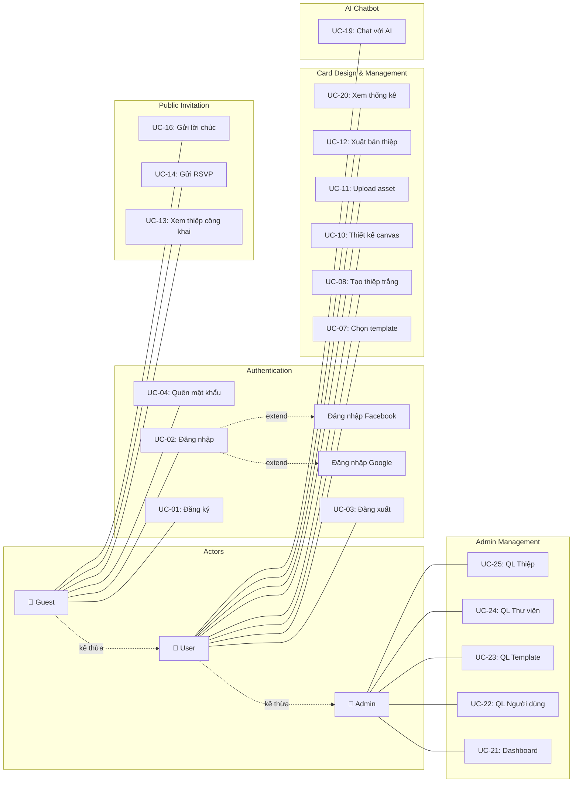
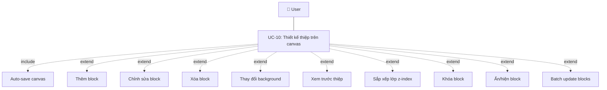
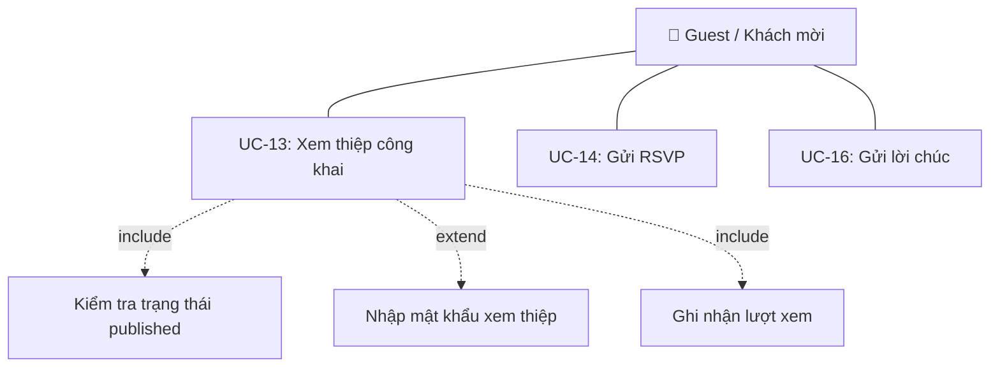
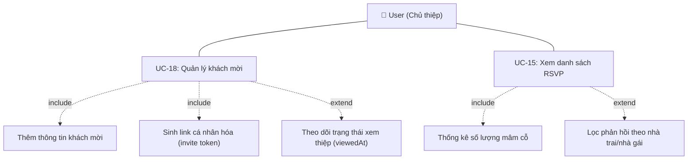
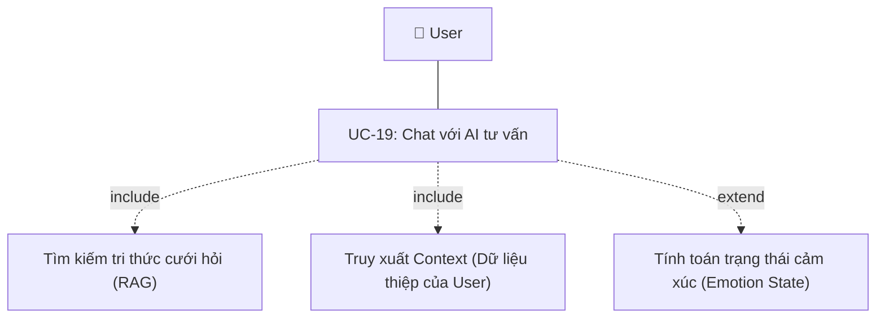
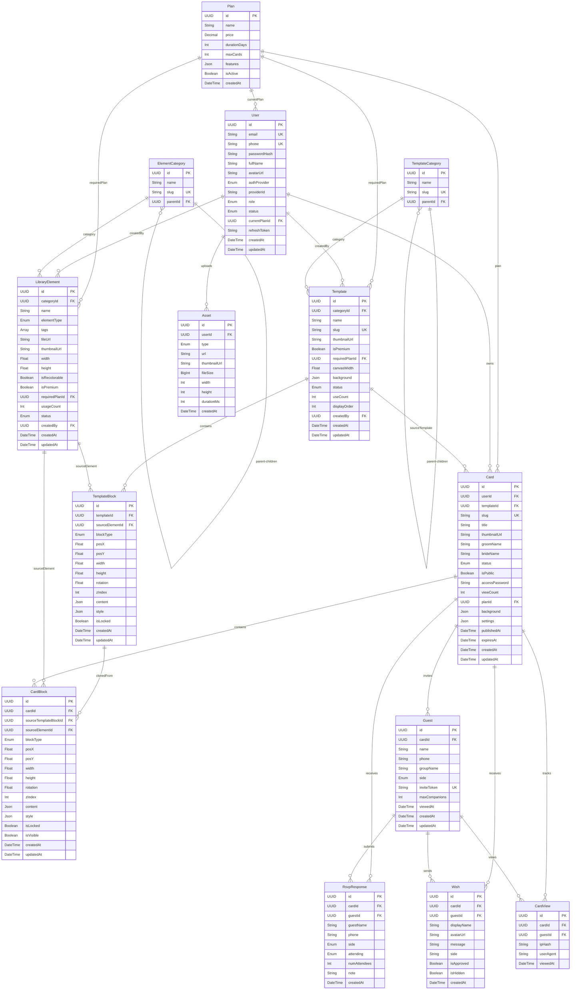
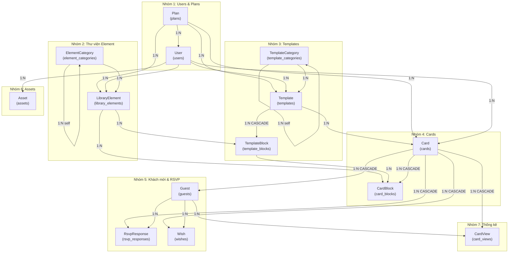

# CHƯƠNG 3: PHÂN TÍCH VÀ THIẾT KẾ HỆ THỐNG

---

## 3.1 Phân tích yêu cầu hệ thống

Phân tích yêu cầu hệ thống là bước quan trọng đầu tiên trong quy trình phát triển phần mềm, nhằm xác định rõ ràng những gì hệ thống cần thực hiện (yêu cầu chức năng) và những ràng buộc về chất lượng mà hệ thống phải đáp ứng (yêu cầu phi chức năng). Việc phân tích yêu cầu giúp đội ngũ phát triển có cái nhìn toàn diện về phạm vi dự án, từ đó đưa ra các quyết định thiết kế và triển khai phù hợp. Dưới đây là kết quả phân tích yêu cầu cho hệ thống Website thiết kế thiệp cưới điện tử trực tuyến.

### 3.1.1 Yêu cầu chức năng (Functional Requirements)

Với đặc thù của một nền tảng thiết kế thiệp cưới điện tử, hệ thống không chỉ dừng lại ở việc cung cấp công cụ vẽ đơn thuần, mà phải đảm đương toàn bộ vòng đời của một sự kiện cưới: từ lúc cô dâu chú rể lên ý tưởng chọn mẫu, thiết kế nội dung, cho đến khâu phát hành thiệp, mời khách và thống kê phản hồi. Quá trình phân tích đã bám sát hành trình thực tế của người dùng để số hóa các thao tác truyền thống thành các chức năng phần mềm.

Nhằm đảm bảo hệ thống đáp ứng trọn vẹn nghiệp vụ cưới hỏi, 64 yêu cầu chức năng cốt lõi đã được xác định và chia thành 11 phân hệ chính. Mỗi yêu cầu được đặc tả rõ ràng về hành vi, đối tượng thực hiện và mức độ ưu tiên triển khai như sau:

#### Nhóm 1: Authentication (Xác thực người dùng)

Để cá nhân hóa trải nghiệm và bảo vệ dữ liệu thiết kế thiệp, hệ thống yêu cầu người dùng (cô dâu, chú rể hoặc wedding planner) phải có tài khoản định danh. Nhóm chức năng này hỗ trợ việc đăng nhập nhanh chóng qua email hoặc mạng xã hội, đảm bảo mỗi tài khoản có một không gian làm việc riêng biệt và an toàn tuyệt đối cho các mẫu thiệp đang thiết kế dang dở.

| Mã FR | Tên chức năng | Mô tả | Actor | Mức ưu tiên |
|-------|---------------|-------|-------|-------------|
| FR-01 | Đăng ký tài khoản | Người dùng có thể đăng ký tài khoản mới bằng email và mật khẩu. Hệ thống kiểm tra tính duy nhất của email và số điện thoại trước khi tạo tài khoản. | Guest | Cao |
| FR-02 | Đăng nhập bằng email | Người dùng đăng nhập hệ thống bằng email và mật khẩu đã đăng ký. Hệ thống xác thực thông tin và cấp JWT Access Token cùng Refresh Token. | Guest | Cao |
| FR-03 | Đăng nhập bằng Google | Người dùng có thể đăng nhập nhanh bằng tài khoản Google thông qua giao thức OAuth 2.0. Nếu chưa có tài khoản, hệ thống tự động tạo mới. | Guest | Cao |
| FR-04 | Đăng nhập bằng Facebook | Người dùng có thể đăng nhập nhanh bằng tài khoản Facebook thông qua giao thức OAuth 2.0. Cơ chế hoạt động tương tự đăng nhập Google. | Guest | Trung bình |
| FR-05 | Đăng xuất | Người dùng đăng xuất khỏi hệ thống. Hệ thống xóa Refresh Token trong cơ sở dữ liệu và xóa các cookie liên quan trên trình duyệt. | User, Admin | Cao |
| FR-06 | Làm mới Access Token | Hệ thống tự động làm mới Access Token khi token hiện tại hết hạn bằng cách sử dụng Refresh Token (cơ chế Refresh Token Rotation). | User, Admin | Cao |
| FR-07 | Quên mật khẩu | Người dùng yêu cầu đặt lại mật khẩu qua email. Hệ thống gửi email chứa liên kết đặt lại mật khẩu với token có thời hạn. | Guest | Trung bình |
| FR-08 | Đặt lại mật khẩu | Người dùng sử dụng token nhận qua email để thiết lập mật khẩu mới. Hệ thống xác thực token và cập nhật mật khẩu đã hash. | Guest | Trung bình |

#### Nhóm 2: Template Management (Quản lý mẫu thiệp)

Không phải cặp đôi nào cũng có kỹ năng thiết kế chuyên nghiệp. Do đó, hệ thống cung cấp sẵn một kho mẫu thiệp cưới (template) đa dạng phong cách như Minimalism, Vintage hay Floral. Nhóm chức năng này cho phép đội ngũ admin xây dựng và phân loại kho giao diện, đồng thời giúp cô dâu chú rể dễ dàng "clone" (sao chép) một mẫu ưng ý làm điểm tựa để bắt đầu thiết kế thiệp của riêng mình.

| Mã FR | Tên chức năng | Mô tả | Actor | Mức ưu tiên |
|-------|---------------|-------|-------|-------------|
| FR-09 | Xem danh sách template | Người dùng duyệt các mẫu thiệp có sẵn, được phân loại theo danh mục (chủ đề, phong cách). Hỗ trợ tìm kiếm và lọc theo trạng thái. | User | Cao |
| FR-10 | Chọn template để tạo thiệp | Người dùng chọn một mẫu thiệp để bắt đầu thiết kế. Hệ thống clone toàn bộ block của template vào thiệp mới trong một transaction. | User | Cao |
| FR-11 | Quản lý template (Admin) | Admin tạo mới, chỉnh sửa, xóa và thay đổi trạng thái (draft/published/archived) của các mẫu thiệp. Admin cũng có thể thiết kế canvas cho template. | Admin | Cao |
| FR-12 | Upload thumbnail template | Admin tải lên hình ảnh đại diện cho template. Hình ảnh được upload lên Cloudinary và lưu URL vào cơ sở dữ liệu. | Admin | Trung bình |
| FR-13 | Quản lý danh mục template | Admin tạo, sửa, xóa các danh mục phân loại template (ví dụ: Tối giản, Hoa văn, Sang trọng). Hỗ trợ cấu trúc danh mục phân cấp cha-con. | Admin | Trung bình |
| FR-14 | Sắp xếp thứ tự template | Admin thay đổi thứ tự hiển thị của các template thông qua trường displayOrder, ảnh hưởng đến vị trí hiển thị trên trang chọn mẫu. | Admin | Thấp |

#### Nhóm 3: Card Management (Quản lý thiệp cưới)

Mỗi sự kiện cưới có thể cần nhiều phiên bản thiệp khác nhau (ví dụ: thiệp nhà trai, thiệp nhà gái, thiệp báo hỷ). Phân hệ này cho phép người dùng tạo, lưu trữ và thiết lập các thông tin cơ sở cho từng tấm thiệp như tên cô dâu chú rể, đường dẫn URL cá nhân hóa (slug), cài đặt nhạc nền lãng mạn, hoặc thậm chí đặt mật khẩu bảo vệ để đảm bảo sự riêng tư cho sự kiện.

| Mã FR | Tên chức năng | Mô tả | Actor | Mức ưu tiên |
|-------|---------------|-------|-------|-------------|
| FR-15 | Tạo thiệp mới | Người dùng tạo thiệp mới từ template có sẵn hoặc từ trang trắng. Hệ thống tự động sinh slug duy nhất từ tiêu đề thiệp. | User | Cao |
| FR-16 | Xem danh sách thiệp | Người dùng xem danh sách các thiệp đã tạo với phân trang, bộ lọc theo trạng thái (draft/published/archived) và tìm kiếm theo tên. | User | Cao |
| FR-17 | Cập nhật thông tin thiệp | Người dùng chỉnh sửa các thông tin cơ bản của thiệp bao gồm tiêu đề, tên cô dâu-chú rể, slug, background, cài đặt nhạc nền và theme. | User | Cao |
| FR-18 | Xóa thiệp | Người dùng có thể xóa mềm (chuyển sang archived) hoặc xóa cứng thiệp. Xóa cứng sẽ cascade xóa toàn bộ block, guest, RSVP và lời chúc. | User | Cao |
| FR-19 | Xuất bản thiệp | Người dùng chuyển trạng thái thiệp từ draft sang published. Hệ thống tự động ghi nhận thời điểm xuất bản (publishedAt). | User | Cao |
| FR-20 | Đặt mật khẩu xem thiệp | Người dùng tùy chọn đặt mật khẩu bảo vệ thiệp. Khách mời cần nhập đúng mật khẩu mới xem được nội dung. Mật khẩu được hash bằng bcrypt. | User | Trung bình |
| FR-21 | Đặt hạn hiển thị thiệp | Người dùng thiết lập ngày hết hạn cho thiệp. Sau thời điểm này, thiệp sẽ không còn truy cập được từ đường dẫn công khai. | User | Thấp |
| FR-22 | Xem thống kê thiệp | Người dùng xem các chỉ số thống kê của thiệp bao gồm: lượt xem, tổng RSVP, tổng lời chúc, số khách mời, phân loại theo nhà trai/nhà gái. | User | Trung bình |

#### Nhóm 4: Canvas Editor (Trình biên tập thiệp)

Đây là "trái tim" của hệ thống, nơi cung cấp một không gian thiết kế WYSIWYG (nhìn thấy là lấy được) dựa trên nền tảng Canvas. Người dùng có thể tự do kéo-thả các khối nội dung đặc thù của thiệp cưới như: bộ đếm ngược (countdown) đến ngày cử hành hôn lễ, bản đồ chỉ đường đến nhà hàng (map), mã QR mừng cưới, hay form phản hồi tham dự. Mọi thay đổi về vị trí, màu sắc, font chữ đều được tự động lưu lại theo thời gian thực.

| Mã FR | Tên chức năng | Mô tả | Actor | Mức ưu tiên |
|-------|---------------|-------|-------|-------------|
| FR-23 | Thêm block vào canvas | Người dùng thêm các block (text, image, shape, icon, video, audio, countdown, map, button, gallery, rsvp_form, wishes_wall, qr_code, calendar) vào canvas bằng thao tác kéo-thả. | User | Cao |
| FR-24 | Di chuyển block | Người dùng kéo-thả để thay đổi vị trí block trên canvas. Hệ thống lưu tọa độ (posX, posY) mới vào cơ sở dữ liệu. | User | Cao |
| FR-25 | Thay đổi kích thước block | Người dùng resize block bằng các handle kéo ở cạnh và góc. Hệ thống cập nhật width, height tương ứng. | User | Cao |
| FR-26 | Xoay block | Người dùng xoay block theo góc tùy ý. Hệ thống lưu giá trị rotation (đơn vị độ) vào cơ sở dữ liệu. | User | Trung bình |
| FR-27 | Chỉnh sửa nội dung block | Người dùng chỉnh sửa nội dung bên trong block: thay đổi văn bản, cập nhật hình ảnh, cấu hình ngày đếm ngược, thiết lập vị trí bản đồ, tùy chỉnh form RSVP, v.v. | User | Cao |
| FR-28 | Thay đổi style block | Người dùng tùy chỉnh phong cách hiển thị của block bao gồm: font chữ, màu sắc, bóng đổ, hiệu ứng animation, bo góc, viền, opacity. | User | Cao |
| FR-29 | Sắp xếp lớp (z-index) | Người dùng thay đổi thứ tự chồng lấp giữa các block thông qua các thao tác: Bring to Front, Send to Back, Bring Forward, Send Backward. | User | Trung bình |
| FR-30 | Khóa block | Người dùng khóa block để ngăn chặn việc vô tình di chuyển hoặc chỉnh sửa. Block bị khóa (isLocked = true) không thể tương tác trên canvas. | User | Thấp |
| FR-31 | Ẩn/hiện block | Người dùng tạm ẩn block khỏi canvas mà không xóa. Block ẩn (isVisible = false) không hiển thị khi xem thiệp công khai. | User | Thấp |
| FR-32 | Xóa block | Người dùng xóa block khỏi canvas. Hệ thống xóa bản ghi CardBlock tương ứng khỏi cơ sở dữ liệu. | User | Cao |
| FR-33 | Cập nhật hàng loạt block | Người dùng cập nhật nhiều block cùng lúc (multi-select drag, group move). Hệ thống xử lý batch update trong một lần request. | User | Trung bình |
| FR-34 | Auto-save canvas | Hệ thống tự động lưu toàn bộ trạng thái canvas mỗi 30 giây. Cơ chế sync đồng bộ: thêm block mới, cập nhật block thay đổi, xóa block đã bỏ. | User | Cao |
| FR-35 | Thay đổi background | Người dùng thay đổi nền của thiệp bằng màu đơn sắc, gradient, hoặc hình ảnh. Cấu hình background lưu dạng JSON. | User | Trung bình |
| FR-36 | Upload thumbnail thiệp | Người dùng tải lên hoặc hệ thống tự chụp ảnh đại diện cho thiệp. Thumbnail được sử dụng trong danh sách thiệp và chia sẻ mạng xã hội. | User | Trung bình |
| FR-37 | Xem trước thiệp (Preview) | Người dùng xem trước thiệp trên giao diện mô phỏng thiết bị di động trước khi xuất bản, đảm bảo nội dung hiển thị đúng như mong muốn. | User | Cao |

#### Nhóm 5: Asset Management (Quản lý tài nguyên)

Thiệp cưới điện tử vượt trội hơn thiệp giấy ở khả năng truyền tải đa phương tiện. Phân hệ này cho phép các cặp đôi tải lên album ảnh cưới (Pre-wedding), video câu chuyện tình yêu, hay bản nhạc nền yêu thích. Hệ thống sẽ xử lý và tối ưu dung lượng các tệp tin này trước khi lưu trữ, đảm bảo thiệp load nhanh trên thiết bị của khách mời.

| Mã FR | Tên chức năng | Mô tả | Actor | Mức ưu tiên |
|-------|---------------|-------|-------|-------------|
| FR-38 | Upload file media | Người dùng tải lên hình ảnh (JPEG, PNG, WebP, GIF), video (MP4, MOV) và audio (MP3, WAV) với giới hạn 20MB/file. File được lưu trên Cloudinary. | User | Cao |
| FR-39 | Upload font chữ | Người dùng tải lên font chữ tùy chỉnh (TTF, OTF, WOFF, WOFF2). Admin có thể tải font hệ thống dùng chung cho tất cả người dùng. | User, Admin | Trung bình |
| FR-40 | Xem danh sách asset | Người dùng xem danh sách tất cả media đã tải lên, bao gồm thông tin kích thước, loại file và thời gian tải. | User | Trung bình |
| FR-41 | Xóa asset | Người dùng xóa file media đã tải lên. Hệ thống xóa file trên Cloudinary và xóa bản ghi trong cơ sở dữ liệu. | User | Trung bình |
| FR-42 | Quản lý thư viện element | Admin quản lý thư viện element có sẵn (icon, shape, illustration, sticker, frame, photo) để người dùng tìm kiếm và sử dụng trong thiết kế. | Admin | Cao |
| FR-43 | Quản lý danh mục element | Admin tạo, sửa, xóa danh mục phân loại element (ví dụ: Hoa lá, Khung viền, Biểu tượng cưới). Hỗ trợ phân cấp cha-con. | Admin | Trung bình |
| FR-44 | Tìm kiếm element | Người dùng tìm kiếm element trong thư viện theo tên hoặc tag. Hệ thống hỗ trợ tìm kiếm gần đúng qua GIN index trên PostgreSQL. | User | Trung bình |

#### Nhóm 6: Guest Management (Quản lý khách mời)

Việc gửi thiệp hàng loạt thường thiếu đi sự trang trọng. Do đó, hệ thống cung cấp công cụ để chủ thiệp lập danh sách khách mời chi tiết (theo họ nhà trai, nhà gái, bạn bè, đồng nghiệp). Từ danh sách này, hệ thống sẽ tự động phát sinh các đường link thiệp cá nhân hóa cho từng người (ví dụ hiển thị đích danh "Kính mời anh A/chị B" trên thiệp) và theo dõi xem khách đã mở link xem thiệp hay chưa.

| Mã FR | Tên chức năng | Mô tả | Actor | Mức ưu tiên |
|-------|---------------|-------|-------|-------------|
| FR-45 | Thêm khách mời | Chủ thiệp thêm thông tin khách mời gồm: tên, số điện thoại, nhóm (họ nhà trai/nhà gái), số người đi kèm tối đa. Hệ thống sinh invite token duy nhất. | User | Trung bình |
| FR-46 | Xem danh sách khách mời | Chủ thiệp xem danh sách toàn bộ khách mời của một thiệp cụ thể, bao gồm trạng thái xem thiệp (viewedAt) và phân loại theo nhóm. | User | Trung bình |
| FR-47 | Sinh link cá nhân hóa | Hệ thống tạo URL riêng cho từng khách mời theo cấu trúc `/thiep/<slug>?to=<inviteToken>`, cho phép cá nhân hóa nội dung thiệp khi hiển thị. | User | Trung bình |

#### Nhóm 7: RSVP (Phản hồi tham dự)

Để giải quyết bài toán "dự kiến số lượng mâm cỗ" vốn gây đau đầu trong khâu tổ chức cưới, hệ thống tích hợp sẵn form RSVP (Xác nhận tham dự) trực tiếp trên thiệp. Khách mời chỉ cần vài thao tác chạm để phản hồi trạng thái đi dự và số người đi kèm. Dữ liệu này được tổng hợp tức thời về dashboard của cô dâu chú rể, giúp họ lên kế hoạch đặt tiệc nhà hàng chính xác nhất.

| Mã FR | Tên chức năng | Mô tả | Actor | Mức ưu tiên |
|-------|---------------|-------|-------|-------------|
| FR-48 | Gửi phản hồi RSVP | Khách mời gửi xác nhận tham dự (yes/no/maybe) kèm tên, số điện thoại, số người đi kèm, bên nhà trai/gái và ghi chú. Không cần đăng nhập. | Guest (Khách mời) | Cao |
| FR-49 | Xem danh sách RSVP | Chủ thiệp xem danh sách toàn bộ phản hồi RSVP, có thể lọc theo thiệp cụ thể. Hiển thị thống kê chi tiết số người tham dự. | User | Cao |

#### Nhóm 8: Wishes (Lời chúc)

Không chỉ là một trang thông tin một chiều, thiệp cưới điện tử còn đóng vai trò như một cuốn sổ lưu bút trực tuyến. Khách mời có thể gửi những lời chúc mừng hạnh phúc đến đôi uyên ương ngay trên giao diện xem thiệp. Về phía chủ thiệp, họ có toàn quyền quản trị, duyệt hoặc ẩn các lời chúc để đảm bảo không gian hiển thị luôn tích cực và văn minh.

| Mã FR | Tên chức năng | Mô tả | Actor | Mức ưu tiên |
|-------|---------------|-------|-------|-------------|
| FR-50 | Gửi lời chúc | Khách mời gửi lời chúc tới cô dâu chú rể kèm tên hiển thị, avatar (tùy chọn) và bên nhà trai/gái. Không cần đăng nhập. | Guest (Khách mời) | Cao |
| FR-51 | Xem danh sách lời chúc | Chủ thiệp xem toàn bộ lời chúc được gửi đến thiệp, có thể lọc theo thiệp cụ thể. | User | Trung bình |
| FR-52 | Duyệt/ẩn lời chúc | Chủ thiệp duyệt hoặc ẩn lời chúc trước khi hiển thị công khai trên tường lời chúc (wishes_wall) của thiệp. | User | Trung bình |
| FR-53 | Xóa lời chúc | Chủ thiệp xóa vĩnh viễn lời chúc không phù hợp khỏi hệ thống. | User | Thấp |

#### Nhóm 9: Chatbot AI

Quy trình tổ chức cưới hỏi thường đi kèm vô số quy tắc truyền thống và áp lực lên ý tưởng. Hệ thống tích hợp một chatbot AI đóng vai trò như một "Wedding Planner" ảo. AI này không chỉ am hiểu các phong tục cưới hỏi, cách viết lời mời sao cho khéo, mà còn có khả năng truy xuất dữ liệu thiệp của người dùng để trả lời chính xác số lượng khách đã RSVP hay gợi ý cách thiết kế thiệp phù hợp.

| Mã FR | Tên chức năng | Mô tả | Actor | Mức ưu tiên |
|-------|---------------|-------|-------|-------------|
| FR-54 | Chat với AI Linh | Người dùng trò chuyện với chatbot AI tên "Linh" — chuyên gia tư vấn cưới hỏi. AI hỗ trợ tư vấn thiết kế, hướng dẫn sử dụng và trả lời câu hỏi về cưới hỏi. | User | Cao |
| FR-55 | RAG Knowledge Search | Hệ thống sử dụng kỹ thuật RAG (Retrieval-Augmented Generation): nhúng (embed) câu hỏi thành vector, tìm kiếm ngữ nghĩa trong cơ sở tri thức, trả về ngữ cảnh phù hợp cho LLM. | System | Cao |
| FR-56 | Context từ dữ liệu người dùng | AI tự động truy xuất dữ liệu thiệp, RSVP, lời chúc của người dùng hiện tại để đưa vào ngữ cảnh hội thoại, cung cấp câu trả lời cá nhân hóa. | System | Trung bình |
| FR-57 | Emotion State trên mô hình 3D | AI trả về trạng thái cảm xúc (neutral, happy, excited, thinking) kèm câu trả lời, điều khiển animation 3D avatar của chatbot trên giao diện. | System | Thấp |

#### Nhóm 10: Admin (Quản trị hệ thống)

Đây là trung tâm điều khiển của hệ thống, giúp ban quản trị theo dõi bức tranh toàn cảnh về lượng người dùng mới, số lượng thiệp được xuất bản và các chỉ số tăng trưởng. Admin cũng là người trực tiếp quản lý kho thư viện thành phần (icon, sticker cưới), tạo ra các Template gốc, và quy định quyền lợi cho các gói tài khoản (Free, Premium, Pro) trên nền tảng.

| Mã FR | Tên chức năng | Mô tả | Actor | Mức ưu tiên |
|-------|---------------|-------|-------|-------------|
| FR-58 | Dashboard thống kê | Admin xem tổng quan hệ thống: tổng người dùng, tổng thiệp, tổng template, thiệp xuất bản, biểu đồ xu hướng 7 ngày, template phổ biến nhất, hoạt động gần đây. | Admin | Cao |
| FR-59 | Quản lý người dùng | Admin xem danh sách người dùng (phân trang, tìm kiếm), xem chi tiết, thay đổi trạng thái (active/suspended/unverified) và vai trò (user/admin). | Admin | Cao |
| FR-60 | Quản lý thiệp (Admin) | Admin xem danh sách tất cả thiệp trong hệ thống, thay đổi trạng thái công khai (isPublic) và xóa thiệp vi phạm. | Admin | Trung bình |
| FR-61 | Quản lý gói dịch vụ (Plan) | Admin quản lý các gói dịch vụ (Free, Premium, Pro) bao gồm giá, thời hạn, số thiệp tối đa và các tính năng đặc biệt. | Admin | Trung bình |

#### Nhóm 11: Public Invitation (Xem thiệp công khai)

Sản phẩm cuối cùng của hệ thống là một trang web thiệp cưới thực thụ hiển thị trên thiết bị của khách mời. Phân hệ này tập trung vào trải nghiệm của người xem: đảm bảo thiệp load mượt mà, hiển thị chuẩn xác (responsive) trên mọi kích thước màn hình điện thoại, và tối ưu hóa các thẻ meta để khi cô dâu chú rể chia sẻ link qua Zalo, Facebook, thiệp sẽ hiện hình ảnh thumbnail cưới thật đẹp mắt.

| Mã FR | Tên chức năng | Mô tả | Actor | Mức ưu tiên |
|-------|---------------|-------|-------|-------------|
| FR-62 | Xem thiệp công khai | Khách mời truy cập thiệp qua URL `/thiep/<slug>`. Hệ thống kiểm tra trạng thái published, quyền công khai, hạn hiển thị và mật khẩu (nếu có). | Guest (Khách mời) | Cao |
| FR-63 | Ghi nhận lượt xem | Hệ thống tự động tăng bộ đếm lượt xem (viewCount) mỗi khi khách truy cập thiệp. Xử lý bất đồng bộ, không block response. | System | Trung bình |
| FR-64 | Chia sẻ thiệp qua URL | Hệ thống cung cấp URL chia sẻ ngắn gọn dựa trên slug của thiệp. Người dùng có thể chia sẻ qua mạng xã hội, tin nhắn hoặc email. | User | Cao |

### 3.1.2 Yêu cầu phi chức năng (Non-Functional Requirements)

Bên cạnh các tính năng nghiệp vụ, một nền tảng thiết kế thiệp cưới đòi hỏi rất khắt khe về trải nghiệm mượt mà, bởi khách hàng thường thao tác kéo-thả hàng chục block hình ảnh, chữ viết trên cùng một canvas. Đồng thời, vào thời điểm cô dâu chú rể "phát thiệp", hệ thống có thể đón nhận lượng truy cập tăng vọt từ hàng trăm khách mời trong một thời gian ngắn.

Vì vậy, hệ thống phải đáp ứng các tiêu chuẩn kỹ thuật nghiêm ngặt về tốc độ phản hồi (đặc biệt cho trình biên tập canvas), tính toàn vẹn của dữ liệu (auto-save không mất nội dung), và khả năng chịu tải cao. Bảng dưới đây liệt kê chi tiết các yêu cầu phi chức năng thiết yếu để đảm bảo nền tảng luôn vận hành ổn định trong mùa cưới:

| Mã NFR | Nhóm | Tên yêu cầu | Mô tả chi tiết |
|--------|------|-------------|-----------------|
| NFR-01 | Performance | Thời gian phản hồi API | Các API thông thường (CRUD) phải phản hồi trong vòng 500ms. API tải trang thiệp công khai phản hồi dưới 2 giây bao gồm cả dữ liệu block. |
| NFR-02 | Performance | Hiệu suất Canvas Editor | Trình biên tập canvas phải hoạt động mượt mà với ít nhất 50 block đồng thời trên thiết bị di động và 100 block trên desktop, duy trì tối thiểu 30fps khi kéo-thả. |
| NFR-03 | Performance | Auto-save không gián đoạn | Cơ chế auto-save mỗi 30 giây phải hoạt động ngầm (background) mà không ảnh hưởng đến trải nghiệm thao tác kéo-thả của người dùng. |
| NFR-04 | Security | Xác thực JWT | Hệ thống sử dụng JWT (JSON Web Token) với cơ chế Access Token (thời hạn ngắn) và Refresh Token Rotation để đảm bảo an toàn phiên đăng nhập. |
| NFR-05 | Security | Mã hóa mật khẩu | Tất cả mật khẩu người dùng và mật khẩu xem thiệp phải được hash bằng thuật toán bcrypt với salt round tối thiểu 10 trước khi lưu vào cơ sở dữ liệu. |
| NFR-06 | Security | Phân quyền truy cập | Hệ thống phân quyền theo vai trò (RBAC): User chỉ truy cập tài nguyên của mình, Admin có quyền quản trị toàn bộ. Bảo vệ chống tấn công IDOR (Insecure Direct Object Reference). |
| NFR-07 | Security | Bảo vệ dữ liệu cá nhân | Hệ thống không lưu trữ IP thô của khách truy cập mà chỉ lưu hash IP (ipHash) trong bảng CardView. Cookie sử dụng cờ HttpOnly và Secure. |
| NFR-08 | Availability | Thời gian hoạt động | Hệ thống đảm bảo uptime tối thiểu 99% trong điều kiện vận hành bình thường, không tính thời gian bảo trì theo kế hoạch. |
| NFR-09 | Scalability | Khả năng mở rộng | Kiến trúc hệ thống tách biệt frontend và backend (decoupled), cho phép scale độc lập từng layer. Database sử dụng index tối ưu cho các truy vấn thường xuyên. |
| NFR-10 | Reliability | Tính nhất quán dữ liệu | Các thao tác phức tạp (tạo thiệp từ template, batch update blocks) sử dụng database transaction để đảm bảo tính atomicity — toàn bộ thành công hoặc toàn bộ rollback. |
| NFR-11 | Maintainability | Kiến trúc module hóa | Backend tổ chức theo mô hình Module của NestJS, mỗi module (auth, cards, templates, assets, rsvps, wishes, linh-ai) hoạt động độc lập, dễ bảo trì và mở rộng. |
| NFR-12 | Maintainability | API Documentation | Toàn bộ API được document tự động bằng Swagger/OpenAPI, mỗi endpoint có mô tả, ví dụ request/response, giúp đội ngũ phát triển và kiểm thử dễ dàng. |
| NFR-13 | Compatibility | Tương thích trình duyệt | Giao diện frontend hỗ trợ các trình duyệt hiện đại: Chrome (phiên bản 90+), Firefox (phiên bản 88+), Safari (phiên bản 14+), Edge (phiên bản 90+). |
| NFR-14 | Responsive | Thiết kế đáp ứng | Giao diện hệ thống tương thích với đa dạng kích thước màn hình: desktop (≥1024px), tablet (768–1023px) và mobile (≤767px). Canvas editor tối ưu cho mobile-first (414px). |
| NFR-15 | Accessibility | Khả năng truy cập | Thiệp công khai hiển thị tốt trên mọi thiết bị mà không cần đăng nhập. URL chia sẻ ngắn gọn, dễ nhớ và thân thiện với mạng xã hội. |
| NFR-16 | Backup | Sao lưu dữ liệu | Cơ sở dữ liệu PostgreSQL được sao lưu định kỳ. Media file lưu trữ trên Cloudinary với cơ chế backup riêng của nhà cung cấp dịch vụ đám mây. |
| NFR-17 | Logging | Ghi nhật ký | Hệ thống ghi log cho các sự kiện quan trọng: lỗi xác thực, lỗi AI, thao tác admin. Sử dụng Logger tích hợp của NestJS với phân cấp log level. |
| NFR-18 | Audit | Kiểm soát thay đổi | Mọi bản ghi quan trọng đều có trường createdAt và updatedAt (tự động cập nhật bởi Prisma) để theo dõi lịch sử tạo và chỉnh sửa. |
| NFR-19 | AI Response Time | Thời gian phản hồi AI | Chatbot AI phải phản hồi trong vòng 5 giây cho mỗi câu hỏi. Trong trường hợp lỗi kết nối API hoặc timeout, hệ thống trả về phản hồi fallback thân thiện. |

---

## 3.2 Phân tích Use Case

Phân tích use case là phương pháp mô hình hóa hành vi hệ thống dưới góc nhìn của người dùng cuối (actor). Mỗi use case đại diện cho một tương tác có ý nghĩa giữa actor và hệ thống nhằm đạt được một mục tiêu cụ thể. Việc phân tích use case giúp xác định rõ phạm vi chức năng, luồng xử lý chính và các trường hợp ngoại lệ, làm nền tảng cho việc thiết kế kiến trúc và triển khai chi tiết.

### 3.2.1 Xác định Actor

Hệ thống xác định ba nhóm tác nhân (actor) chính tương tác với các chức năng khác nhau của hệ thống:

**Actor 1: Guest (Khách / Người dùng chưa đăng nhập)**

Guest là tác nhân đại diện cho bất kỳ ai truy cập hệ thống mà chưa đăng nhập, bao gồm cả khách mời xem thiệp. Guest có quyền hạn giới hạn, chỉ có thể thực hiện các thao tác không yêu cầu xác thực. Cụ thể, Guest có thể đăng ký tài khoản mới, đăng nhập vào hệ thống, xem thiệp cưới công khai thông qua URL chia sẻ, gửi phản hồi tham dự (RSVP) và gửi lời chúc mừng tới cô dâu chú rể. Các use case mà Guest tham gia bao gồm: Đăng ký, Đăng nhập, Xem thiệp công khai, Gửi RSVP, Gửi lời chúc, Quên mật khẩu và Đặt lại mật khẩu.

**Actor 2: User (Người dùng đã đăng nhập)**

User là tác nhân chính của hệ thống, đại diện cho người dùng đã xác thực thành công. User có đầy đủ quyền hạn để sử dụng các tính năng cốt lõi của hệ thống. User có thể quản lý thiệp cưới (tạo, sửa, xóa, xuất bản), thiết kế thiệp trên canvas editor với khả năng kéo-thả các block đa dạng, quản lý tài nguyên media (upload, xem, xóa hình ảnh/video/audio/font), quản lý danh sách khách mời, theo dõi phản hồi RSVP và lời chúc, xem thống kê thiệp, và trò chuyện với chatbot AI để được tư vấn thiết kế. Các use case mà User tham gia bao gồm: toàn bộ chức năng của Guest cộng thêm Thiết kế thiệp, Quản lý thiệp, Quản lý asset, Quản lý khách mời, Xem RSVP, Quản lý lời chúc, Chat với AI, Xem thống kê, Quản lý hồ sơ cá nhân.

**Actor 3: Admin (Quản trị viên)**

Admin là tác nhân có quyền hạn cao nhất trong hệ thống, chịu trách nhiệm quản trị và vận hành toàn bộ nền tảng. Admin thừa kế toàn bộ quyền của User và được bổ sung các quyền quản trị đặc biệt. Admin có thể quản lý người dùng (xem, thay đổi trạng thái, thay đổi vai trò), quản lý template (tạo, sửa, xóa, thiết kế canvas, upload thumbnail, thay đổi trạng thái), quản lý thư viện element, quản lý danh mục phân loại, quản lý thiệp của tất cả người dùng, quản lý gói dịch vụ, và xem dashboard thống kê tổng quan. Các use case mà Admin tham gia bao gồm: toàn bộ chức năng của User cộng thêm Dashboard thống kê, Quản lý người dùng, Quản lý template, Quản lý thư viện element, Quản lý danh mục, Quản lý thiệp (Admin), Quản lý gói dịch vụ.

### 3.2.2 Danh sách Use Case

Bảng dưới đây liệt kê toàn bộ các use case của hệ thống, được tổ chức theo nhóm chức năng và gắn với actor tương ứng:

| UC ID | Use Case Name | Actor | Brief Description |
|-------|---------------|-------|-------------------|
| UC-01 | Đăng ký tài khoản | Guest | Tạo tài khoản mới bằng email, mật khẩu, họ tên và số điện thoại |
| UC-02 | Đăng nhập | Guest | Xác thực bằng email/mật khẩu hoặc OAuth (Google/Facebook) |
| UC-03 | Đăng xuất | User, Admin | Kết thúc phiên đăng nhập, xóa token |
| UC-04 | Quên mật khẩu | Guest | Yêu cầu gửi email đặt lại mật khẩu |
| UC-05 | Đặt lại mật khẩu | Guest | Thiết lập mật khẩu mới qua link email |
| UC-06 | Xem danh sách template | User | Duyệt, tìm kiếm và lọc các mẫu thiệp có sẵn |
| UC-07 | Chọn template tạo thiệp | User | Chọn mẫu thiệp và clone vào thiệp mới |
| UC-08 | Tạo thiệp trắng | User | Tạo thiệp mới không dùng template |
| UC-09 | Xem danh sách thiệp | User | Xem, tìm kiếm và lọc các thiệp đã tạo |
| UC-10 | Thiết kế thiệp trên canvas | User | Kéo-thả, chỉnh sửa các block trên canvas editor |
| UC-11 | Upload asset | User | Tải lên hình ảnh, video, audio, font chữ |
| UC-12 | Xuất bản thiệp | User | Chuyển thiệp từ draft sang published |
| UC-13 | Xem thiệp công khai | Guest | Truy cập thiệp qua URL slug |
| UC-14 | Gửi RSVP | Guest (Khách mời) | Gửi phản hồi xác nhận tham dự |
| UC-15 | Xem danh sách RSVP | User | Xem và thống kê phản hồi tham dự |
| UC-16 | Gửi lời chúc | Guest (Khách mời) | Gửi lời chúc mừng tới cô dâu chú rể |
| UC-17 | Quản lý lời chúc | User | Duyệt, ẩn, xóa lời chúc |
| UC-18 | Quản lý khách mời | User | Thêm, xem, sinh link cá nhân hóa cho khách |
| UC-19 | Chat với AI | User | Trò chuyện với chatbot AI tư vấn cưới hỏi |
| UC-20 | Xem thống kê thiệp | User | Xem các chỉ số: lượt xem, RSVP, lời chúc |
| UC-21 | Dashboard thống kê (Admin) | Admin | Xem tổng quan hệ thống: người dùng, thiệp, biểu đồ |
| UC-22 | Quản lý người dùng | Admin | CRUD người dùng, thay đổi trạng thái/vai trò |
| UC-23 | Quản lý template (Admin) | Admin | CRUD template, thiết kế canvas, upload thumbnail |
| UC-24 | Quản lý thư viện element | Admin | CRUD element, upload file, quản lý danh mục |
| UC-25 | Quản lý thiệp (Admin) | Admin | Xem, thay đổi visibility, xóa thiệp toàn hệ thống |

### 3.2.3 Use Case Diagram

Dưới đây là sơ đồ Use Case tổng quan được mô tả bằng cú pháp Mermaid, thể hiện mối quan hệ giữa các actor và các use case chính của hệ thống. Sơ đồ được chia thành các nhóm chức năng rõ ràng, sử dụng quan hệ `<<include>>` cho các use case bắt buộc đi kèm và `<<extend>>` cho các use case mở rộng tùy chọn.

#### Sơ đồ Use Case tổng quan

```
Hệ thống: Online Wedding Invitation Builder

Actor: Guest, User (kế thừa từ Guest), Admin (kế thừa từ User)

═══════════════════════════════════════════════════════════════
NHÓM AUTHENTICATION
═══════════════════════════════════════════════════════════════
Guest ──── UC-01: Đăng ký tài khoản
Guest ──── UC-02: Đăng nhập
              ├── <<extend>> Đăng nhập bằng Google
              └── <<extend>> Đăng nhập bằng Facebook
Guest ──── UC-04: Quên mật khẩu
              └── <<include>> UC-05: Đặt lại mật khẩu
User  ──── UC-03: Đăng xuất

═══════════════════════════════════════════════════════════════
NHÓM TEMPLATE
═══════════════════════════════════════════════════════════════
User  ──── UC-06: Xem danh sách template
User  ──── UC-07: Chọn template tạo thiệp
              └── <<include>> UC-06: Xem danh sách template

═══════════════════════════════════════════════════════════════
NHÓM CARD MANAGEMENT
═══════════════════════════════════════════════════════════════
User  ──── UC-08: Tạo thiệp trắng
User  ──── UC-09: Xem danh sách thiệp
User  ──── UC-10: Thiết kế thiệp trên canvas
              ├── <<include>> Auto-save canvas
              ├── <<extend>> Thêm block
              ├── <<extend>> Chỉnh sửa block
              ├── <<extend>> Xóa block
              ├── <<extend>> Thay đổi background
              └── <<extend>> Xem trước thiệp
User  ──── UC-11: Upload asset
User  ──── UC-12: Xuất bản thiệp
              └── <<include>> Sinh URL chia sẻ

═══════════════════════════════════════════════════════════════
NHÓM PUBLIC INVITATION
═══════════════════════════════════════════════════════════════
Guest ──── UC-13: Xem thiệp công khai
              ├── <<include>> Kiểm tra trạng thái published
              ├── <<extend>> Nhập mật khẩu xem thiệp
              └── <<include>> Ghi nhận lượt xem
Guest ──── UC-14: Gửi RSVP
Guest ──── UC-16: Gửi lời chúc

═══════════════════════════════════════════════════════════════
NHÓM GUEST & RSVP MANAGEMENT
═══════════════════════════════════════════════════════════════
User  ──── UC-15: Xem danh sách RSVP
User  ──── UC-17: Quản lý lời chúc
User  ──── UC-18: Quản lý khách mời
User  ──── UC-20: Xem thống kê thiệp

═══════════════════════════════════════════════════════════════
NHÓM AI CHATBOT
═══════════════════════════════════════════════════════════════
User  ──── UC-19: Chat với AI
              ├── <<include>> RAG Knowledge Search
              └── <<include>> Truy xuất context người dùng

═══════════════════════════════════════════════════════════════
NHÓM ADMIN
═══════════════════════════════════════════════════════════════
Admin ──── UC-21: Dashboard thống kê
Admin ──── UC-22: Quản lý người dùng
Admin ──── UC-23: Quản lý template (Admin)
Admin ──── UC-24: Quản lý thư viện element
Admin ──── UC-25: Quản lý thiệp (Admin)

Quan hệ kế thừa:
  User  ◄── extends ── Guest
  Admin ◄── extends ── User
```

#### Sơ đồ Mermaid — Use Case tổng quan hệ thống



#### Sơ đồ Mermaid — Use Case chi tiết: Thiết kế thiệp trên Canvas



#### Sơ đồ Mermaid — Use Case chi tiết: Xem thiệp công khai



#### Sơ đồ Mermaid — Use Case chi tiết: Quản lý khách mời và RSVP



#### Sơ đồ Mermaid — Use Case chi tiết: Trợ lý AI (Chatbot RAG)



### 3.2.4 Đặc tả Use Case

Phần này trình bày đặc tả chi tiết các use case quan trọng nhất của hệ thống. Mỗi use case được mô tả đầy đủ bao gồm mục tiêu, actor, tiền điều kiện, hậu điều kiện, luồng sự kiện chính, luồng thay thế và xử lý ngoại lệ.

---

#### UC-02: Đăng nhập

| Thuộc tính | Mô tả |
|------------|-------|
| **Mục tiêu** | Xác thực người dùng và cấp quyền truy cập hệ thống |
| **Actor** | Guest |
| **Tiền điều kiện** | Người dùng đã có tài khoản trong hệ thống. Người dùng chưa đăng nhập (chưa có Access Token hợp lệ). |
| **Hậu điều kiện** | Người dùng được cấp Access Token và Refresh Token. Refresh Token được lưu vào cơ sở dữ liệu và cookie HttpOnly. Người dùng được chuyển hướng đến trang Dashboard. |

**Luồng chính (Main Flow):**

1. Người dùng truy cập trang đăng nhập.
2. Người dùng nhập địa chỉ email và mật khẩu.
3. Người dùng nhấn nút "Đăng nhập".
4. Hệ thống xác thực email tồn tại trong cơ sở dữ liệu.
5. Hệ thống so sánh mật khẩu nhập vào với mật khẩu đã hash bằng bcrypt.
6. Hệ thống kiểm tra trạng thái tài khoản (phải là `active`).
7. Hệ thống sinh JWT Access Token (chứa userId, email, role) và Refresh Token.
8. Hệ thống lưu Refresh Token vào cơ sở dữ liệu và set cookie `refresh_token` (HttpOnly, Secure, SameSite).
9. Hệ thống trả về Access Token, Refresh Token và thông tin người dùng.
10. Frontend lưu Access Token và chuyển hướng đến trang Dashboard.

**Luồng thay thế (Alternative Flow):**

- **A1 — Đăng nhập bằng Google:** Tại bước 2, người dùng nhấn nút "Đăng nhập bằng Google". Hệ thống chuyển hướng đến trang xác thực Google OAuth 2.0. Sau khi xác thực thành công, Google callback trả về thông tin người dùng. Hệ thống tìm hoặc tạo tài khoản OAuth (`findOrCreateOAuthUser`), sau đó thực hiện bước 7–10.
- **A2 — Đăng nhập bằng Facebook:** Tương tự A1 nhưng sử dụng Facebook OAuth 2.0.

**Ngoại lệ (Exception):**

- **E1:** Email không tồn tại → Hệ thống trả về lỗi 401 "Email hoặc mật khẩu không chính xác".
- **E2:** Mật khẩu không khớp → Hệ thống trả về lỗi 401 "Email hoặc mật khẩu không chính xác".
- **E3:** Tài khoản bị khóa (status = `suspended`) → Hệ thống trả về lỗi 403 "Tài khoản đã bị tạm khóa".
- **E4:** Tài khoản chưa xác minh (status = `unverified`) → Hệ thống trả về lỗi 403 "Tài khoản chưa được xác minh".

---

#### UC-01: Đăng ký tài khoản

| Thuộc tính | Mô tả |
|------------|-------|
| **Mục tiêu** | Tạo tài khoản mới cho người dùng |
| **Actor** | Guest |
| **Tiền điều kiện** | Người dùng chưa có tài khoản với email này trong hệ thống. |
| **Hậu điều kiện** | Tài khoản mới được tạo với trạng thái `unverified`. Mật khẩu được hash bằng bcrypt. Người dùng được gán vai trò `user` và gói `Free` mặc định. |

**Luồng chính (Main Flow):**

1. Người dùng truy cập trang đăng ký.
2. Người dùng nhập các thông tin: email, mật khẩu, xác nhận mật khẩu, họ tên đầy đủ, số điện thoại (tùy chọn).
3. Người dùng nhấn nút "Đăng ký".
4. Hệ thống validate dữ liệu đầu vào: email hợp lệ, mật khẩu đủ độ dài tối thiểu, xác nhận mật khẩu khớp.
5. Hệ thống kiểm tra email và số điện thoại chưa tồn tại trong cơ sở dữ liệu.
6. Hệ thống hash mật khẩu bằng bcrypt.
7. Hệ thống tạo bản ghi User mới với authProvider = `email`, role = `user`, status = `unverified`.
8. Hệ thống trả về thông tin tài khoản đã tạo (không bao gồm mật khẩu).
9. Người dùng được chuyển hướng đến trang đăng nhập.

**Luồng thay thế:** Không có.

**Ngoại lệ (Exception):**

- **E1:** Email đã tồn tại → Hệ thống trả về lỗi 409 "Email đã được sử dụng".
- **E2:** Số điện thoại đã tồn tại → Hệ thống trả về lỗi 409 "Số điện thoại đã được sử dụng".
- **E3:** Dữ liệu đầu vào không hợp lệ → Hệ thống trả về lỗi 400 kèm danh sách lỗi validation.

---

#### UC-10: Thiết kế thiệp trên canvas

| Thuộc tính | Mô tả |
|------------|-------|
| **Mục tiêu** | Cho phép người dùng thiết kế thiệp cưới bằng trình biên tập canvas kéo-thả trực quan |
| **Actor** | User |
| **Tiền điều kiện** | Người dùng đã đăng nhập. Thiệp đã được tạo (từ template hoặc trang trắng). |
| **Hậu điều kiện** | Trạng thái canvas được lưu vào cơ sở dữ liệu. Tất cả block được lưu với đầy đủ thông tin vị trí, kích thước, nội dung và phong cách. |

**Luồng chính (Main Flow):**

1. Người dùng mở thiệp trong chế độ chỉnh sửa (Canvas Editor).
2. Hệ thống tải toàn bộ block của thiệp từ API (sắp xếp theo zIndex).
3. Canvas hiển thị các block hiện có và thanh công cụ bên trái (LeftToolbar) với các tùy chọn thêm block.
4. Người dùng chọn loại block cần thêm từ toolbar (text, image, shape, icon, countdown, map, gallery, rsvp_form, wishes_wall, qr_code, calendar, button, video, audio).
5. Hệ thống tạo block mới với vị trí, kích thước mặc định và thêm vào canvas.
6. Người dùng kéo-thả block để thay đổi vị trí (posX, posY).
7. Người dùng resize block bằng các handle ở cạnh và góc (width, height).
8. Người dùng chỉnh sửa nội dung block thông qua bảng thuộc tính bên phải (RightPanel): thay đổi text, chọn ảnh, cấu hình countdown, thiết lập bản đồ, v.v.
9. Người dùng tùy chỉnh phong cách block: font, màu sắc, bóng đổ, hiệu ứng animation, opacity, bo góc.
10. Cứ mỗi 30 giây, hệ thống tự động gọi API `POST /cards/:id/save` để đồng bộ toàn bộ trạng thái canvas (auto-save).
11. Người dùng nhấn nút "Xem trước" để kiểm tra thiệp trên giao diện mô phỏng thiết bị di động.

**Luồng thay thế:**

- **A1 — Thêm block từ thư viện element:** Tại bước 4, người dùng mở bảng Library, tìm kiếm element theo tên/tag, kéo element vào canvas. Hệ thống tạo CardBlock với `sourceElementId` trỏ đến LibraryElement gốc.
- **A2 — Batch update:** Người dùng chọn nhiều block cùng lúc (multi-select) và di chuyển nhóm. Hệ thống gọi API `PATCH /cards/:cardId/blocks/batch` để cập nhật hàng loạt.
- **A3 — Sắp xếp lớp:** Người dùng click chuột phải vào block và chọn "Bring to Front / Send to Back" để thay đổi thứ tự z-index.
- **A4 — Khóa block:** Người dùng khóa block (isLocked = true) để ngăn chặn chỉnh sửa vô tình. Block bị khóa hiển thị biểu tượng ổ khóa.
- **A5 — Crop ảnh:** Khi chỉnh sửa block hình ảnh, người dùng mở modal ImageCropModal để cắt và chỉnh sửa ảnh trước khi lưu.

**Ngoại lệ (Exception):**

- **E1:** Mất kết nối mạng → Auto-save queue lưu lại thay đổi cục bộ và tự động thử lại khi có mạng.
- **E2:** Thiệp không thuộc quyền sở hữu → API trả về lỗi 403 "Bạn không có quyền thao tác thiệp này".
- **E3:** Block không tồn tại → API trả về lỗi 404 "Không tìm thấy block".

---

#### UC-07: Chọn Template để tạo thiệp

| Thuộc tính | Mô tả |
|------------|-------|
| **Mục tiêu** | Người dùng chọn mẫu thiệp có sẵn để bắt đầu thiết kế |
| **Actor** | User |
| **Tiền điều kiện** | Người dùng đã đăng nhập. Hệ thống có ít nhất một template với trạng thái `published`. |
| **Hậu điều kiện** | Thiệp mới được tạo với slug duy nhất. Toàn bộ TemplateBlock được clone thành CardBlock. UseCount của template tăng 1. |

**Luồng chính (Main Flow):**

1. Người dùng truy cập trang chọn template.
2. Hệ thống hiển thị danh sách template theo danh mục (TemplateCategory), sắp xếp theo displayOrder.
3. Người dùng duyệt, tìm kiếm và chọn template mong muốn.
4. Người dùng nhập thông tin cơ bản: tiêu đề thiệp, tên chú rể, tên cô dâu.
5. Người dùng nhấn nút "Tạo thiệp".
6. Hệ thống bắt đầu transaction cơ sở dữ liệu:
   - Sinh slug duy nhất từ tiêu đề.
   - Tạo bản ghi Card với templateId, background và canvasWidth kế thừa từ template.
   - Clone toàn bộ TemplateBlock thành CardBlock (giữ nguyên vị trí, kích thước, nội dung, style).
   - Tăng useCount của template.
7. Hệ thống commit transaction và trả về thiệp mới kèm blocks.
8. Người dùng được chuyển hướng đến Canvas Editor để bắt đầu tùy chỉnh.

**Luồng thay thế:** Không có.

**Ngoại lệ (Exception):**

- **E1:** Template không tồn tại → Hệ thống trả về lỗi 404 "Không tìm thấy template".
- **E2:** Template chưa published → Hệ thống trả về lỗi 400 "Template chưa được phát hành".
- **E3:** Transaction thất bại → Toàn bộ thao tác rollback, người dùng nhận thông báo lỗi và được yêu cầu thử lại.

---

#### UC-11: Upload Asset

| Thuộc tính | Mô tả |
|------------|-------|
| **Mục tiêu** | Tải lên tài nguyên media (ảnh, video, audio, font) để sử dụng trong thiết kế thiệp |
| **Actor** | User |
| **Tiền điều kiện** | Người dùng đã đăng nhập. |
| **Hậu điều kiện** | File được tải lên Cloudinary. Bản ghi Asset được tạo trong cơ sở dữ liệu với URL, loại file, kích thước và metadata. |

**Luồng chính (Main Flow):**

1. Người dùng nhấn nút "Upload" trong bảng Asset hoặc trong Canvas Editor.
2. Hệ thống mở hộp thoại chọn file với bộ lọc theo loại file được phép.
3. Người dùng chọn file từ thiết bị (hỗ trợ: JPEG, PNG, WebP, GIF, MP4, MOV, MP3, WAV).
4. Hệ thống kiểm tra MIME type của file thuộc danh sách cho phép.
5. Hệ thống kiểm tra kích thước file không vượt quá 20MB.
6. Hệ thống tải file lên Cloudinary và nhận URL của file.
7. Hệ thống xử lý ảnh bằng Sharp: tạo thumbnail, trích xuất metadata (width, height, duration).
8. Hệ thống tạo bản ghi Asset trong cơ sở dữ liệu với đầy đủ thông tin.
9. Hệ thống trả về thông tin asset đã tạo bao gồm URL để sử dụng trong canvas.

**Luồng thay thế:**

- **A1 — Upload font chữ:** Tại bước 3, người dùng chọn file font (TTF, OTF, WOFF, WOFF2). Hệ thống kiểm tra extension file font hợp lệ. Admin có thể tải font hệ thống (userId = null) để dùng chung cho tất cả người dùng.

**Ngoại lệ (Exception):**

- **E1:** Định dạng file không hỗ trợ → Hệ thống trả về lỗi 400 "Định dạng file không được hỗ trợ".
- **E2:** File quá lớn (>20MB) → Hệ thống trả về lỗi 400 "Kích thước file vượt quá giới hạn".
- **E3:** Lỗi upload Cloudinary → Hệ thống ghi log lỗi và trả về lỗi 500.

---

#### UC-12: Xuất bản thiệp

| Thuộc tính | Mô tả |
|------------|-------|
| **Mục tiêu** | Chuyển thiệp từ trạng thái draft sang published, cho phép chia sẻ công khai |
| **Actor** | User |
| **Tiền điều kiện** | Người dùng đã đăng nhập. Thiệp đang ở trạng thái `draft`. Thiệp có ít nhất một block. |
| **Hậu điều kiện** | Trạng thái thiệp chuyển thành `published`. Thời điểm xuất bản (publishedAt) được ghi nhận. URL công khai `/thiep/<slug>` có thể truy cập. |

**Luồng chính (Main Flow):**

1. Người dùng mở modal "Xuất bản thiệp" (PublishModal) từ Canvas Editor.
2. Hệ thống hiển thị form cấu hình xuất bản: slug tùy chỉnh, mật khẩu xem thiệp (tùy chọn), ngày hết hạn (tùy chọn), quyền công khai (isPublic).
3. Người dùng tùy chỉnh slug (hệ thống kiểm tra slug khả dụng qua API `GET /cards/check-slug`).
4. Người dùng nhấn nút "Xuất bản".
5. Hệ thống cập nhật Card: status = `published`, publishedAt = thời điểm hiện tại.
6. Nếu có mật khẩu, hệ thống hash mật khẩu bằng bcrypt trước khi lưu.
7. Hệ thống trả về URL công khai của thiệp.
8. Người dùng có thể sao chép URL để chia sẻ qua mạng xã hội, email hoặc tin nhắn.

**Luồng thay thế:**

- **A1 — Upload thumbnail trước khi xuất bản:** Người dùng tải lên hoặc chụp ảnh đại diện cho thiệp. Thumbnail được sử dụng khi chia sẻ trên mạng xã hội (OG Image).

**Ngoại lệ (Exception):**

- **E1:** Slug đã tồn tại → Hệ thống thông báo "Slug này đã được sử dụng" và gợi ý slug thay thế.
- **E2:** Thiệp không có block nào → Hệ thống cảnh báo "Thiệp chưa có nội dung".

---

#### UC-14: Gửi phản hồi RSVP

| Thuộc tính | Mô tả |
|------------|-------|
| **Mục tiêu** | Khách mời xác nhận tham dự hoặc từ chối lời mời |
| **Actor** | Guest (Khách mời) |
| **Tiền điều kiện** | Thiệp đã được xuất bản (published). Thiệp có block RSVP form trên canvas. |
| **Hậu điều kiện** | Bản ghi RsvpResponse được tạo trong cơ sở dữ liệu, liên kết với cardId và guestId (nếu có). |

**Luồng chính (Main Flow):**

1. Khách mời truy cập thiệp công khai và cuộn đến phần RSVP form.
2. Khách mời nhập thông tin: tên, số điện thoại, chọn bên nhà trai/nhà gái/cả hai.
3. Khách mời chọn trạng thái tham dự: Sẽ tham dự (yes) / Không thể tham dự (no) / Chưa chắc chắn (maybe).
4. Khách mời nhập số người đi kèm (numAttendees) và ghi chú (tùy chọn).
5. Khách mời nhấn nút "Gửi xác nhận".
6. Hệ thống gọi API `POST /rsvps/public/:cardId` (không yêu cầu JWT).
7. Hệ thống tạo bản ghi RsvpResponse. Nếu khách truy cập qua link cá nhân hóa (có inviteToken), hệ thống liên kết guestId tương ứng.
8. Hệ thống trả về xác nhận thành công.
9. Giao diện hiển thị thông báo "Cảm ơn bạn đã xác nhận tham dự!".

**Luồng thay thế:** Không có.

**Ngoại lệ (Exception):**

- **E1:** Thiệp không tồn tại → Hệ thống trả về lỗi 404.
- **E2:** Thiệp chưa published → Hệ thống trả về lỗi 404 "Thiệp chưa được phát hành".
- **E3:** Dữ liệu thiếu (tên bắt buộc) → Hệ thống trả về lỗi 400 kèm thông tin validation.

---

#### UC-19: Chat với AI

| Thuộc tính | Mô tả |
|------------|-------|
| **Mục tiêu** | Người dùng trò chuyện với chatbot AI "Linh" để được tư vấn về cưới hỏi, thiết kế thiệp và hướng dẫn sử dụng |
| **Actor** | User |
| **Tiền điều kiện** | Người dùng đã đăng nhập. API Gemini đã được cấu hình với API Key hợp lệ. Vector store đã được khởi tạo với cơ sở tri thức. |
| **Hậu điều kiện** | Câu trả lời từ AI được hiển thị kèm trạng thái cảm xúc (emotion) điều khiển animation 3D. |

**Luồng chính (Main Flow):**

1. Người dùng mở cửa sổ chat AI (avatar 3D "Linh") trên giao diện.
2. Người dùng nhập câu hỏi và gửi đi.
3. Frontend gọi API `POST /linh-ai/chat` kèm JWT token, gửi query và lịch sử hội thoại (history).
4. Backend thực hiện pipeline RAG (Retrieval-Augmented Generation):
   - **Bước 4a:** Truy xuất dữ liệu thiệp của người dùng từ database (buildUserContext): danh sách thiệp, số RSVP, số lời chúc.
   - **Bước 4b:** Nhúng (embed) câu hỏi thành vector bằng mô hình Gemini Embedding.
   - **Bước 4c:** Tìm kiếm ngữ nghĩa (cosine similarity) trong vector store để tìm top-3 tài liệu phù hợp nhất.
   - **Bước 4d:** Kết hợp context (dữ liệu người dùng + knowledge base) vào prompt.
   - **Bước 4e:** Gọi Gemini 2.5 Flash với system prompt chuyên gia cưới hỏi, yêu cầu trả về JSON có 2 trường: `emotion` (neutral/happy/excited/thinking) và `response`.
5. Backend parse kết quả JSON và trả về cho frontend.
6. Frontend hiển thị câu trả lời trong cửa sổ chat và cập nhật animation 3D avatar theo trạng thái emotion.

**Luồng thay thế:**

- **A1 — Câu hỏi về dữ liệu cá nhân:** Nếu người dùng hỏi về thống kê thiệp (ví dụ: "Bao nhiêu người xác nhận tham dự?"), AI sử dụng context từ buildUserContext để trả lời chính xác dựa trên dữ liệu thực.
- **A2 — Câu hỏi kiến thức phổ thông:** Nếu context không có thông tin nhưng câu hỏi thuộc kiến thức phổ thông (đổi lịch âm/dương, phong tục cưới), AI sử dụng kiến thức nền để trả lời.

**Ngoại lệ (Exception):**

- **E1:** API Gemini lỗi hoặc timeout → Hệ thống trả về fallback response: `{ emotion: "thinking", response: "Xin lỗi bạn, Linh đang gặp chút sự cố kỹ thuật..." }`.
- **E2:** Rate limit embedding API → Hệ thống retry sau 15 giây, tối đa 5 lần.
- **E3:** Vector store chưa sẵn sàng → Tìm kiếm trả về mảng rỗng, AI trả lời dựa trên kiến thức nền.

---

#### UC-23: Quản lý Template (Admin)

| Thuộc tính | Mô tả |
|------------|-------|
| **Mục tiêu** | Admin quản lý toàn bộ vòng đời của các mẫu thiệp: tạo mới, thiết kế canvas, thay đổi trạng thái, xóa |
| **Actor** | Admin |
| **Tiền điều kiện** | Người dùng đã đăng nhập với vai trò `admin`. |
| **Hậu điều kiện** | Template được tạo/cập nhật/xóa trong cơ sở dữ liệu. Block của template được lưu đầy đủ. |

**Luồng chính (Main Flow):**

1. Admin truy cập trang "Quản lý Template" trong bảng điều khiển admin.
2. Hệ thống hiển thị danh sách template với phân trang, bộ lọc theo trạng thái (draft/published/archived).
3. Admin nhấn nút "Tạo Template mới".
4. Admin nhập thông tin: tên template, danh mục, canvasWidth (mặc định 414px), background, isPremium, displayOrder.
5. Hệ thống tạo bản ghi Template mới với trạng thái `draft` và createdBy = admin ID.
6. Admin mở Canvas Editor cho template vừa tạo (API `GET /admin/templates/:id/canvas`).
7. Admin thiết kế canvas: thêm/sửa/xóa các TemplateBlock tương tự Canvas Editor người dùng.
8. Admin lưu canvas (API `POST /admin/templates/:id/canvas`) — gửi toàn bộ danh sách blocks.
9. Admin upload thumbnail cho template (API `POST /admin/templates/:id/thumbnail`).
10. Admin chuyển trạng thái template sang `published` (API `PATCH /admin/templates/:id/status`).
11. Template xuất hiện trong danh sách mẫu để người dùng sử dụng.

**Luồng thay thế:**

- **A1 — Chỉnh sửa template:** Admin chọn template từ danh sách, cập nhật thông tin hoặc mở lại canvas để chỉnh sửa block.
- **A2 — Toggle trạng thái:** Admin chuyển nhanh trạng thái published ↔ draft bằng nút toggle.
- **A3 — Xóa template:** Admin xóa template. Cascade xóa toàn bộ TemplateBlock. Thiệp đã tạo từ template không bị ảnh hưởng (templateId set null).

**Ngoại lệ (Exception):**

- **E1:** Không có quyền admin → Hệ thống trả về lỗi 403 "Bạn không có quyền truy cập".
- **E2:** Template đang được sử dụng bởi nhiều thiệp → Hiển thị cảnh báo trước khi xóa.

---

#### UC-22: Quản lý người dùng (Admin)

| Thuộc tính | Mô tả |
|------------|-------|
| **Mục tiêu** | Admin quản lý tài khoản người dùng: xem, tạo, thay đổi trạng thái và phân quyền |
| **Actor** | Admin |
| **Tiền điều kiện** | Người dùng đã đăng nhập với vai trò `admin`. |
| **Hậu điều kiện** | Thông tin người dùng được cập nhật trong cơ sở dữ liệu theo thay đổi của Admin. |

**Luồng chính (Main Flow):**

1. Admin truy cập trang "Quản lý người dùng" trong bảng điều khiển admin.
2. Hệ thống gọi API `GET /admin/users` và hiển thị danh sách người dùng với phân trang và tìm kiếm.
3. Admin chọn một người dùng để xem chi tiết (API `GET /admin/users/:id`).
4. Hệ thống hiển thị thông tin: email, họ tên, trạng thái, vai trò, phương thức đăng nhập, ngày tạo, số thiệp đã tạo.
5. Admin thực hiện hành động quản trị:
   - Thay đổi trạng thái: active ↔ suspended ↔ unverified (API `PATCH /admin/users/:id/status`).
   - Thay đổi vai trò: user ↔ admin (API `PATCH /admin/users/:id/role`).
6. Hệ thống cập nhật thông tin và phản hồi kết quả.

**Luồng thay thế:**

- **A1 — Tạo người dùng mới:** Admin tạo tài khoản cho người dùng (API `POST /admin/users`).

**Ngoại lệ (Exception):**

- **E1:** Không có quyền admin → Lỗi 403.
- **E2:** Người dùng không tồn tại → Lỗi 404.

---

## 3.3 Thiết kế cơ sở dữ liệu

Thiết kế cơ sở dữ liệu là một trong những bước then chốt trong quá trình phát triển hệ thống, quyết định trực tiếp đến hiệu năng, tính nhất quán và khả năng mở rộng của ứng dụng. Hệ thống Website thiết kế thiệp cưới điện tử trực tuyến sử dụng PostgreSQL làm hệ quản trị cơ sở dữ liệu quan hệ, kết hợp với Prisma ORM để quản lý schema và thực hiện các truy vấn. Cơ sở dữ liệu được thiết kế theo kiến trúc single-page (canvas cuộn dài, không phân trang), trong đó các block được gắn trực tiếp vào Card hoặc Template mà không thông qua bảng trung gian Page.

Quy ước đặt tên trong schema:
- **Model (bảng):** PascalCase (ví dụ: CardBlock, RsvpResponse)
- **Field (cột):** camelCase trong code, snake_case trong database (ví dụ: camelCase `createdAt` → snake_case `created_at`)
- **Primary Key:** UUID do PostgreSQL sinh tự động (`gen_random_uuid()`)
- **Timestamp:** `createdAt` tự động gán khi tạo, `updatedAt` tự động cập nhật bởi Prisma (`@updatedAt`)

### 3.3.1 Sơ đồ thực thể - mối quan hệ (ERD)

Sơ đồ ERD (Entity-Relationship Diagram) dưới đây thể hiện toàn bộ các thực thể (entity) trong hệ thống cùng các mối quan hệ giữa chúng. Hệ thống bao gồm 14 bảng dữ liệu chính, được tổ chức thành 7 nhóm nghiệp vụ.

#### Danh sách thực thể

| STT | Thực thể (Entity) | Bảng DB (Table) | Nhóm nghiệp vụ | Mô tả |
|-----|-------------------|-----------------|-----------------|-------|
| 1 | Plan | plans | Users & Plans | Gói dịch vụ (Free, Premium, Pro) |
| 2 | User | users | Users & Plans | Người dùng hệ thống |
| 3 | ElementCategory | element_categories | Thư viện Element | Danh mục phân loại element |
| 4 | LibraryElement | library_elements | Thư viện Element | Element có sẵn trong thư viện (icon, shape, sticker...) |
| 5 | TemplateCategory | template_categories | Templates | Danh mục phân loại template |
| 6 | Template | templates | Templates | Mẫu thiệp do admin thiết kế |
| 7 | TemplateBlock | template_blocks | Templates | Block trong mẫu thiệp gốc |
| 8 | Card | cards | Cards | Thiệp cưới thực tế của người dùng |
| 9 | CardBlock | card_blocks | Cards | Block trên canvas thiệp người dùng |
| 10 | Guest | guests | Khách mời & RSVP | Danh sách khách mời |
| 11 | RsvpResponse | rsvp_responses | Khách mời & RSVP | Phản hồi xác nhận tham dự |
| 12 | Wish | wishes | Khách mời & RSVP | Lời chúc mừng |
| 13 | Asset | assets | Assets | Tài nguyên media người dùng tải lên |
| 14 | CardView | card_views | Thống kê | Lượt xem thiệp |

#### Sơ đồ ERD (Mermaid)



**Nhận xét sơ đồ ERD:**

Sơ đồ ERD trên thể hiện rõ ràng cấu trúc dữ liệu của hệ thống với 14 thực thể được kết nối thông qua các khóa ngoại. Có thể nhận thấy một số đặc điểm kiến trúc quan trọng:

- **Kiến trúc single-page:** CardBlock và TemplateBlock trỏ trực tiếp vào Card và Template mà không thông qua bảng Page trung gian. Quyết định thiết kế này giúp đơn giản hóa cấu trúc dữ liệu, phù hợp với trải nghiệm canvas cuộn dài trên thiết bị di động.

- **Cơ chế clone template:** Khi người dùng tạo thiệp từ template, hệ thống clone toàn bộ TemplateBlock thành CardBlock, đồng thời giữ tham chiếu `sourceTemplateBlockId` để hỗ trợ tính năng "khôi phục mặc định" sau này.

- **Tách biệt thư viện và canvas:** LibraryElement là kho tài nguyên thiết kế (icon, shape, sticker), độc lập với block trên canvas. Khi người dùng kéo element vào canvas, hệ thống tạo block mới và liên kết qua `sourceElementId`.

- **Phân cấp danh mục:** Cả ElementCategory và TemplateCategory đều hỗ trợ quan hệ tự tham chiếu (self-referencing) qua trường parentId, cho phép tạo cấu trúc cây danh mục phân cấp không giới hạn độ sâu.

### 3.3.2 Sơ đồ quan hệ (Relationship Diagram)

Phần này mô tả chi tiết các mối quan hệ giữa các thực thể trong cơ sở dữ liệu, bao gồm loại quan hệ (One-to-One, One-to-Many, Many-to-Many) và lý do thiết kế cho mỗi mối quan hệ.

#### Bảng tổng hợp các mối quan hệ

| STT | Thực thể A | Quan hệ | Thực thể B | FK tại bảng | Hành vi xóa | Giải thích |
|-----|-----------|---------|-----------|-------------|-------------|------------|
| 1 | Plan | 1 — N | User | User.currentPlanId | SET NULL | Mỗi gói dịch vụ có thể được nhiều người dùng sử dụng. Khi xóa gói, người dùng không bị xóa mà chỉ mất liên kết. |
| 2 | Plan | 1 — N | Template | Template.requiredPlanId | SET NULL | Mỗi template có thể yêu cầu gói tối thiểu để sử dụng. Template premium cần gói Pro. |
| 3 | Plan | 1 — N | LibraryElement | LibraryElement.requiredPlanId | SET NULL | Mỗi element có thể yêu cầu gói tối thiểu. Element premium chỉ hiển thị cho người dùng gói phù hợp. |
| 4 | Plan | 1 — N | Card | Card.planId | SET NULL | Ghi nhận gói dịch vụ tại thời điểm tạo thiệp để kiểm soát tính năng (watermark, giới hạn). |
| 5 | User | 1 — N | Card | Card.userId | CASCADE | Mỗi người dùng có thể tạo nhiều thiệp. Xóa người dùng sẽ cascade xóa tất cả thiệp. |
| 6 | User | 1 — N | Asset | Asset.userId | CASCADE | Mỗi người dùng tải lên nhiều file media. Xóa người dùng sẽ xóa tất cả asset. |
| 7 | User | 1 — N | Template | Template.createdBy | SET NULL | Admin tạo template. Nếu admin bị xóa, template vẫn tồn tại. |
| 8 | User | 1 — N | LibraryElement | LibraryElement.createdBy | SET NULL | Admin tạo element. Nếu admin bị xóa, element vẫn tồn tại. |
| 9 | ElementCategory | 1 — N | ElementCategory | ElementCategory.parentId | SET NULL | Quan hệ tự tham chiếu tạo cây danh mục phân cấp. Xóa cha thì con trở thành gốc. |
| 10 | ElementCategory | 1 — N | LibraryElement | LibraryElement.categoryId | SET NULL | Mỗi element thuộc một danh mục. Xóa danh mục thì element mất phân loại. |
| 11 | TemplateCategory | 1 — N | TemplateCategory | TemplateCategory.parentId | SET NULL | Cấu trúc phân cấp danh mục template tương tự ElementCategory. |
| 12 | TemplateCategory | 1 — N | Template | Template.categoryId | SET NULL | Mỗi template thuộc một danh mục chủ đề. |
| 13 | Template | 1 — N | TemplateBlock | TemplateBlock.templateId | CASCADE | Mỗi template chứa nhiều block thiết kế. Xóa template sẽ cascade xóa tất cả block. |
| 14 | Template | 1 — N | Card | Card.templateId | SET NULL | Nhiều thiệp có thể tạo từ cùng một template. Xóa template không ảnh hưởng thiệp đã tạo. |
| 15 | LibraryElement | 1 — N | TemplateBlock | TemplateBlock.sourceElementId | SET NULL | Block template tham chiếu đến element gốc trong thư viện. |
| 16 | LibraryElement | 1 — N | CardBlock | CardBlock.sourceElementId | SET NULL | Block thiệp tham chiếu đến element gốc khi kéo trực tiếp từ thư viện. |
| 17 | TemplateBlock | 1 — N | CardBlock | CardBlock.sourceTemplateBlockId | SET NULL | Block thiệp tham chiếu block template gốc khi clone, hỗ trợ "khôi phục mặc định". |
| 18 | Card | 1 — N | CardBlock | CardBlock.cardId | CASCADE | Mỗi thiệp chứa nhiều block. Xóa thiệp cascade xóa tất cả block — đây là bảng trung tâm của editor. |
| 19 | Card | 1 — N | Guest | Guest.cardId | CASCADE | Mỗi thiệp có danh sách khách mời riêng. Xóa thiệp xóa luôn danh sách khách. |
| 20 | Card | 1 — N | RsvpResponse | RsvpResponse.cardId | CASCADE | Mỗi thiệp nhận nhiều phản hồi RSVP. Xóa thiệp xóa luôn phản hồi. |
| 21 | Card | 1 — N | Wish | Wish.cardId | CASCADE | Mỗi thiệp nhận nhiều lời chúc. Xóa thiệp xóa luôn lời chúc. |
| 22 | Card | 1 — N | CardView | CardView.cardId | CASCADE | Mỗi thiệp có nhiều lượt xem. Xóa thiệp xóa luôn lịch sử xem. |
| 23 | Guest | 1 — N | RsvpResponse | RsvpResponse.guestId | SET NULL | Một khách mời có thể gửi nhiều phản hồi RSVP. Xóa khách thì phản hồi vẫn tồn tại. |
| 24 | Guest | 1 — N | Wish | Wish.guestId | SET NULL | Một khách mời có thể gửi nhiều lời chúc. |
| 25 | Guest | 1 — N | CardView | CardView.guestId | SET NULL | Ghi nhận lượt xem của khách mời cụ thể qua invite token. |

#### Sơ đồ quan hệ (Mermaid)



**Nhận xét sơ đồ quan hệ:**

Hệ thống không sử dụng bất kỳ mối quan hệ Many-to-Many nào, tất cả đều là One-to-Many. Điều này giúp đơn giản hóa cấu trúc dữ liệu, tránh các bảng trung gian (junction table) phức tạp, đồng thời cải thiện hiệu năng truy vấn.

Chiến lược xóa dữ liệu (onDelete) được thiết kế cẩn thận theo hai nguyên tắc:
- **CASCADE:** Áp dụng cho dữ liệu phụ thuộc chặt chẽ (ví dụ: xóa Card → cascade xóa CardBlock, Guest, RsvpResponse, Wish, CardView). Điều này đảm bảo không có dữ liệu mồ côi (orphaned data) trong hệ thống.
- **SET NULL:** Áp dụng cho dữ liệu có tính độc lập tương đối (ví dụ: xóa Template → thiệp đã tạo vẫn tồn tại, chỉ mất liên kết templateId). Điều này bảo vệ dữ liệu quan trọng của người dùng không bị xóa theo chuỗi.

### 3.3.3 Từ điển dữ liệu (Data Dictionary)

Phần này trình bày chi tiết cấu trúc của từng bảng dữ liệu trong hệ thống, bao gồm tên cột, kiểu dữ liệu, ràng buộc và mô tả ý nghĩa. Từ điển dữ liệu giúp các thành viên trong đội phát triển hiểu thống nhất về cấu trúc dữ liệu, đồng thời là tài liệu tham chiếu quan trọng trong quá trình bảo trì hệ thống.

#### Danh sách Enum Types

Trước khi mô tả các bảng, hệ thống sử dụng các kiểu liệt kê (Enum) sau để ràng buộc giá trị cho các trường dữ liệu:

| Tên Enum | Giá trị | Mô tả |
|----------|---------|-------|
| UserRole | `user`, `admin` | Vai trò người dùng trong hệ thống |
| UserStatus | `active`, `suspended`, `unverified` | Trạng thái tài khoản người dùng |
| AuthProvider | `email`, `google`, `facebook` | Phương thức xác thực đã sử dụng khi tạo tài khoản |
| TemplateStatus | `draft`, `published`, `archived` | Trạng thái vòng đời của template |
| CardStatus | `draft`, `published`, `archived` | Trạng thái vòng đời của thiệp cưới |
| BlockType | `text`, `image`, `shape`, `icon`, `line`, `video`, `audio`, `countdown`, `map`, `button`, `gallery`, `rsvp_form`, `wishes_wall`, `qr_code`, `calendar` | Loại block kéo-thả trên canvas |
| AssetType | `image`, `video`, `audio`, `font` | Loại tài nguyên media |
| GuestSide | `groom`, `bride`, `both` | Bên nhà trai / nhà gái / cả hai |
| RsvpStatus | `yes`, `no`, `maybe` | Trạng thái xác nhận tham dự |
| ElementType | `icon`, `shape`, `illustration`, `sticker`, `frame`, `photo` | Loại element trong thư viện |

---

#### Bảng 1: Plan (plans) — Gói dịch vụ

**Ý nghĩa:** Lưu trữ thông tin các gói dịch vụ (Free, Premium, Pro) mà người dùng có thể đăng ký. Mỗi gói quy định giới hạn số thiệp, tính năng đặc biệt (xóa watermark, template premium) và giá cả.

| Field | Type | Constraint | Description |
|-------|------|------------|-------------|
| id | UUID | PK, DEFAULT gen_random_uuid() | Mã định danh gói dịch vụ |
| name | VARCHAR | NOT NULL | Tên gói (VD: Free, Premium, Pro) |
| price | DECIMAL(12,2) | NOT NULL, DEFAULT 0 | Giá gói dịch vụ |
| duration_days | INTEGER | NULLABLE | Thời hạn gói tính bằng ngày. NULL = vĩnh viễn |
| max_cards | INTEGER | NULLABLE | Số thiệp tối đa được tạo. NULL = không giới hạn |
| features | JSON | NOT NULL, DEFAULT '{}' | Các tính năng đặc biệt dạng JSON (VD: {"remove_watermark": true}) |
| is_active | BOOLEAN | NOT NULL, DEFAULT true | Gói có đang hoạt động hay không |
| created_at | TIMESTAMP | NOT NULL, DEFAULT now() | Thời điểm tạo gói |

---

#### Bảng 2: User (users) — Người dùng

**Ý nghĩa:** Lưu trữ thông tin tài khoản người dùng bao gồm thông tin cá nhân, phương thức xác thực, vai trò, trạng thái và các token bảo mật. Đây là bảng trung tâm liên kết với hầu hết các bảng khác.

| Field | Type | Constraint | Description |
|-------|------|------------|-------------|
| id | UUID | PK, DEFAULT gen_random_uuid() | Mã định danh người dùng |
| email | VARCHAR | UNIQUE, NULLABLE | Địa chỉ email (unique, dùng để đăng nhập) |
| phone | VARCHAR | UNIQUE, NULLABLE | Số điện thoại (unique) |
| password_hash | VARCHAR | NULLABLE | Mật khẩu đã hash bằng bcrypt. NULL nếu đăng nhập qua OAuth |
| full_name | VARCHAR | NULLABLE | Họ và tên đầy đủ |
| avatar_url | VARCHAR | NULLABLE | URL ảnh đại diện |
| auth_provider | AuthProvider | NOT NULL, DEFAULT 'email' | Phương thức xác thực: email / google / facebook |
| provider_id | VARCHAR | NULLABLE | ID từ Google/Facebook OAuth |
| role | UserRole | NOT NULL, DEFAULT 'user' | Vai trò: user hoặc admin |
| status | UserStatus | NOT NULL, DEFAULT 'unverified' | Trạng thái: active / suspended / unverified |
| current_plan_id | UUID | FK → plans.id, NULLABLE | Gói dịch vụ hiện tại đang sử dụng |
| refresh_token | VARCHAR | NULLABLE | Refresh Token hiện tại (JWT Rotation) |
| reset_password_token | VARCHAR | NULLABLE | Token đặt lại mật khẩu (gửi qua email) |
| reset_password_expires | TIMESTAMP | NULLABLE | Thời điểm hết hạn token đặt lại mật khẩu |
| created_at | TIMESTAMP | NOT NULL, DEFAULT now() | Thời điểm tạo tài khoản |
| updated_at | TIMESTAMP | NOT NULL, @updatedAt | Thời điểm cập nhật cuối cùng |

**Index:** `idx_users_email` trên cột `email`.

---

#### Bảng 3: ElementCategory (element_categories) — Danh mục Element

**Ý nghĩa:** Phân loại các element trong thư viện thiết kế theo chủ đề (VD: Hoa lá, Khung viền, Biểu tượng cưới). Hỗ trợ cấu trúc phân cấp cha-con thông qua quan hệ tự tham chiếu.

| Field | Type | Constraint | Description |
|-------|------|------------|-------------|
| id | UUID | PK, DEFAULT gen_random_uuid() | Mã định danh danh mục |
| name | VARCHAR | NOT NULL | Tên danh mục (VD: "Hoa lá", "Khung viền") |
| slug | VARCHAR | UNIQUE, NOT NULL | Slug thân thiện URL, dùng để tìm kiếm |
| parent_id | UUID | FK → element_categories.id, NULLABLE | ID danh mục cha. NULL = danh mục gốc |

---

#### Bảng 4: LibraryElement (library_elements) — Element thư viện

**Ý nghĩa:** Lưu trữ các element có sẵn (icon, shape, illustration, sticker, frame, photo) do admin quản lý. Người dùng tìm kiếm theo tên hoặc tag và kéo thả vào canvas thiết kế.

| Field | Type | Constraint | Description |
|-------|------|------------|-------------|
| id | UUID | PK, DEFAULT gen_random_uuid() | Mã định danh element |
| category_id | UUID | FK → element_categories.id, NULLABLE | Danh mục phân loại |
| name | VARCHAR | NOT NULL | Tên element (dùng để quản lý và hiển thị hover) |
| element_type | ElementType | NOT NULL | Loại element: icon / shape / illustration / sticker / frame / photo |
| tags | TEXT[] | NOT NULL, DEFAULT '{}' | Mảng từ khóa tìm kiếm (GIN index) |
| file_url | VARCHAR | NOT NULL | URL file ảnh/SVG thực tế trên Cloudinary |
| thumbnail_url | VARCHAR | NULLABLE | URL ảnh thumbnail kích thước nhỏ |
| width | FLOAT | NULLABLE | Chiều rộng gốc (px) |
| height | FLOAT | NULLABLE | Chiều cao gốc (px) |
| is_recolorable | BOOLEAN | NOT NULL, DEFAULT false | SVG có thể đổi màu fill hay không |
| is_premium | BOOLEAN | NOT NULL, DEFAULT false | Element yêu cầu gói premium |
| required_plan_id | UUID | FK → plans.id, NULLABLE | Gói dịch vụ tối thiểu để sử dụng |
| usage_count | INTEGER | NOT NULL, DEFAULT 0 | Số lần element được sử dụng |
| status | TemplateStatus | NOT NULL, DEFAULT 'draft' | Trạng thái: draft / published / archived |
| created_by | UUID | FK → users.id, NULLABLE | Admin đã tạo element |
| created_at | TIMESTAMP | NOT NULL, DEFAULT now() | Thời điểm tạo |
| updated_at | TIMESTAMP | NOT NULL, @updatedAt | Thời điểm cập nhật cuối |

**Index:** `idx_library_elements_category_id` trên `category_id`; `idx_library_elements_status` trên `status`; `idx_library_elements_tags` (GIN) trên `tags`.

---

#### Bảng 5: TemplateCategory (template_categories) — Danh mục Template

**Ý nghĩa:** Phân loại các mẫu thiệp theo phong cách hoặc chủ đề (VD: Tối giản, Hoa văn, Sang trọng, Vintage). Hỗ trợ cấu trúc phân cấp cha-con.

| Field | Type | Constraint | Description |
|-------|------|------------|-------------|
| id | UUID | PK, DEFAULT gen_random_uuid() | Mã định danh danh mục template |
| name | VARCHAR | NOT NULL | Tên danh mục (VD: "Thiệp cưới", "Tối giản") |
| slug | VARCHAR | UNIQUE, NOT NULL | Slug thân thiện URL |
| parent_id | UUID | FK → template_categories.id, NULLABLE | ID danh mục cha. NULL = gốc |

---

#### Bảng 6: Template (templates) — Mẫu thiệp

**Ý nghĩa:** Lưu trữ thông tin các mẫu thiệp do admin thiết kế sẵn. Mỗi template bao gồm cấu hình canvas (chiều rộng, background) và danh sách block. Người dùng chọn template để clone thành thiệp cá nhân.

| Field | Type | Constraint | Description |
|-------|------|------------|-------------|
| id | UUID | PK, DEFAULT gen_random_uuid() | Mã định danh template |
| category_id | UUID | FK → template_categories.id, NULLABLE | Danh mục phân loại |
| name | VARCHAR | NOT NULL | Tên mẫu thiệp (VD: "Thiệp Cưới 223 Pre") |
| slug | VARCHAR | UNIQUE, NOT NULL | Slug duy nhất |
| thumbnail_url | VARCHAR | NULLABLE | URL ảnh đại diện mẫu thiệp |
| is_premium | BOOLEAN | NOT NULL, DEFAULT false | Template yêu cầu gói premium |
| required_plan_id | UUID | FK → plans.id, NULLABLE | Gói dịch vụ tối thiểu để sử dụng |
| canvas_width | FLOAT | NOT NULL, DEFAULT 414 | Chiều rộng canvas (px), mặc định 414 (mobile-first) |
| background | JSON | NOT NULL, DEFAULT '{}' | Cấu hình nền: {"type":"color","value":"#fff"} hoặc {"type":"image","url":"..."} |
| status | TemplateStatus | NOT NULL, DEFAULT 'draft' | Trạng thái vòng đời: draft / published / archived |
| use_count | INTEGER | NOT NULL, DEFAULT 0 | Số lần template được người dùng sử dụng |
| display_order | INTEGER | NOT NULL, DEFAULT 0 | Thứ tự hiển thị (sắp xếp trên giao diện) |
| created_by | UUID | FK → users.id, NULLABLE | Admin đã tạo template |
| created_at | TIMESTAMP | NOT NULL, DEFAULT now() | Thời điểm tạo |
| updated_at | TIMESTAMP | NOT NULL, @updatedAt | Thời điểm cập nhật cuối |

**Index:** `idx_templates_category_id` trên `category_id`; `idx_templates_status` trên `status`.

---

#### Bảng 7: TemplateBlock (template_blocks) — Block mẫu thiệp

**Ý nghĩa:** Lưu trữ từng block trong mẫu thiệp gốc. Mỗi block đại diện cho một phần tử kéo-thả tự do trên canvas (text, image, shape, icon, v.v.) với đầy đủ thông tin vị trí, kích thước, nội dung và phong cách hiển thị. Khi người dùng tạo thiệp từ template, toàn bộ TemplateBlock sẽ được clone thành CardBlock.

| Field | Type | Constraint | Description |
|-------|------|------------|-------------|
| id | UUID | PK, DEFAULT gen_random_uuid() | Mã định danh block |
| template_id | UUID | FK → templates.id, NOT NULL, CASCADE | Template chứa block này |
| source_element_id | UUID | FK → library_elements.id, NULLABLE | Element gốc từ thư viện (nếu kéo từ library) |
| block_type | BlockType | NOT NULL | Loại block: text / image / shape / icon / countdown / map / ... |
| pos_x | FLOAT | NOT NULL, DEFAULT 0 | Tọa độ X trên canvas (px) |
| pos_y | FLOAT | NOT NULL, DEFAULT 0 | Tọa độ Y trên canvas (px) |
| width | FLOAT | NOT NULL, DEFAULT 100 | Chiều rộng block (px) |
| height | FLOAT | NOT NULL, DEFAULT 100 | Chiều cao block (px) |
| rotation | FLOAT | NOT NULL, DEFAULT 0 | Góc xoay (đơn vị: độ) |
| z_index | INTEGER | NOT NULL, DEFAULT 0 | Thứ tự lớp chồng (số lớn = trên cùng) |
| content | JSON | NOT NULL, DEFAULT '{}' | Nội dung block theo blockType (VD: text → {"text":"...", "fontSize":16}) |
| style | JSON | NOT NULL, DEFAULT '{}' | Phong cách hiển thị: màu, font, shadow, animation, border... |
| is_locked | BOOLEAN | NOT NULL, DEFAULT false | Block bị khóa (không thể di chuyển/chỉnh sửa) |
| created_at | TIMESTAMP | NOT NULL, DEFAULT now() | Thời điểm tạo block |
| updated_at | TIMESTAMP | NOT NULL, @updatedAt | Thời điểm cập nhật cuối |

**Index:** `idx_template_blocks_template_id_z_index` trên `(template_id, z_index)`.

---

#### Bảng 8: Card (cards) — Thiệp cưới

**Ý nghĩa:** Lưu trữ thông tin thiệp cưới thực tế của người dùng. Đây là bảng trung tâm của hệ thống, liên kết với nhiều bảng khác (block, khách mời, RSVP, lời chúc, lượt xem). Mỗi thiệp có slug duy nhất để tạo URL chia sẻ công khai.

| Field | Type | Constraint | Description |
|-------|------|------------|-------------|
| id | UUID | PK, DEFAULT gen_random_uuid() | Mã định danh thiệp |
| user_id | UUID | FK → users.id, NOT NULL, CASCADE | Chủ sở hữu thiệp |
| template_id | UUID | FK → templates.id, NULLABLE | Template gốc đã dùng. NULL = thiệp tạo từ trang trắng |
| slug | VARCHAR | UNIQUE, NOT NULL | Slug duy nhất cho URL công khai: /thiep/\<slug\> |
| title | VARCHAR | NOT NULL | Tên nội bộ của thiệp |
| thumbnail_url | VARCHAR | NULLABLE | URL ảnh đại diện (dùng cho OG image khi chia sẻ) |
| groom_name | VARCHAR | NULLABLE | Tên chú rể |
| bride_name | VARCHAR | NULLABLE | Tên cô dâu |
| status | CardStatus | NOT NULL, DEFAULT 'draft' | Trạng thái: draft / published / archived |
| is_public | BOOLEAN | NOT NULL, DEFAULT true | Thiệp có cho phép xem công khai không |
| access_password | VARCHAR | NULLABLE | Mật khẩu xem thiệp (đã hash bằng bcrypt) |
| view_count | INTEGER | NOT NULL, DEFAULT 0 | Tổng lượt xem thiệp |
| plan_id | UUID | FK → plans.id, NULLABLE | Gói dịch vụ tại thời điểm tạo thiệp |
| background | JSON | NOT NULL, DEFAULT '{}' | Cấu hình nền canvas |
| settings | JSON | NOT NULL, DEFAULT '{}' | Cài đặt: nhạc nền, theme, font, hạn RSVP, canvasWidth... |
| published_at | TIMESTAMP | NULLABLE | Thời điểm xuất bản lần đầu |
| expires_at | TIMESTAMP | NULLABLE | Thời điểm hết hạn hiển thị công khai |
| created_at | TIMESTAMP | NOT NULL, DEFAULT now() | Thời điểm tạo thiệp |
| updated_at | TIMESTAMP | NOT NULL, @updatedAt | Thời điểm cập nhật cuối |

**Index:** `idx_cards_user_id` trên `user_id`; `idx_cards_slug` trên `slug`; `idx_cards_status` trên `status`.

---

#### Bảng 9: CardBlock (card_blocks) — Block thiệp người dùng

**Ý nghĩa:** Bảng trung tâm của trình biên tập kéo-thả. Lưu trữ mọi block trên canvas thiệp thực tế của người dùng. Mọi thao tác trên canvas (di chuyển, resize, xoay, đổi nội dung, thay đổi style) đều ghi vào bảng này. Auto-save mỗi 30 giây đồng bộ toàn bộ trạng thái block lên server.

| Field | Type | Constraint | Description |
|-------|------|------------|-------------|
| id | UUID | PK, DEFAULT gen_random_uuid() | Mã định danh block |
| card_id | UUID | FK → cards.id, NOT NULL, CASCADE | Thiệp chứa block này |
| source_template_block_id | UUID | FK → template_blocks.id, NULLABLE | Block gốc từ template khi clone (hỗ trợ "khôi phục mặc định") |
| source_element_id | UUID | FK → library_elements.id, NULLABLE | Element gốc từ thư viện (nếu kéo trực tiếp) |
| block_type | BlockType | NOT NULL | Loại block (tương tự TemplateBlock) |
| pos_x | FLOAT | NOT NULL, DEFAULT 0 | Tọa độ X trên canvas (px) |
| pos_y | FLOAT | NOT NULL, DEFAULT 0 | Tọa độ Y trên canvas (px) |
| width | FLOAT | NOT NULL, DEFAULT 100 | Chiều rộng block (px) |
| height | FLOAT | NOT NULL, DEFAULT 100 | Chiều cao block (px) |
| rotation | FLOAT | NOT NULL, DEFAULT 0 | Góc xoay (đơn vị: độ) |
| z_index | INTEGER | NOT NULL, DEFAULT 0 | Thứ tự lớp chồng |
| content | JSON | NOT NULL, DEFAULT '{}' | Nội dung block theo blockType |
| style | JSON | NOT NULL, DEFAULT '{}' | Phong cách hiển thị |
| is_locked | BOOLEAN | NOT NULL, DEFAULT false | Block bị khóa |
| is_visible | BOOLEAN | NOT NULL, DEFAULT true | Block có hiển thị khi xem thiệp công khai |
| created_at | TIMESTAMP | NOT NULL, DEFAULT now() | Thời điểm tạo |
| updated_at | TIMESTAMP | NOT NULL, @updatedAt | Thời điểm cập nhật cuối |

**Index:** `idx_card_blocks_card_id_z_index` trên `(card_id, z_index)`.

**Lưu ý:** So với TemplateBlock, CardBlock có thêm hai trường: `source_template_block_id` (truy vết block gốc khi clone từ template) và `is_visible` (cho phép ẩn block mà không xóa). Đây là sự khác biệt quan trọng phản ánh nhu cầu linh hoạt hơn của người dùng cuối so với admin thiết kế template.

---

#### Bảng 10: Guest (guests) — Khách mời

**Ý nghĩa:** Lưu trữ danh sách khách mời do chủ thiệp quản lý. Mỗi khách được gán invite token duy nhất để sinh URL cá nhân hóa, cho phép cá nhân hóa nội dung thiệp khi khách truy cập (VD: hiển thị tên khách trên thiệp).

| Field | Type | Constraint | Description |
|-------|------|------------|-------------|
| id | UUID | PK, DEFAULT gen_random_uuid() | Mã định danh khách mời |
| card_id | UUID | FK → cards.id, NOT NULL, CASCADE | Thiệp mà khách được mời |
| name | VARCHAR | NOT NULL | Tên khách mời |
| phone | VARCHAR | NULLABLE | Số điện thoại |
| group_name | VARCHAR | NULLABLE | Nhóm khách (VD: "Họ nhà trai", "Bạn cô dâu") |
| side | GuestSide | NOT NULL, DEFAULT 'both' | Bên nhà trai / nhà gái / cả hai |
| invite_token | VARCHAR | UNIQUE, NOT NULL | Token duy nhất để sinh link: /thiep/\<slug\>?to=\<token\> |
| max_companions | INTEGER | NOT NULL, DEFAULT 1 | Số người đi kèm tối đa |
| viewed_at | TIMESTAMP | NULLABLE | Thời điểm khách mở link lần đầu |
| created_at | TIMESTAMP | NOT NULL, DEFAULT now() | Thời điểm thêm khách |
| updated_at | TIMESTAMP | NOT NULL, @updatedAt | Thời điểm cập nhật cuối |

**Index:** `idx_guests_card_id` trên `card_id`; `idx_guests_invite_token` trên `invite_token`.

---

#### Bảng 11: RsvpResponse (rsvp_responses) — Phản hồi tham dự

**Ý nghĩa:** Lưu trữ phản hồi xác nhận tham dự (RSVP) từ khách mời. Khách có thể gửi RSVP thông qua form nhúng trên thiệp mà không cần đăng nhập. Phản hồi có thể liên kết với khách mời cụ thể (qua guestId) hoặc độc lập (khách điền trực tiếp không qua link cá nhân hóa).

| Field | Type | Constraint | Description |
|-------|------|------------|-------------|
| id | UUID | PK, DEFAULT gen_random_uuid() | Mã định danh phản hồi |
| card_id | UUID | FK → cards.id, NOT NULL, CASCADE | Thiệp nhận phản hồi |
| guest_id | UUID | FK → guests.id, NULLABLE | Khách mời liên kết. NULL nếu khách gửi trực tiếp |
| guest_name | VARCHAR | NOT NULL | Tên khách tự điền (độc lập với Guest.name) |
| phone | VARCHAR | NULLABLE | Số điện thoại khách |
| side | GuestSide | NULLABLE | Bên nhà trai / nhà gái (cho public link) |
| attending | RsvpStatus | NOT NULL | Trạng thái tham dự: yes / no / maybe |
| num_attendees | INTEGER | NOT NULL, DEFAULT 1 | Tổng số người tham dự (bao gồm người đi kèm) |
| note | VARCHAR | NULLABLE | Ghi chú thêm từ khách |
| created_at | TIMESTAMP | NOT NULL, DEFAULT now() | Thời điểm gửi phản hồi |

**Index:** `idx_rsvp_responses_card_id` trên `card_id`; `idx_rsvp_responses_guest_id` trên `guest_id`.

**Lưu ý:** Bảng này không có trường `updatedAt` vì phản hồi RSVP là write-once — khách chỉ gửi một lần và không chỉnh sửa. Trường `guest_name` được lưu độc lập với `Guest.name` để đảm bảo tên hiển thị chính xác theo ý khách, ngay cả khi chủ thiệp cập nhật danh sách khách mời sau đó.

---

#### Bảng 12: Wish (wishes) — Lời chúc

**Ý nghĩa:** Lưu trữ lời chúc mừng từ khách gửi đến cô dâu chú rể. Lời chúc hiển thị trên "tường lời chúc" (wishes_wall block) trong thiệp. Chủ thiệp có quyền duyệt hoặc ẩn lời chúc trước khi hiển thị công khai.

| Field | Type | Constraint | Description |
|-------|------|------------|-------------|
| id | UUID | PK, DEFAULT gen_random_uuid() | Mã định danh lời chúc |
| card_id | UUID | FK → cards.id, NOT NULL, CASCADE | Thiệp nhận lời chúc |
| guest_id | UUID | FK → guests.id, NULLABLE | Khách mời liên kết (nếu truy cập qua link cá nhân hóa) |
| display_name | VARCHAR | NOT NULL | Tên hiển thị của người gửi |
| avatar_url | VARCHAR | NULLABLE | URL ảnh đại diện (tùy chọn) |
| message | TEXT | NOT NULL | Nội dung lời chúc |
| side | VARCHAR | NULLABLE, DEFAULT 'none' | Bên gửi: groom / bride / none |
| is_approved | BOOLEAN | NOT NULL, DEFAULT true | Đã được duyệt bởi chủ thiệp (mặc định true) |
| is_hidden | BOOLEAN | NOT NULL, DEFAULT false | Bị ẩn nhưng không xóa (soft hide) |
| created_at | TIMESTAMP | NOT NULL, DEFAULT now() | Thời điểm gửi lời chúc |

**Index:** `idx_wishes_card_id` trên `card_id`.

---

#### Bảng 13: Asset (assets) — Tài nguyên media

**Ý nghĩa:** Lưu trữ thông tin các file media mà người dùng tải lên hệ thống (hình ảnh, video, audio, font chữ). File thực tế được lưu trên Cloudinary, bảng này chỉ lưu metadata và URL truy cập.

| Field | Type | Constraint | Description |
|-------|------|------------|-------------|
| id | UUID | PK, DEFAULT gen_random_uuid() | Mã định danh asset |
| user_id | UUID | FK → users.id, NULLABLE, CASCADE | Người dùng sở hữu. NULL = asset hệ thống (font chung) |
| type | AssetType | NOT NULL | Loại asset: image / video / audio / font |
| url | VARCHAR | NOT NULL | URL file trên Cloudinary |
| thumbnail_url | VARCHAR | NULLABLE | URL ảnh thumbnail (cho preview nhanh) |
| file_size | BIGINT | NULLABLE | Kích thước file (bytes) |
| width | INTEGER | NULLABLE | Chiều rộng (px) — dùng cho ảnh/video |
| height | INTEGER | NULLABLE | Chiều cao (px) — dùng cho ảnh/video |
| duration_ms | INTEGER | NULLABLE | Thời lượng (mili giây) — dùng cho audio/video |
| created_at | TIMESTAMP | NOT NULL, DEFAULT now() | Thời điểm tải lên |

**Index:** `idx_assets_user_id` trên `user_id`.

**Lưu ý:** Trường `user_id` có giá trị NULL khi asset là font chữ hệ thống do admin tải lên — font này hiển thị cho tất cả người dùng. Font cá nhân (user_id != NULL) chỉ hiển thị cho người dùng tải lên.

---

#### Bảng 14: CardView (card_views) — Lượt xem thiệp

**Ý nghĩa:** Ghi nhận chi tiết từng lượt xem thiệp công khai. Bảng này phục vụ cho mục đích thống kê và phân tích: theo dõi khách nào đã xem thiệp, thời điểm xem, và thiết bị sử dụng. Lưu ý hệ thống không lưu IP thô mà chỉ lưu hash IP để bảo vệ quyền riêng tư.

| Field | Type | Constraint | Description |
|-------|------|------------|-------------|
| id | UUID | PK, DEFAULT gen_random_uuid() | Mã định danh lượt xem |
| card_id | UUID | FK → cards.id, NOT NULL, CASCADE | Thiệp được xem |
| guest_id | UUID | FK → guests.id, NULLABLE | Khách mời cụ thể (nếu truy cập qua invite token) |
| ip_hash | VARCHAR | NULLABLE | Hash của địa chỉ IP (không lưu IP thô — bảo vệ GDPR) |
| user_agent | VARCHAR | NULLABLE | Thông tin trình duyệt/thiết bị |
| viewed_at | TIMESTAMP | NOT NULL, DEFAULT now() | Thời điểm xem |

**Index:** `idx_card_views_card_id_viewed_at` trên `(card_id, viewed_at)`.

---

#### Tổng kết thiết kế cơ sở dữ liệu

Cơ sở dữ liệu của hệ thống bao gồm **14 bảng dữ liệu** với **10 enum types**, được tổ chức thành 7 nhóm nghiệp vụ rõ ràng. Thiết kế tuân thủ các nguyên tắc sau:

1. **Chuẩn hóa dữ liệu:** Các bảng được thiết kế ở dạng chuẩn 3NF (Third Normal Form), loại bỏ các phụ thuộc bắc cầu và dữ liệu dư thừa. Ngoại trừ các trường JSON (`content`, `style`, `settings`, `background`, `features`) được sử dụng có chủ đích cho dữ liệu linh hoạt, phi cấu trúc.

2. **Sử dụng UUID làm khóa chính:** Tất cả bảng sử dụng UUID thay vì auto-increment integer. Lựa chọn này giúp tránh xung đột ID trong môi trường phân tán và không để lộ thứ tự tạo bản ghi (bảo mật).

3. **Tối ưu hóa truy vấn:** Hệ thống sử dụng tổng cộng 18 index bao gồm B-tree index cho khóa ngoại và trường lọc thường xuyên, GIN index cho tìm kiếm full-text trên mảng tags, và composite index cho các truy vấn kết hợp (VD: `card_id + z_index`).

4. **Chiến lược xóa dữ liệu nhất quán:** CASCADE cho dữ liệu phụ thuộc chặt (block, guest, RSVP → theo card), SET NULL cho dữ liệu có tính độc lập (template, plan → giữ lại dữ liệu đã tạo).

5. **Hỗ trợ mở rộng:** Các trường JSON (`content`, `style`) cho phép mở rộng loại block mới mà không cần thay đổi schema cơ sở dữ liệu. Cấu trúc danh mục phân cấp (self-referencing) hỗ trợ phân loại không giới hạn độ sâu.
