# 2.2 Các Công Nghệ Sử Dụng

> **Dự án:** Online Wedding Invitation Builder — Web thiết kế thiệp cưới trực tuyến  
> **Kiến trúc:** SPA Frontend (React/Vite) + REST API Backend (NestJS) + PostgreSQL + AI Services  
> **Deploy:** Vercel (Frontend) + Railway (Backend + Database)

---

## 🗺️ Sơ Đồ Kiến Trúc Tổng Thể Hệ Thống

```mermaid
graph TD
    %% ═══════════════════════════════════════════
    %% CLIENT LAYER
    %% ═══════════════════════════════════════════
    subgraph CLIENT["👤  CLIENT LAYER"]
        direction LR
        WEB["🖥️ Web Browser\n─────────────\nChrome / Firefox\nSafari / Edge"]
        MOBILE["📱 Mobile Browser\n─────────────\nResponsive PWA\niOS / Android"]
    end

    %% ═══════════════════════════════════════════
    %% CDN / EDGE
    %% ═══════════════════════════════════════════
    subgraph CDN_EDGE["🌐  CONTENT DELIVERY NETWORK"]
        VERCEL_CDN["⚡ Vercel Edge Network\n──────────────────────\nGlobal CDN (100+ PoP)\nHTTPS · Auto-compress\nStatic Asset Serving"]
    end

    %% ═══════════════════════════════════════════
    %% APPLICATION LAYER — FRONTEND
    %% ═══════════════════════════════════════════
    subgraph FRONTEND["🎨  FRONTEND APPLICATION  ─  Vite 8 + React 19 + TypeScript 6"]
        direction TB

        subgraph FE_CORE["Core Framework"]
            REACT["⚛️ React 19\nComponent Tree"]
            ROUTER["🔀 React Router v7\nClient-side Routing"]
            ZUSTAND["🐻 Zustand v5\nGlobal State"]
        end

        subgraph FE_PAGES["Pages & Features"]
            direction LR
            P_LANDING["🏠 Landing Page\n+ Templates\n+ Reviews"]
            P_AUTH["🔐 Auth Pages\nLogin / Signup\nReset Password"]
            P_EDITOR["✏️ Canvas Editor\n(Core Feature)\nDrag·Drop·Resize"]
            P_DASHBOARD["📊 User Dashboard\nRSVP · Wishes\nGifts · Analytics"]
            P_PUBLIC["💌 Public Invite\n/view/:slug\n(No Auth)"]
            P_ADMIN["🛡️ Admin Panel\nUsers · Cards\nTemplates · Plans"]
        end

        subgraph FE_UI["UI & Animation"]
            direction LR
            TAILWIND["🎨 TailwindCSS v4\nUtility CSS"]
            FRAMER["🎭 Framer Motion v12\nPage Transitions\nMicro-animations"]
            LUCIDE["🔷 Lucide React\n+ HugeIcons\nIcon System"]
            SONNER["🔔 Sonner v2\nToast Notifications"]
            ANIMATE["✨ Animate.css v4\nCSS Animations"]
        end

        subgraph FE_EDITOR_CORE["Canvas Editor Engine"]
            direction LR
            MOVEABLE["🖱️ React Moveable\nDrag · Rotate\nResize · Snap"]
            HTML2IMG["📸 html-to-image\nCanvas → PNG/JPG\nExport Thiệp"]
            COLORPICKER["🎨 React Colorful\nColor Picker"]
            THREEJS["🌐 Three.js v0.185\nWebGL 3D Render\n(AI Avatar)"]
        end

        subgraph FE_FORMS["Forms & Validation"]
            RHF["📋 React Hook Form v7\nForm Management"]
            ZOD["🛡️ Zod v4\nSchema Validation"]
        end

        subgraph FE_DATA["Data & Utilities"]
            direction LR
            AXIOS["📡 Axios v1\nHTTP Client"]
            LEAFLET["🗺️ React Leaflet v5\nInteractive Map\n(Venue Location)"]
            QR["📷 react-qr-code\nQR Code Generator"]
            RECHARTS["📈 Recharts v3\nAnalytics Charts"]
            DATEFNS["📅 date-fns v4\nDate Formatting\nCountdown Timer"]
        end
    end

    %% ═══════════════════════════════════════════
    %% APPLICATION LAYER — BACKEND
    %% ═══════════════════════════════════════════
    subgraph BACKEND["⚙️  BACKEND API  ─  NestJS 11 + TypeScript 5 + Express"]
        direction TB

        subgraph BE_GATEWAY["API Gateway"]
            SWAGGER["📖 Swagger / OpenAPI\nAuto API Docs\n:8000/api"]
            CORS["🔒 CORS Guard\nCookie Parser\nJSON 50MB limit"]
        end

        subgraph BE_AUTH["Auth Module 🔐"]
            JWT["🎫 JWT\nAccess Token (1d)\nPassport-JWT"]
            OAUTH["🌐 OAuth2\nGoogle · Facebook\nPassport Strategy"]
            BCRYPT["🔑 bcrypt v6\nPassword Hashing"]
            GUARD["🛡️ AuthGuard\nRoute Protection"]
        end

        subgraph BE_MODULES["Business Modules"]
            direction LR
            MOD_USERS["👥 Users Module\nProfile Management\nRole: user/admin"]
            MOD_CARDS["💌 Cards Module\nCreate·Edit·Publish\nSlug Generation"]
            MOD_TPL["📐 Templates Module\nAdmin Template\nManagement"]
            MOD_ASSETS["🖼️ Assets Module\nMedia Library\nMulter Upload"]
            MOD_LIB["📚 Library Elements\nDecor·Frame\nStickers Library"]
            MOD_RSVP["✅ RSVPs Module\nGuest Responses\nAttendance Track"]
            MOD_WISH["💝 Wishes Module\nGuest Messages\nModeration"]
            MOD_ADMIN["🛡️ Admin Stats\nSystem Analytics\nDashboard Data"]
        end

        subgraph BE_IMAGE["Image AI Module 🖼️"]
            IMG_CTRL["🎛️ ImageProcess\nController\n/api/image-process"]
            SHARP["⚡ Sharp v0.35\nPreprocess · WebP\nResize · Strip EXIF"]
            MULTER["📤 Multer v2\nFile Upload\nMiddleware"]
        end

        subgraph BE_LINH["Linh AI Module 🤖"]
            RAG["🧠 RAG Pipeline\nRetrieval-Augmented\nGeneration"]
            VECTOR["📊 Vector Search\nIn-Memory Store\nCosine Similarity"]
            MAIL["📧 Nodemailer v9\nSMTP Gmail\nNotifications"]
        end
    end

    %% ═══════════════════════════════════════════
    %% AI & EXTERNAL SERVICES
    %% ═══════════════════════════════════════════
    subgraph AI_SERVICES["🤖  AI & EXTERNAL SERVICES"]
        direction LR

        subgraph AI_GEMINI["Google AI Platform"]
            GEMINI_FLASH["💬 Gemini 2.5 Flash\nLLM · Chatbot\nRAG Generation"]
            GEMINI_EMBED["🔢 Gemini Embedding-2\nText → Vector\n768 Dimensions"]
        end

        subgraph AI_IMAGE_PROC["AI Image Processing"]
            CLIPDROP["✂️ Clipdrop API\n──────────────\n• Remove Background\n• Remove Object\n  (Inpainting)"]
            STABILITY["🎨 Stability AI\nv2beta Outpaint\nImage Expansion"]
            CLAUDE["👁️ Anthropic Claude\nVision Analysis\nImage Understanding"]
        end

        subgraph AUTH_PROVIDER["OAuth Providers"]
            GOOGLE_AUTH["🔵 Google OAuth2\nSign-in Provider"]
            FB_AUTH["🔷 Facebook OAuth2\nSign-in Provider"]
        end
    end

    %% ═══════════════════════════════════════════
    %% DATA LAYER
    %% ═══════════════════════════════════════════
    subgraph DATA["🗄️  DATA LAYER"]
        direction LR

        subgraph DB_PRIMARY["Primary Database — Railway"]
            POSTGRES["🐘 PostgreSQL\nRelational DB\nACID Transactions\nUUID Primary Keys"]
            PRISMA["🔷 Prisma ORM v5\nType-safe Client\nAuto Migrations\n15+ Models"]
        end

        subgraph DB_CACHE["Cache Layer"]
            REDIS["⚡ Upstash Redis\nServerless Cache\nTTL: 7 days\nKey: img-cache:*"]
        end

        subgraph CLOUD_STORAGE["Cloud Storage & CDN"]
            CLOUDINARY["☁️ Cloudinary\nMedia Storage\nImage CDN\nAuto-optimize"]
            IMAGEKIT["🖼️ ImageKit\nAsset CDN\nURL Transform"]
        end

        subgraph EMAIL_SVC["Notification Service"]
            SMTP_SVC["📧 Gmail SMTP\nRSVP Alerts\nAccount Confirm\nWish Notify"]
        end
    end

    %% ═══════════════════════════════════════════
    %% DATA FLOW CONNECTIONS
    %% ═══════════════════════════════════════════

    %% User → CDN → Frontend
    WEB -->|"HTTPS"| VERCEL_CDN
    MOBILE -->|"HTTPS"| VERCEL_CDN
    VERCEL_CDN -->|"Serve SPA\n(Static Files)"| REACT

    %% Frontend Internal
    REACT --> ROUTER
    ROUTER --> P_LANDING & P_AUTH & P_EDITOR & P_DASHBOARD & P_PUBLIC & P_ADMIN
    REACT --> ZUSTAND
    P_EDITOR --> MOVEABLE
    P_EDITOR --> HTML2IMG
    P_EDITOR --> THREEJS

    %% Frontend → Backend
    AXIOS -->|"REST API\nBearer Token\nPort 8000"| SWAGGER

    %% Backend Gateway → Modules
    SWAGGER --> BE_AUTH
    SWAGGER --> BE_MODULES
    SWAGGER --> BE_IMAGE
    SWAGGER --> BE_LINH

    %% Auth Flow
    JWT --> GUARD
    OAUTH -->|"Callback URL"| VERCEL_CDN
    BE_AUTH --> JWT & OAUTH & BCRYPT

    %% Image Processing Pipeline
    IMG_CTRL -->|"Check Cache"| REDIS
    IMG_CTRL --> SHARP
    SHARP -->|"Preprocessed\nBuffer"| CLIPDROP
    SHARP -->|"Preprocessed\nBuffer"| STABILITY
    IMG_CTRL --> CLAUDE
    CLIPDROP -->|"Result Buffer"| REDIS
    STABILITY -->|"Result Buffer"| REDIS
    REDIS -->|"Cache Hit\n(Cloudinary URL)"| IMG_CTRL
    IMG_CTRL -->|"Upload Result"| CLOUDINARY

    %% RAG Pipeline
    RAG -->|"Embed Query"| GEMINI_EMBED
    GEMINI_EMBED -->|"Index Knowledge\nVectors"| VECTOR
    RAG -->|"Semantic Search\nTop-K"| VECTOR
    VECTOR -->|"Relevant Context"| RAG
    RAG -->|"Context + Query"| GEMINI_FLASH
    GEMINI_FLASH -->|"JSON Response\n{emotion, text}"| RAG

    %% Backend → Database
    BE_MODULES -->|"Prisma ORM\nSQL Queries"| PRISMA
    PRISMA -->|"SQL"| POSTGRES

    %% Backend → Storage
    MOD_ASSETS -->|"Upload\nMedia Files"| CLOUDINARY
    MOD_LIB -->|"Upload\nAsset Files"| IMAGEKIT

    %% Backend → Email
    MAIL -->|"SMTP\nPort 587"| SMTP_SVC

    %% OAuth Flow
    OAUTH -->|"Verify Token"| GOOGLE_AUTH & FB_AUTH

    %% ═══════════════════════════════════════════
    %% STYLES
    %% ═══════════════════════════════════════════
    classDef clientBox fill:#1e293b,stroke:#475569,color:#e2e8f0,rx:12
    classDef cdnBox fill:#0c4a6e,stroke:#0ea5e9,color:#e0f2fe,rx:8
    classDef feBox fill:#134e4a,stroke:#14b8a6,color:#ccfbf1,rx:8
    classDef beBox fill:#14532d,stroke:#22c55e,color:#dcfce7,rx:8
    classDef aiBox fill:#451a03,stroke:#f97316,color:#ffedd5,rx:8
    classDef dataBox fill:#3b0764,stroke:#a855f7,color:#f3e8ff,rx:8
    classDef storageBox fill:#500724,stroke:#f43f5e,color:#ffe4e6,rx:8
    classDef cacheBox fill:#422006,stroke:#eab308,color:#fef9c3,rx:8

    class WEB,MOBILE clientBox
    class VERCEL_CDN cdnBox
    class REACT,ROUTER,ZUSTAND,P_LANDING,P_AUTH,P_EDITOR,P_DASHBOARD,P_PUBLIC,P_ADMIN feBox
    class TAILWIND,FRAMER,LUCIDE,SONNER,ANIMATE,MOVEABLE,HTML2IMG,COLORPICKER,THREEJS,RHF,ZOD,AXIOS,LEAFLET,QR,RECHARTS,DATEFNS feBox
    class SWAGGER,CORS,JWT,OAUTH,BCRYPT,GUARD beBox
    class MOD_USERS,MOD_CARDS,MOD_TPL,MOD_ASSETS,MOD_LIB,MOD_RSVP,MOD_WISH,MOD_ADMIN beBox
    class IMG_CTRL,SHARP,MULTER,RAG,VECTOR,MAIL beBox
    class GEMINI_FLASH,GEMINI_EMBED,CLIPDROP,STABILITY,CLAUDE aiBox
    class GOOGLE_AUTH,FB_AUTH aiBox
    class POSTGRES,PRISMA dataBox
    class REDIS cacheBox
    class CLOUDINARY,IMAGEKIT storageBox
    class SMTP_SVC storageBox
```



---

## 2.2.1 Frontend — Giao Diện Người Dùng

### ⚛️ React 19 — UI Framework

**Tổng quan:** React là thư viện JavaScript mã nguồn mở do Meta phát triển, xây dựng giao diện người dùng theo mô hình component-based với Virtual DOM. Phiên bản 19 mang đến nhiều cải tiến hiệu năng và các concurrent features mới.

**Đặc điểm nổi bật:**
- Kiến trúc Virtual DOM tối ưu re-render, chỉ cập nhật đúng vùng DOM thay đổi
- Concurrent Mode với `useTransition`, `useDeferredValue` xử lý tác vụ nặng không chặn UI
- Component-based: tách biệt từng phần tử thiệp (TextBlock, ImageBlock, CountdownBlock...) thành component độc lập
- React Strict Mode phát hiện side-effect ngầm trong môi trường development

**Lý do phù hợp:** Giao diện trình chỉnh sửa canvas phức tạp với hàng chục loại block thiệp khác nhau; kiến trúc component giúp quản lý, tái sử dụng và test từng phần tử độc lập.

**Phiên bản:** `react ^19.2.7`

---

### 🏗️ TypeScript 6 — Ngôn Ngữ Lập Trình

**Tổng quan:** TypeScript là ngôn ngữ lập trình mạnh kiểu (strongly-typed superset của JavaScript) do Microsoft phát triển. Cả frontend và backend đều dùng TypeScript, tạo nên hệ sinh thái type-safe end-to-end.

**Đặc điểm nổi bật:**
- Static type checking phát hiện lỗi tại compile-time, trước khi code chạy trên production
- Interface, Generic, Enum, Decorator đầy đủ tính năng OOP hiện đại
- IntelliSense mạnh trong VSCode giúp tăng tốc phát triển đáng kể
- Strict null checks loại bỏ lỗi `undefined is not a function` phổ biến

**Lý do phù hợp:** Dự án có hàng trăm kiểu dữ liệu phức tạp (CardBlock, TemplateElement, RsvpResponse...). TypeScript đảm bảo frontend và backend nhất quán về kiểu dữ liệu xuyên suốt.

**Phiên bản FE:** `typescript ~6.0.2` | **Phiên bản BE:** `typescript ^5.7.3`

---

### ⚡ Vite 8 — Build Tool & Dev Server

**Tổng quan:** Vite là công cụ build thế hệ mới dựa trên native ES Modules, cung cấp tốc độ khởi động và Hot Module Replacement (HMR) vượt trội so với Webpack truyền thống.

**Đặc điểm nổi bật:**
- Cold start gần tức thì: không bundle toàn bộ ứng dụng, chỉ phục vụ module theo yêu cầu
- HMR cập nhật trình duyệt trong mili giây mà không reload toàn trang
- Production build dùng Rollup với tree-shaking và code-splitting tự động
- Plugin `@vitejs/plugin-react` tích hợp React Fast Refresh

**Lý do phù hợp:** Canvas editor phức tạp đòi hỏi vòng lặp phát triển nhanh; Vite giúp tiết kiệm hàng giờ chờ đợi mỗi ngày so với Webpack.

**Phiên bản:** `vite ^8.1.0`

---

### 🎨 TailwindCSS 4 — Utility-First CSS Framework

**Tổng quan:** TailwindCSS là framework CSS utility-first cho phép xây dựng giao diện trực tiếp trong JSX bằng các class tiện ích định nghĩa sẵn, không cần viết CSS tùy chỉnh cho từng component.

**Đặc điểm nổi bật:**
- Design token nhất quán (màu, spacing, typography) đảm bảo UI đồng đều
- JIT (Just-In-Time) compiler chỉ generate CSS các class thực sự dùng → bundle nhỏ
- Responsive modifier (`sm:`, `md:`, `lg:`) và dark mode tích hợp sẵn
- PostCSS integration với `@tailwindcss/postcss`

**Phiên bản:** `@tailwindcss/postcss ^4.3.1`

---

### 🎭 Framer Motion 12 — Animation Library

**Tổng quan:** Framer Motion là thư viện animation production-ready cho React, cung cấp declarative API để tạo hiệu ứng chuyển động mượt mà với physics-based animations.

**Đặc điểm nổi bật:**
- `AnimatePresence` — animate component khi mount/unmount khỏi DOM
- Layout animations tự động xử lý transition khi cấu trúc DOM thay đổi
- Gesture support: hover, tap, drag với spring physics tự nhiên
- Page transition animations giữa các route

**Lý do phù hợp:** Giao diện thiệp cưới yêu cầu trải nghiệm cao cấp; Framer Motion cung cấp các hiệu ứng chuyển trang và xuất hiện phần tử làm người dùng "wow" ngay lần đầu.

**Phiên bản:** `framer-motion ^12.42.0`

---

### 🖱️ React Moveable — Canvas Interaction Engine

**Tổng quan:** React Moveable là thư viện chuyên biệt cho phép drag, resize, rotate, warp và scale các phần tử DOM — cốt lõi của trình chỉnh sửa thiệp cưới.

**Đặc điểm nổi bật:**
- Hỗ trợ đa thao tác đồng thời: kéo + xoay + resize trong một gesture
- Snapping tới grid và các element khác
- Resizable với handle points tùy chỉnh, hỗ trợ aspect-ratio lock
- Keyboard events cho điều chỉnh chính xác

**Lý do phù hợp:** Đây là thư viện không thể thiếu để xây dựng canvas editor — người dùng kéo thả, xoay và resize từng phần tử trực tiếp trên thiệp.

**Phiên bản:** `react-moveable ^0.56.0`

---

### 🐻 Zustand 5 — State Management

**Tổng quan:** Zustand là thư viện quản lý trạng thái toàn cục siêu nhẹ (~1KB gzip) cho React, thay thế Redux với API đơn giản hơn và hiệu năng tốt hơn trong nhiều tình huống.

**Đặc điểm nổi bật:**
- Không cần Provider wrapper, sử dụng hook trực tiếp
- Tự động tối ưu re-render: component chỉ re-render khi đúng slice state mà nó subscribe thay đổi
- Middleware hỗ trợ persist (localStorage), immer (immutable update), devtools
- TypeScript generic type-safe state

**Lý do phù hợp:** Canvas editor lưu toàn bộ trạng thái thiệp (danh sách blocks, block đang chọn, lịch sử undo/redo) trong Zustand store — cần hiệu năng cao khi state cập nhật liên tục theo mỗi drag action.

**Phiên bản:** `zustand ^5.0.14`

---

### 🌐 Three.js — 3D WebGL Rendering

**Tổng quan:** Three.js là thư viện đồ họa 3D hàng đầu cho web, cung cấp abstraction layer trên WebGL để tạo và render cảnh 3D trong trình duyệt.

**Đặc điểm nổi bật:**
- Hỗ trợ geometry, material, lighting, animation và particle system đầy đủ
- WebGL renderer với fallback canvas
- GLTF/GLB model loading cho 3D assets
- Tích hợp với React qua `@react-three/fiber`

**Lý do phù hợp:** Nhân vật AI tư vấn cưới "Linh" được render dạng 3D avatar với 4 trạng thái cảm xúc (neutral/happy/excited/thinking), tạo trải nghiệm chatbot độc đáo và sinh động.

**Phiên bản:** `three ^0.185.1`

---

### 🗺️ React Leaflet 5 — Interactive Maps

**Tổng quan:** React Leaflet là wrapper React cho thư viện bản đồ Leaflet.js, cho phép nhúng bản đồ tương tác OpenStreetMap vào ứng dụng web.

**Đặc điểm nổi bật:**
- Marker, Popup, TileLayer với API React declarative
- Miễn phí, không cần API key (OpenStreetMap tiles)
- Hỗ trợ custom marker icons, polylines, polygons
- Mobile-friendly với touch gesture support

**Lý do phù hợp:** Thiệp cưới tích hợp block bản đồ cho phép khách xem trực tiếp địa điểm tổ chức tiệc cưới, click để mở navigation.

**Phiên bản:** `react-leaflet ^5.0.0`

---

### 📋 React Hook Form 7 + Zod 4 — Form & Validation

**Tổng quan:** Bộ đôi quản lý form và validation schema phổ biến nhất trong hệ sinh thái React hiện đại.

**Đặc điểm nổi bật:**
- **React Hook Form**: Performance-first, không re-render khi người dùng nhập — dùng uncontrolled components
- **Zod**: TypeScript-first schema validation, auto-infer TypeScript types từ schema
- `@hookform/resolvers` kết nối hai thư viện liền mạch
- Hỗ trợ async validation, dependent fields, conditional rules

**Lý do phù hợp:** Form đăng ký, RSVP và thông tin đám cưới yêu cầu validation phức tạp (ngày tháng, định dạng, bắt buộc). Zod schema đồng thời là source of truth cho TypeScript types.

**Phiên bản:** `react-hook-form ^7.80.0` · `zod ^4.4.3`

---

### 📡 Axios 1 — HTTP Client

**Tổng quan:** Axios là thư viện HTTP client phổ biến nhất cho JavaScript, cung cấp API Promise-based để gọi REST API với nhiều tính năng nâng cao.

**Đặc điểm nổi bật:**
- Request/Response interceptor để attach JWT token và xử lý lỗi toàn cục
- Automatic JSON serialization/deserialization
- Request cancellation và timeout support
- TypeScript generic types cho response data

**Phiên bản:** `axios ^1.18.1`

---

### Các Thư Viện Bổ Sung Frontend

| Thư viện | Phiên bản | Chức năng |
|----------|-----------|-----------|
| `html-to-image` | `^1.11.13` | Export canvas thiệp → PNG/JPG/SVG |
| `react-qr-code` | `^2.2.0` | Sinh mã QR link thiệp cưới |
| `recharts` | `^3.9.1` | Biểu đồ thống kê Dashboard |
| `react-colorful` | `^5.7.0` | Color picker chỉnh màu elements |
| `date-fns` | `^4.4.0` | Format ngày tháng, countdown timer |
| `sonner` | `^2.0.7` | Toast notification system |
| `animate.css` | `^4.1.1` | CSS animation presets |
| `lucide-react` | `^1.22.0` | Icon library chính |
| `@hugeicons/react` | `^1.1.9` | Bộ icon bổ sung |
| `slugify` | `^1.6.9` | Tạo URL slug cho thiệp |
| `clsx` + `tailwind-merge` | latest | Merge Tailwind class conditionally |
| `class-variance-authority` | `^0.7.1` | Component variant system |
| `@radix-ui/react-slot` | `^1.3.0` | Headless UI primitives |

---

## 2.2.2 Backend — Máy Chủ API

### 🏛️ NestJS 11 — Backend Framework

**Tổng quan:** NestJS là framework Node.js enterprise-grade xây dựng trên TypeScript, lấy cảm hứng từ Angular với kiến trúc module, Dependency Injection container và decorator-based API.

**Đặc điểm nổi bật:**
- Module hóa domain nghiệp vụ: mỗi feature (auth, cards, templates, rsvps...) là một module độc lập
- DI container tự động quản lý lifecycle và dependency của mọi service
- Guard, Interceptor, Pipe, Filter — middleware pipeline linh hoạt
- Tích hợp sẵn Swagger, WebSocket, gRPC, Microservices
- Scaffold CLI: `nest generate module/service/controller`

**Các Module trong dự án:**
| Module | Chức năng |
|--------|-----------|
| `AuthModule` | Đăng nhập, OAuth2, JWT |
| `UsersModule` | Quản lý người dùng, profile |
| `CardsModule` | CRUD thiệp cưới, publish, slug |
| `TemplatesModule` | Quản lý template hệ thống |
| `AssetsModule` | Upload và quản lý media |
| `LibraryElementsModule` | Thư viện sticker, frame, decor |
| `RsvpsModule` | RSVP khách mời |
| `WishesModule` | Lời chúc từ khách |
| `AdminStatsModule` | Thống kê hệ thống |
| `ImageProcessModule` | AI xử lý ảnh |
| `LinhAIModule` | Chatbot AI tư vấn cưới |
| `PrismaModule` | Database connection |

**Phiên bản:** `@nestjs/core ^11.0.1`

---

### 🔐 Authentication — Passport.js + JWT + OAuth2

**Tổng quan:** Hệ thống xác thực đa lớp kết hợp JWT stateless authentication và OAuth2 Social Login qua Google, Facebook.

**Đặc điểm nổi bật:**
- **JWT Access Token** (1 ngày TTL): stateless, scale ngang dễ dàng
- **bcrypt v6**: hash password với salt rounds để bảo mật
- **Passport-Google-OAuth20**: đăng nhập Google một chạm
- **Passport-Facebook**: đăng nhập Facebook
- **Passport-JWT**: verify Bearer token mọi request protected
- **Passport-Local**: login email/password truyền thống
- **Cookie-parser**: đọc token từ HttpOnly cookie

**Phiên bản:** `passport ^0.7.0` · `@nestjs/jwt ^11.0.2` · `bcrypt ^6.0.0`

---

### 📧 Nodemailer 9 + Gmail SMTP — Email Service

**Tổng quan:** Nodemailer là thư viện gửi email de facto cho Node.js, tích hợp với Gmail SMTP để gửi thông báo trong hệ thống.

**Các trường hợp sử dụng:**
- Thông báo khi khách xác nhận RSVP
- Email xác nhận tài khoản đăng ký
- Thông báo khi nhận lời chúc mới
- Reset password email

**Phiên bản:** `nodemailer ^9.0.3`

---

### ⚡ Sharp 0.35 — Image Preprocessing

**Tổng quan:** Sharp là thư viện xử lý ảnh high-performance cho Node.js, dựa trên libvips — nhanh hơn ImageMagick 4-5 lần và sử dụng ít RAM hơn.

**Chức năng trong dự án:**
- Resize ảnh về kích thước tối đa (4Mpx) trước khi gửi đến AI API
- Convert sang WebP để giảm kích thước file
- Strip EXIF metadata (bảo mật, giảm dung lượng)
- Lấy metadata (width, height) để resize mask đúng kích thước

**Phiên bản:** `sharp ^0.35.3`

---

### 📤 Multer 2 — File Upload Middleware

**Tổng quan:** Multer là middleware Express/NestJS để xử lý multipart/form-data — tiêu chuẩn cho upload file trong Node.js.

**Chức năng trong dự án:**
- Upload ảnh từ máy người dùng vào hệ thống (Assets Module)
- Xử lý file buffer trong memory trước khi upload lên Cloudinary/ImageKit
- Giới hạn file size và loại MIME type được phép

**Phiên bản:** `multer ^2.2.0`

---

### 📖 NestJS Swagger — API Documentation

**Tổng quan:** Swagger (OpenAPI) được tích hợp vào NestJS để tự động sinh tài liệu API tương tác tại endpoint `/api`.

**Phiên bản:** `@nestjs/swagger ^11.4.4`

---

### Các Package Backend Bổ Sung

| Package | Phiên bản | Chức năng |
|---------|-----------|-----------|
| `class-validator` | `^0.15.1` | DTO validation decorator |
| `class-transformer` | `^0.5.1` | Transform request body |
| `rxjs` | `^7.8.1` | Reactive programming (NestJS core) |
| `cookie-parser` | `^1.4.7` | Parse cookie headers |
| `form-data` | `^4.0.6` | Multipart form builder |
| `streamifier` | `^0.1.1` | Buffer → ReadableStream |
| `reflect-metadata` | `^0.2.2` | Decorator metadata (NestJS core) |
| `@gradio/client` | `^2.3.1` | HuggingFace Gradio API client |

---

## 2.2.3 Database — Cơ Sở Dữ Liệu

### 🐘 PostgreSQL — Relational Database

**Tổng quan:** PostgreSQL là hệ quản trị cơ sở dữ liệu quan hệ mã nguồn mở tiên tiến nhất, được mệnh danh "The World's Most Advanced Open Source Relational Database". Dự án sử dụng PostgreSQL managed trên Railway.

**Đặc điểm nổi bật:**
- ACID transactions đảm bảo tính toàn vẹn dữ liệu trong mọi tình huống
- JSONB storage: lưu cấu hình block canvas linh hoạt mà vẫn có thể query
- UUID primary keys (`gen_random_uuid()`) đảm bảo uniqueness toàn cục
- Full-text search built-in, indexing B-tree, Hash, GiST, GIN
- 15+ model schema: User, Card, CardBlock, Template, TemplateBlock, RsvpResponse, Wish, Asset, LibraryElement...

**Phiên bản:** PostgreSQL (managed trên Railway)

---

### 🔷 Prisma ORM 5 — Type-safe Database Client

**Tổng quan:** Prisma là ORM thế hệ mới cho TypeScript/Node.js, tự động sinh type-safe database client từ schema định nghĩa trong `schema.prisma`.

**Đặc điểm nổi bật:**
- **Prisma Schema Language**: định nghĩa model trực quan, dễ đọc hơn SQL thuần
- **Prisma Client**: fluent API type-safe, autocomplete đến từng field của từng model
- **Prisma Migrate**: quản lý database migrations theo phiên bản
- **Prisma Studio**: GUI để browse và edit data trong development
- Schema thực tế: `schema.prisma` dài 458 dòng, định nghĩa 15+ model phức tạp

**Phiên bản:** `prisma ^5.22.0` · `@prisma/client ^5.22.0`

---

### ⚡ Upstash Redis — Serverless Cache

**Tổng quan:** Upstash là dịch vụ Redis serverless với REST API, không cần quản lý server. Hệ thống dùng Redis làm cache 2 tầng cho kết quả xử lý ảnh AI.

**Cơ chế Cache trong dự án:**
```
Request → Check Redis (key: "img-cache:{SHA256(image+operation+params)}")
         ↓ MISS                    ↓ HIT
    Call AI API              Return Cloudinary URL (< 1ms)
    Upload → Cloudinary
    Store URL → Redis (TTL: 7 ngày)
    Return result
```

**Lý do phù hợp:** Xử lý ảnh AI tốn 2–60 giây và $0.001–0.01/ảnh. Cache Redis tránh gọi lại API với cùng input, tiết kiệm chi phí và giảm latency từ 30s → <1ms.

**Phiên bản:** `@upstash/redis ^1.38.0`

---

## 2.2.4 AI & Machine Learning

### 💬 Google Gemini API — AI Chatbot & Embedding

**Tổng quan:** Google Gemini là mô hình AI đa phương thức thế hệ mới nhất của Google DeepMind. Dự án sử dụng **2 model khác nhau** phục vụ RAG Pipeline của chatbot "Linh".

**Model 1 — `gemini-2.5-flash` (LLM):**
- Context window 1M token — lý tưởng cho RAG với nhiều tài liệu
- Structured Output (JSON Schema) đảm bảo response đúng format `{emotion, response}`
- Temperature 0.7 + maxOutputTokens 1024 cho phản hồi sáng tạo nhưng nhất quán
- Hỗ trợ multi-turn conversation history

**Model 2 — `gemini-embedding-2` (Embedding):**
- Sinh vector 768 chiều cho tìm kiếm ngữ nghĩa
- Index toàn bộ 1.092 topic kiến thức đám cưới Việt Nam
- Cosine similarity search để tìm context phù hợp nhất với query

**Kiến trúc RAG Pipeline:**
```
User Query
    ↓
[1] Embed query → Gemini Embedding-2 → Query Vector
    ↓
[2] Vector Search → Cosine Similarity → Top-3 relevant topics
    ↓
[3] Build prompt: [CONTEXT] + [USER_QUERY]
    ↓
[4] Gemini 2.5 Flash → JSON: {emotion: "happy", response: "..."}
    ↓
[5] 3D Avatar animation sync với emotion state
```

**Phiên bản:** `@google/generative-ai ^0.24.1`

---

### ✂️ Clipdrop API — AI Image Editing

**Tổng quan:** Clipdrop (by Stability AI) là nền tảng AI xử lý ảnh cung cấp các công cụ chỉnh sửa chuyên nghiệp qua REST API đơn giản.

**Tính năng sử dụng:**

**① Remove Background** (`/remove-background/v1`):
- Tự động tách nền ảnh bằng AI segmentation
- Output: PNG với transparent background
- Timeout: 10 giây, retry 1 lần khi timeout

**② Remove Object / Cleanup** (`/cleanup/v1`):
- Xóa vật thể trong ảnh bằng inpainting AI
- Input: ảnh gốc + mask PNG (white=erase, black=keep)
- Tự động lấp đầy vùng xóa một cách tự nhiên
- Timeout: 30 giây

**Lý do phù hợp:** Người dùng chỉnh sửa ảnh cưới trực tiếp trong trình tạo thiệp — xóa phông nền để đặt trên nền thiệp, loại bỏ vật thể thừa trong khung ảnh.

**API Version:** Clipdrop API v1

---

### 🎨 Stability AI — Image Outpainting

**Tổng quan:** Stability AI là công ty tiên phong về AI sinh ảnh mã nguồn mở (Stable Diffusion). API `v2beta stable-image/edit/outpaint` cho phép mở rộng ảnh ra ngoài biên giới gốc.

**Tính năng sử dụng:**
- **Outpainting**: sinh nội dung ảnh mới phù hợp ngữ cảnh ảnh gốc
- Mở rộng theo 4 hướng (left/right/top/bottom) với số pixel tùy chỉnh
- Tích hợp với **Gemini Vision** để tự động mô tả ảnh → tạo prompt outpaint
- Giới hạn mỗi chiều ≤ 2000px, timeout 60 giây

**Lý do phù hợp:** Khi ảnh cưới không khớp tỉ lệ thiệp (ví dụ: ảnh 4:3 → banner 16:9), Stability AI mở rộng nền ảnh tự nhiên thay vì crop/scale méo.

**API Version:** Stability AI API v2beta

---

### 👁️ Anthropic Claude — Vision AI

**Tổng quan:** Claude là mô hình AI đa phương thức của Anthropic, nổi bật về khả năng phân tích hình ảnh chi tiết và an toàn cao. Dự án dùng Claude Vision để mô tả ảnh phục vụ outpainting prompt.

**Phiên bản:** `@anthropic-ai/sdk ^0.110.0`

---

### 🤗 Gradio Client — HuggingFace Models

**Tổng quan:** Gradio Client cho phép gọi các mô hình AI được deploy trên HuggingFace Spaces. Dự án có tích hợp `@gradio/client` với HuggingFace token.

**Phiên bản:** `@gradio/client ^2.3.1`

---

## 2.2.5 Cloud Storage & Media Services

### ☁️ Cloudinary — Media Storage + CDN

**Tổng quan:** Cloudinary là nền tảng quản lý media cloud toàn diện cung cấp lưu trữ, CDN và transformation ảnh/video theo thời gian thực.

**Chức năng trong dự án:**
- **Assets Module**: lưu trữ ảnh người dùng upload (avatar, ảnh cưới)
- **Image Process Module**: lưu kết quả xử lý AI (`wedding-processed/` folder)
- URL transformation: resize, crop, format convert tự động qua URL parameters
- CDN toàn cầu đảm bảo ảnh tải nhanh ở mọi quốc gia

**Phiên bản:** `cloudinary ^2.10.0`

---

### 🖼️ ImageKit — Asset CDN

**Tổng quan:** ImageKit là dịch vụ CDN và tối ưu hóa ảnh bổ sung, dùng để phục vụ thư viện assets (sticker, frame, decor elements) của hệ thống.

**Phiên bản:** `imagekit ^6.0.0`

---

### 📦 AWS S3 SDK — Cloud Storage Client

**Tổng quan:** AWS SDK cho S3 được tích hợp như tùy chọn lưu trữ thứ ba trong dự án.

**Phiên bản:** `@aws-sdk/client-s3 ^3.1080.0`

---

## 2.2.6 DevOps & Triển Khai

### ⚡ Vercel — Frontend Deployment + CDN

**Tổng quan:** Vercel là nền tảng triển khai frontend hàng đầu, tối ưu hóa cho React/Vite SPA với CDN toàn cầu và CI/CD tự động từ GitHub.

**Đặc điểm nổi bật:**
- Zero-config deployment: kết nối GitHub → tự động build + deploy mỗi commit
- **Edge Network**: 100+ PoP toàn cầu, latency < 50ms từ hầu hết quốc gia
- HTTPS tự động với TLS certificate miễn phí
- Preview deployment cho mỗi Pull Request
- Custom domain và redirect rules qua `vercel.json`

**Config file:** `wedding-frontend/vercel.json`

---

### 🚂 Railway — Backend + PostgreSQL Hosting

**Tổng quan:** Railway là nền tảng PaaS cloud hiện đại hỗ trợ deploy Node.js app và cung cấp PostgreSQL managed database trên cùng một platform.

**Đặc điểm nổi bật:**
- Auto-detect Node.js project, tự động build và deploy
- **PostgreSQL Managed**: backup tự động, SSL connection, monitoring
- Internal networking: backend và database kết nối nội bộ, latency < 1ms
- Environment variables quản lý trực tiếp trên dashboard
- `DATABASE_URL` trỏ đến `hayabusa.proxy.rlwy.net:41807`

**Config:** `nest-cli.json` · `tsconfig.build.json`

---

### 📬 Gmail SMTP — Email Service

**Tổng quan:** Gmail SMTP được sử dụng như email provider để gửi thông báo hệ thống qua Nodemailer.

**Cấu hình:** App Password thay vì mật khẩu trực tiếp để bảo mật 2FA

---

## 📊 Bảng Tổng Hợp Toàn Bộ Công Nghệ

### Frontend

| STT | Công nghệ | Phiên bản | Loại | Vai trò |
|-----|-----------|-----------|------|---------|
| 1 | React | `^19.2.7` | Framework | UI Component Library |
| 2 | TypeScript | `~6.0.2` | Language | Type-safe Development |
| 3 | Vite | `^8.1.0` | Build Tool | Dev Server + Bundler |
| 4 | TailwindCSS | `^4.x` | CSS Framework | Utility-first Styling |
| 5 | Framer Motion | `^12.42.0` | Animation | Page Transitions + Micro-anims |
| 6 | React Moveable | `^0.56.0` | Interaction | Canvas Drag/Resize/Rotate |
| 7 | Zustand | `^5.0.14` | State | Global State Management |
| 8 | Three.js | `^0.185.1` | 3D/WebGL | AI Avatar 3D Render |
| 9 | React Leaflet | `^5.0.0` | Map | Venue Location Map |
| 10 | React Hook Form | `^7.80.0` | Form | Form Management |
| 11 | Zod | `^4.4.3` | Validation | Schema Validation |
| 12 | Axios | `^1.18.1` | HTTP | API Client |
| 13 | html-to-image | `^1.11.13` | Export | Canvas → Image Export |
| 14 | react-qr-code | `^2.2.0` | Widget | QR Code Generator |
| 15 | Recharts | `^3.9.1` | Charts | Dashboard Analytics |
| 16 | react-colorful | `^5.7.0` | UI | Color Picker |
| 17 | date-fns | `^4.4.0` | Utility | Date/Countdown |
| 18 | Sonner | `^2.0.7` | UI | Toast Notifications |
| 19 | Animate.css | `^4.1.1` | Animation | CSS Animations |
| 20 | Lucide React | `^1.22.0` | Icons | Icon System |
| 21 | HugeIcons | `^1.1.9` | Icons | Supplemental Icons |
| 22 | React Router | `^7.18.0` | Routing | Client-side Routing |
| 23 | class-variance-authority | `^0.7.1` | UI | Component Variants |

### Backend

| STT | Công nghệ | Phiên bản | Loại | Vai trò |
|-----|-----------|-----------|------|---------|
| 1 | NestJS | `^11.0.1` | Framework | REST API Framework |
| 2 | TypeScript | `^5.7.3` | Language | Type-safe Development |
| 3 | Passport.js | `^0.7.0` | Auth | Authentication Middleware |
| 4 | JWT | `^11.0.2` | Auth | Token-based Auth |
| 5 | bcrypt | `^6.0.0` | Security | Password Hashing |
| 6 | Sharp | `^0.35.3` | Image | Image Preprocessing |
| 7 | Multer | `^2.2.0` | Upload | File Upload Middleware |
| 8 | Nodemailer | `^9.0.3` | Email | Email Notifications |
| 9 | Swagger | `^11.4.4` | Docs | API Documentation |
| 10 | class-validator | `^0.15.1` | Validation | DTO Validation |
| 11 | cookie-parser | `^1.4.7` | Middleware | Cookie Handling |
| 12 | RxJS | `^7.8.1` | Reactive | Observable Streams |

### Database & Cache

| STT | Công nghệ | Phiên bản | Loại | Vai trò |
|-----|-----------|-----------|------|---------|
| 1 | PostgreSQL | Managed | Database | Relational Database |
| 2 | Prisma ORM | `^5.22.0` | ORM | Type-safe DB Client |
| 3 | Upstash Redis | `^1.38.0` | Cache | Serverless Cache Layer |

### AI & External Services

| STT | Công nghệ | Phiên bản | Loại | Vai trò |
|-----|-----------|-----------|------|---------|
| 1 | Google Gemini 2.5 Flash | `^0.24.1` | LLM | AI Chatbot (RAG) |
| 2 | Gemini Embedding-2 | `^0.24.1` | Embedding | Vector Search |
| 3 | Clipdrop API | v1 | AI Image | Remove BG / Remove Object |
| 4 | Stability AI | v2beta | AI Image | Image Outpainting |
| 5 | Anthropic Claude | `^0.110.0` | Vision AI | Image Analysis |
| 6 | HuggingFace Gradio | `^2.3.1` | AI | External AI Models |

### Storage & Media

| STT | Công nghệ | Phiên bản | Loại | Vai trò |
|-----|-----------|-----------|------|---------|
| 1 | Cloudinary | `^2.10.0` | CDN+Storage | Media Management |
| 2 | ImageKit | `^6.0.0` | CDN | Asset Delivery |
| 3 | AWS S3 SDK | `^3.1080.0` | Storage | Cloud Storage Client |
| 4 | Gmail SMTP | — | Email | Transactional Email |

### DevOps & Infrastructure

| STT | Công nghệ | Vai trò |
|-----|-----------|---------|
| 1 | Vercel | Frontend Deploy + Global CDN |
| 2 | Railway | Backend + PostgreSQL Hosting |
| 3 | GitHub | Source Control + CI/CD Trigger |
| 4 | ESLint + Prettier | Code Quality + Formatting |
| 5 | Jest | Backend Unit Testing |

---

> **Tổng cộng:** Dự án sử dụng **~50 package/công nghệ** trải rộng trên 5 nhóm: Frontend, Backend, Database, AI/ML và DevOps — phản ánh độ phức tạp và tính hiện đại của một nền tảng SaaS web thiết kế thiệp cưới đầy đủ tính năng.
